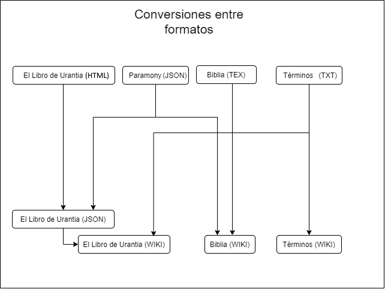

# Urantiapedia - HOWTO para los conversores de inputs

## Formatos

Los formatos de entrada para la Urantiapedia son los siguientes:

* Paramony TXT: es uno o varios archivos TXT que contienen el Paramony, es decir, la relación entre pasajes de El Libro de Urantia y la Biblia, y viceversa. Estos ficheros han sido obtenidos de la web oficial de la Fundación Urantia y la Urantia Fellowship. Estos ficheros han sido incorporados manualmente a los ficheros 'El Libro de Urantia TEX' por su complejidad para crear un conversor.
* Topic-index TXT: es varios archivos, uno por cada letra del abecedario, con una conversión del índice de términos (312 páginas) contenido en la edición de El Libro de Urantia de Uversa Press.
* 'El Libro de Urantia TEX': varios ficheros, uno por documento, con El Libro de Urantia en formato LaTeX.
* 'Biblia TEX': varios ficheros, uno por libro, con la Biblia en formato LaTeX.
* 'El Libro de Urantia JSON': una conversión de 'El Libro de Urantia TEX' a JSON.
* 'Biblia JSON': una conversión de 'Biblia TEX' a JSON.
* 'Wiki': formato de la Wikimedia.

## Enlaces

* LU a Biblia: https://urantia-book.org/urantiabook/paramony/bible_refs_index.html
* Biblia a LU: https://urantia-book.org/urantiabook/paramony/urantia_book_refs_index.html
* Biblia Reina-Valera 1960: https://www.biblegateway.com/passage/?search=G%C3%A9nesis+1&version=RVR1960
* Plugin LaTeX para Visual Code: https://marketplace.visualstudio.com/items?itemName=James-Yu.latex-workshop