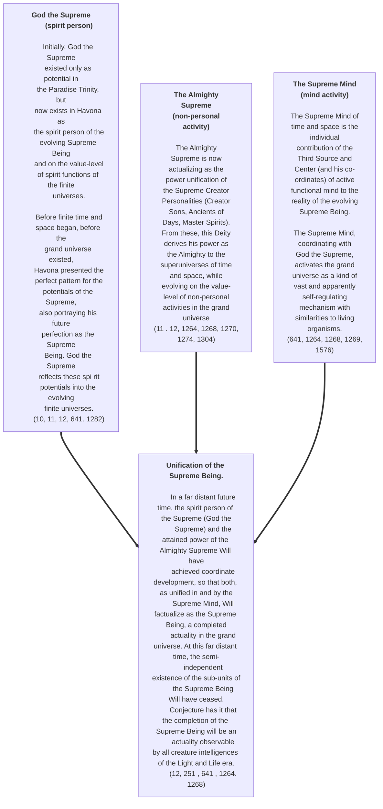

```mermaid
flowchart TD
    GS["
        <b>God the Supreme
        (spirit person)</b>
        
        Initially, God the Supreme
        existed only as potential in
        the Paradise Trinity, but
        now exists in Havona as
        the spirit person of the
        evolving Supreme Being
        and on the value-level
        of spirit functions of the finite
        universes.

        Before finite time and
        space began, before the
        grand universe existed,
        Havona presented the
        perfect pattern for the
        potentials of the Supreme,
        also portraying his future
        perfection as the Supreme
        Being. God the Supreme
        reflects these spi rit
        potentials into the evolving
        finite universes.
        (10, 11, 12, 641. 1282)"]
    AS["
        <b>The Almighty
        Supreme
        (non-personal
        activity)</b>

        The Almighty
        Supreme is now
        actualizing as the
        power unification of
        the Supreme Creator
        Personalities (Creator
        Sons, Ancients of
        Days, Master Spirits).
        From these, this Deity
        derives his power as
        the Almighty to the
        superuniverses of time
        and space, while
        evolving on the value-
        level of non-personal
        activities in the grand
        universe
        (11 . 12, 1264, 1268, 1270,
        1274, 1304)"]
    SM["
        <b>The Supreme Mind
        (mind activity)</b>

        The Supreme Mind of
        time and space is the
        individual
        contribution of the
        Third Source and
        Center (and his co-
        ordinates) of active
        functional mind to the
        reality of the evolving
        Supreme Being.

        The Supreme Mind,
        coordinating with
        God the Supreme,
        activates the grand
        universe as a kind of
        vast and apparently
        self-regulating
        mechanism with
        similarities to living
        organisms.
        (641, 1264, 1268, 1269,
        1576)
    "]
    U["
        <b>Unification of the Supreme Being.</b>

        In a far distant future time, the spirit person of the Supreme (God the
        Supreme) and the attained power of the Almighty Supreme Will have
        achieved coordinate development, so that both, as unified in and by the
        Supreme Mind, Will factualize as the Supreme Being, a completed
        actuality in the grand universe. At this far distant time, the semi-
        independent existence of the sub-units of
        the Supreme Being Will have ceased.
        Conjecture has it that the completion of the Supreme Being will be an
        actuality observable by all creature intelligences of the Light and Life era.
        (12, 251 , 641 , 1264. 1268)
    "]
    GS ==> U
    AS ==> U
    SM ==> U
```

## External links

* Article in Innerface International: https://urantia-book.org/archive/newsletters/innerface/vol7_3/page9.html