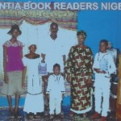
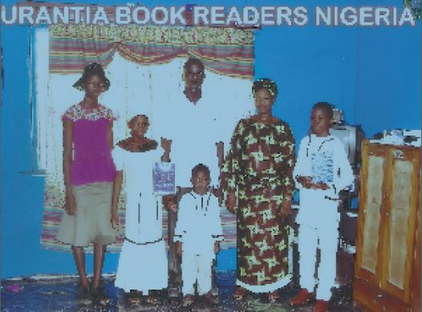

© 2014 Abegunde Julius Taiwo © 2014 International Urantia Association (IUA)

<figure id="Figure_5" class="image urantiapedia image-style-align-left">

</figure>

My dearly beloved brother Rick Lyon, and our international family of students of _The Urantia Book_ in the USA and around the world. Good day and happy greetings from Africa to you all. I am writing to you in order for you to view and share my family photo, our home study group here in Lagos.

May this coming year be one that brings more gratitude, more peace, and more love into the world through people such as you. Eternally grateful.

Abegunde Julius Taiwo, [abejutai@yahoo.com](mailto:abejutai@yahoo.com)
 

<figure id="Figure_5" class="image urantiapedia">

</figure>

## References

- Tidings newsletter: https://urantia-association.org/about-tidings-newsletter/
- This issue: https://urantia-association.org/newsletter/tidings-december-2014/
- This article: https://urantia-association.org/urantia-book-readers-in-nigeria