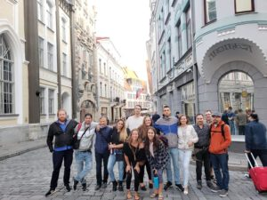
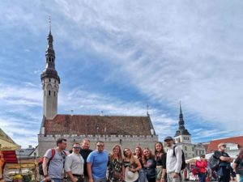
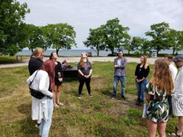
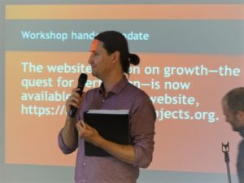

© 2019 Alex Hehlert © 2019 International Urantia Association (IUA)

<figure id="Figure_1" class="image urantiapedia image-style-align-left">

</figure>

(This is an extract summary on the Young Adults’ pre-conference retreat of Alex Heh’s personal testimonial of his experiences at the conference. Used by permission.)_

In July I traveled to Tallinn, the capital city of Estonia, to attend the 2nd European Urantia Association Conference. A number of young Urantia Book readers and I arrived some days earlier to attend the pre-conference retreat that was held from Sunday July 7 to Thursday July 11. This retreat was a joint event organized by Urantia Association’s UYAI (Urantia Young Adult International) and the Fellowship’s YaYas (Youth and Young Adults). I don’t exaggerate when I say that this event—held in a beautiful city and with lots of wonderful lovely people—was one of the most profound experiences in my life so far. By the end of the first night I felt I was able to leave my past behind and start a new life. It didn’t take long for me to stop thinking in my mother tongue (German) and start thinking (and feeling) in English.

We started our program on the first full day (Monday) of the retreat with a walk to the beach; a few of us even jumped into the sea! We enjoyed the atmosphere at this little beach where we introduced ourselves to each other and shared hugs all round. We then divided into pairs and interviewed one another so we could get to know more about each person. After our first group prayer I started to feel at home with these new-found friends. We read and talked about the “Kingdom of Heaven” and I felt that this would be an important topic for me during the conference as I was already starting to consider it from a new angle.

<figure id="Figure_2" class="image urantiapedia image-style-align-right">

</figure>

On the next day (Tuesday) we visited the Estonian Parliament and had a guided tour inside. It was very impressive. The Estonians seem to have a well organized political structure. The tour-guide did a great job and was very friendly. Next to the Parliament was a beautiful Orthodox church that we visited. I lit a candle and did a short prayer to Michael. As we came out of the church a Russian street-musician raised my mood by singing first a German song for me and then “Yellow Submarine!”

After lunch, back at the conference venue we held a brainstorming session about “The Combined Vision of the UYAI and YaYas.” We soon found that we were all of the same mind and realized that we need to work together in the future; maybe we might even be an inspiration for the older generation. We’d like to show that we will allow nothing and no one to come between us or hinder us from cooperating with our work for the revelation. We made some big plans and by the end of the retreat and we now consider UYAI and YaYas to be “together as one.”

Our next reading session was on the “Art of Living” and the “Lures of Maturity” as taught by Rodan of Alexandria. I was deeply impressed with Rodan’s high-minded philosophy. I understand why his teachings have been included in _The Urantia Book_. I promised myself to study these papers again when I am back home.

<figure id="Figure_3" class="image urantiapedia image-style-align-left">

</figure>

On Wednesday we were joined by Gard, Guy and Agnès, who decided to join our pre-conference activities and do workshops with us. We found a nice place in a park with beautiful scenery surrounding us. The first workshop was about “Worship, Prayer and Love.” We sat on the ground in a circle reminding ourselves that these three things always belong together. Gard led us in a group-prayer where we stood in a circle holding hands and one after another, we each said a short prayer. I did mine in German; this was the first moment when I noticed that something special was happening to me. I cried my first tears of joy during this prayer-circle as I felt an overwhelming feeling of love like I’d never felt before—a real unconditional love.

Later we visited the castle of Tallinn. What a beautiful sight. I was happy like never before. We had a great day and I was carrying an enthusiasm that is impossible to describe. I found myself praying a lot. The whole day was like one big prayer. In the evening when I was alone in my room I kept praying and asked the angels to be with us and share our wonderful moments together. I felt their presence and began to understand why I kept crying tears of joy so often. The feeling is hard to describe but it was like a kind of energy flowing through my body, then I started relaxing and felt as if I was not alone. My mood was blissful…

<figure id="Figure_4" class="image urantiapedia image-style-align-right">

</figure>

The next day (Thursday) was when many started to arrive for the main conference. That’s a whole other story so I will leave the details of that amazing time to someone else to tell for this newsletter. However, I will just briefly share my impressions of the lovely opening moments, which were warm and welcoming. I was aware that the atmosphere—the “energy in the air”—was different from all other conferences that I had attended before. Mike MacIsaac was the ideal person to be the Master of Ceremonies. His easy, chilled manner, coupled with his sense of humor made everything feel less formal than other events I’ve been to. Mike was the very first Urantia Book reader I met in person—he was simply the first person to say “hi” to me six years ago at the Blue Club Meeting in Frankfurt, Germany. He is what I would call a “big brother”—a kind of heroic role model for me. Thank you, Mike!

After the closing ceremony at the end of the main conference it was time to say goodbye. Thank you to all of you who made this momentous event so special and spiritually uplifting. I am looking forward to continuing to meet with all my wonderful brothers and sisters online soon, because we simply cannot go on without each other anymore. Our parting promise to one another was: “See you in Vancouver next year!”
 

## References

- Tidings newsletter: https://urantia-association.org/about-tidings-newsletter/
- This issue: https://urantia-association.org/newsletter/tidings-september-2019/
- This article: https://urantia-association.org/young-adults-pre-european-conference