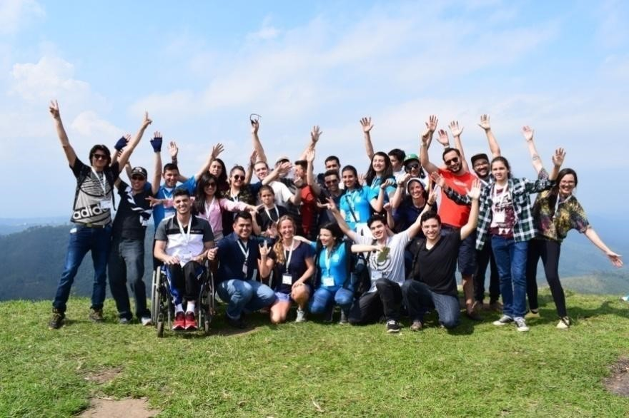
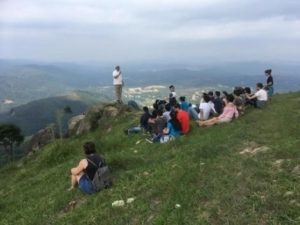
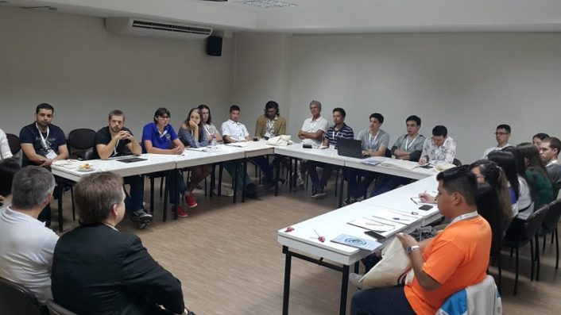
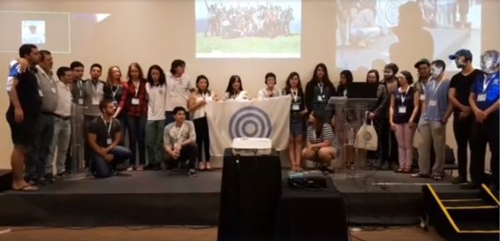

© 2018 Alexandre Nakai, Cintia Angeles © 2018 International Urantia Association (IUA)

<figure id="Figure_1" class="image urantiapedia">

</figure>

At the Latin American Conference in Brazil recently held in Guarulhos, Brazil, young readers from all across Latin America met to exchange experiences, get involved, have fun, and make decisions for the future. We see plenty of potential in these young people who express good ideals, genuine experiences, great talents, and a great deal of faith in the Heavenly Father. The entire event exceeded our expectations.

Youth coordinator Fernando Maldonado started a discussion at the top of Mount Pico Olho D’água, in the neighboring town of Mairiporã. The breathtaking landscape and feelings of a spiritual presence brought about an inspiring moment. Here, we began to tell each other a little bit about ourselves and our experiences, which proved to be an enlivening and moving encounter.

We feel that being a reader of _The Urantia Book_ makes us different and, at times, we feel displaced as faith children of God who do not fit into any religious institution. Some of us have left our churches and often carry a tremendous emotional weight because of it. We were able to share our sorrows and experiences, but it was not a painful process, it was a relief. There were some who felt guided by the Spirit of God to reach that moment on the hill. We heard many similar stories of struggles in the arena of mind, difficult decisions through faith, passing through different religions, and various intellectual and spiritual pursuits, all of which have led us to the same common gift–_The Urantia Book_.

<figure id="Figure_2" class="image urantiapedia image-style-align-right">

</figure>

Some of us had read the book for only a short time, while others for decades. But the intellectual content seemed to be secondary to the feelings of gratitude and brotherhood shared by all. “We were all moved by a heartfelt passion,” said Anna Zeven, an International Youth Leader.

On Friday night we had fun with the beautiful rhythms of samba, salsa, and other Latin music, all conducted by the young Mateo Monroy.

The next day, the young people took the time to work together serving the revelation. Leaders from Urantia Association International held a meeting in which they encouraged us to make our own decisions about our future. Our Youth Goals for Urantia Association’s next international conference in Cuzco, Peru in 2021 were initiated with suggestions from Wilson Leon, Urantia Association’s Continental Coordinator for Latin America. After much discussion and lively debate, we managed to organize ourselves and to formulate our ideas and goals.

<figure id="Figure_3" class="image urantiapedia">

</figure>

That afternoon, both youth and adults engaged in further discussions and reflections on spiritual sense, self-denial, and sharing. Although there were many disagreements and different points of view, we managed to overcome most of these difficulties through notions of self-forgetfulness and a strong sense of spiritual unity. These cooperative experiences must be lived by all who strive for spiritual progression. Indeed, nothing replaces practical learning.

By the end of the conference, we began to feel like a family, or friends who have known each other for a long time. We felt a strong sense of gratitude without the need for explanations or comparisons. Many people had worked hard to make this conference a success, and many others came from far away and struggled to be there, but it was all worthwhile.

Our goals were to foster a solid base of youth groups, entrepreneurship, volunteering, and transcontinental integration with youth strategies and spiritual adventures. We feel it is essential that all these efforts are motivated by spiritual purpose, a personal and genuine relationship with God, service to others, and offering support to the revelation. We believe that, through communion and spiritual discernment, all these goals cease to be mere human efforts and become the basis for real values, fostering ideals of faith, friendship, and integration.

At the end of our conference, Isabel Reinoso made a symbolic act by handing Michael’s flag to the young people. Her speech was inspiring and moving. Now the work goes on, and we will strive to keep ourselves integrated, serving each other and focusing on our goals. We have already set our eyes and spirits towards Urantia Association’s next international conference in Cuzco, Peru in 2021.

From Brazil and all of Latin America, we thank all our brothers and sisters for providing such an experience and for strengthening us in ways we could never have imagined. I hope that young readers across the globe can feel inspired to get more involved as well. We will be preparing and waiting for you. May the will of our Father be done.

<figure id="Figure_4" class="image urantiapedia">

</figure>

A special thanks to the president of Urantia Association Brazil, Enrique Traver, who closely followed the youth group in Brazil. And a special thanks to all others who made it happen–Urantia Association International, Urantia Foundation, Urantia Association Brazil, private donors, organizers, speakers, visitors, spiritual beings and beyond.

## References

- Tidings newsletter: https://urantia-association.org/about-tidings-newsletter/
- This issue: https://urantia-association.org/newsletter/tidings-december-2018/
- This article: https://urantia-association.org/youth-meeting-brazil-conf