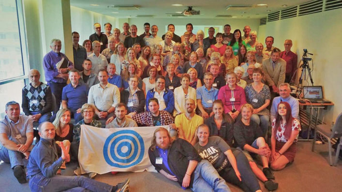
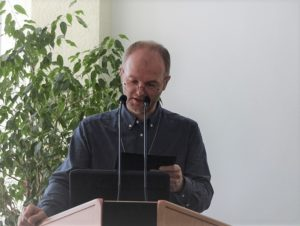
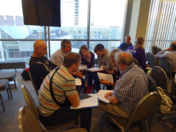
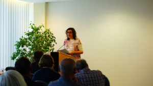
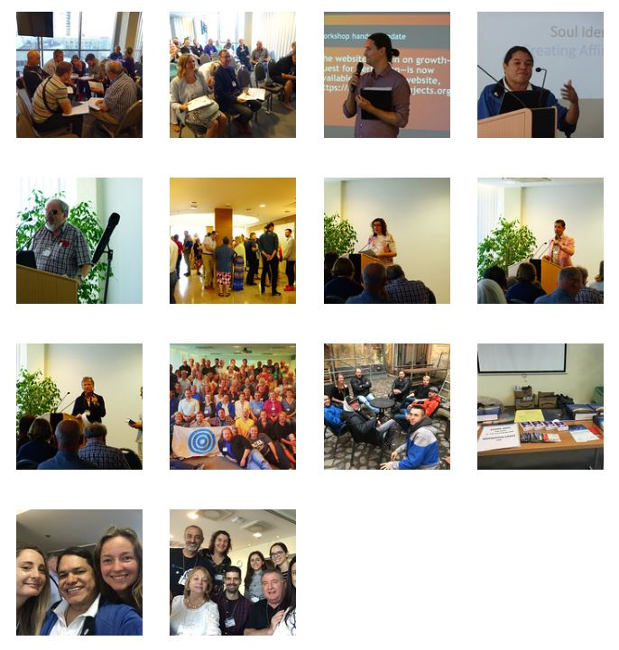

© 2019 Antonio Schefer © 2019 International Urantia Association (IUA)

<figure id="Figure_1" class="image urantiapedia">

</figure>

From 11-14 July 2019, the Urantia Association of Estonia hosted the 2nd European Urantia Conference at Tallink City Hotel with the theme “Sowing Seeds.” This event was the 2nd Continental Conference in Europe and took place almost three years after the Budapest conference. Eighty-seven participants celebrated friendship and brotherhood, in one of the best-preserved medieval cities of Europe, which is listed as a UNESCO World Heritage Site.

At this event in North-East Europe, readers from 15 different countries were present. Students and friends coming from the USA and Canada crossed the Atlantic Ocean, gathered together with people from several European countries; such as Estonia, Finland, Spain, France, The Netherlands, UK, Sweden, Lithuania and more. Just as in Budapest it was a truly worldwide event with association members present from all around the world, but mainly Europe and North America. It was an unforgettable experience in a truly “must-see” city.

<figure id="Figure_2" class="image urantiapedia">

</figure>

In the late afternoon of Thursday July 11, and after the Meet & Greet, our president, Chris Wood, and Karmo Kalda, the conference chair, opened the official program. They were introduced by the Masters of Ceremony, Michael MacIsaac and Helen Anvelt. After the dinner, Sebastian Nozzi (European Coordinator), welcomed the attendees on behalf of the European community. Helen Anvelt gave a musical, dance-art performance called “Bliss, Serenity, and Love,” and with that we ended the official program for that first day. For those who wanted to socialize more every night, there was the hotel lobby with music and drinks, which we all enjoyed.

<figure id="Figure_3" class="image urantiapedia">

</figure>

On Friday, Saturday and Sunday just before breakfast there were meditation sessions with Peep Sõber. Guy Perron organized the worship sessions after breakfast just before the main program started. On Friday, three presentations were given, followed by breakout sessions of one hour, relating to the presentations. In the afternoon of that day, there was a cultural program, with excursions to the Estonian Sea Museum, Art Museum, and a guided tour through Tallinn Old Town. That night Hara Davis gave a traditional dance workshop called “Sacred Dance” which closed the second conference day.

Saturday morning, the European associations of The Netherlands, Great Britain and Ireland, Sweden, Spain, Finland, Estonia, and Denmark gave us updates about the activities in their countries related to the conference theme “Sowing Seeds,” which was followed by a breakout session created and given by Karmo Kalda. Breakout session group representatives informed us just before lunch, during the feedback presentation, about what was discussed in their groups. We were all inspired, and this was truly a great success. It was good to see what all the European associations have accomplished, and what they did to increase Urantia Book seeding in their countries. That Saturday afternoon two other presentations were given including one by Chris Wood, followed by two breakout sessions. Tamara Strumfeld (Executive Director at Urantia Foundation) also gave a brief presentation that afternoon, with updates and other information about Urantia Foundation. Piia & Peeter Paemurru closed the third conference day with classical music, playing the piano can cello together.

Sunday started just as the other conference days except that is was closing day. With two more presentations and a breakout session it all went pretty fast that morning. In between we looked briefly into the future events with our president Chris Wood and talked about the 3rd European Urantia Conference, which will be held in 2022 in Málaga Spain, as announced to us the day before by the Urantia Association of Spain. We said goodbye to each other and thanked the conference organizers for a very successful event. Lunch that afternoon was for most of us the farewell moment. However, for some of us there was a post-conference for additional socializing and sightseeing among Urantia Book students with a Visa-Free Cruise to St. Petersburg and stops in Helsinki, Finland by ferry.

<figure id="Figure_4" class="image urantiapedia">

</figure>

When we started preparations during the 1st European Leadership Meeting in October 2017 in the city of Sitges-Spain and selected the Urantia Association of Estonia to organize this conference, we never expected that the 2nd European Urantia Conference would be such a great success. Personally, I thought we could not do better than Budapest but Karmo Kalda and his local conference team showed that it was possible. It always amazes me how conference planning ideas develop into real conferences and how unforgettable and life-changing they become. For this reason and more, I want to thank the Estonians. I also want to thank our sponsors; Urantia Association International, Urantia Foundation, and Truthbook for their financial and other support offered. But most of all I want to thank the attendees from all around the world who made this 2nd European Urantia Conference happen. Without your trust in our events this would never have been possible.

All the presentations were videoed and are now available for viewing on the Associations YouTube channel. See [this link](https://www.youtube.com/channel/UC_a2gwYGKpctnii4_nx8_vA/playlists) and click on the playlist for the 2nd European Urantia Conference.

I’m looking forward seeing you all again at our next big event, which is the 2021 Urantia Association International Conference, to be held in Urubamba-Cusco-Peru. Thank you for giving me the opportunity to serve you all with helping to organize conferences together with my Conference Committee. It is truly a pleasure to serve you, and I can’t wait to help you with the next one.

Antonio Schefer  
Conference Chair  
Urantia Association International

P.S. I’ll leave you with a few snap shots of our time together:

<figure id="Figure_5" class="image urantiapedia">

</figure>

## References

- Tidings newsletter: https://urantia-association.org/about-tidings-newsletter/
- This issue: https://urantia-association.org/newsletter/tidings-september-2019/
- This article: https://urantia-association.org/2nd-european-conference