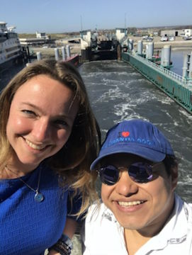
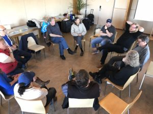
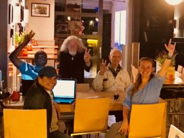
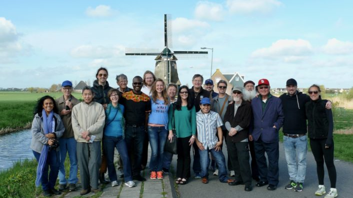

© 2018 Antonio Schefer © 2018 International Urantia Association (IUA)

<figure id="Figure_1" class="image urantiapedia image-style-align-left">

</figure>

The **U**rantia **Y**oung **A**dults **I**nternational committee (UYAI) recently hosted, for the first time in its short history, its very own conference, which was a truly special event. We called it the “2018 UYAI Post-Conference” as it was held right after Urantia Association’s International Conference in The Netherlands.

The conference was in the form of a tour and we began by travelling to The Rijksmuseum with 68 Urantia Book readers using a 50-person touring bus, 2 minivans and a taxi. We visited a renowned museum where we saw many famous paintings such as _The Night Watch_, by Rembrandt van Rijn; _The Milkmaid_, by Johannes Vermeer; and Vincent van Gogh’s _Self Portrait_.

After our visit to the museum we embarked on a 2-hour boat tour through the Amsterdam canals to see and learn about the history of the capital of The Netherlands. This was a once-in-a-lifetime experience, especially when traveling in your “private boat” accompanied by 40 fellow Urantia Book readers from all over the world! We ended the day with dinner and drinks near at The Leidseplein, then headed back to the Conference Centre.

The next day, Monday was when the official post-conference began. Some of our original group had to go home, but those of us booked for the entire post-conference boarded another tour-bus to travel to various historical towns such as Volendam, Enkuizen and Edam. While on the bus Anna Zeven presented the first workshop and Rick Warren gave us a brief book presentation. We then caught a ferry from the city of Den Helder to the island of Texel and stayed in a hostel at the Stayokay Texel.

<figure id="Figure_2" class="image urantiapedia image-style-align-right">

</figure>

Tuesday-morning Alexander Heh from Germany conducted a meditation session followed by a workshop about meditation. Collins Lomo from Ghana gave a workshop on the human qualities of Jesus; he also gave us an insight into how the fifth epochal revelation is impacting people in Africa. It was truly uplifting to hear about what is happening in Africa and how the people there think about Jesus and _The Urantia Book_. In the afternoon we went to the beach where some of us took a three-and-a-half-mile walk from the hostel to the beach and explored Texel Island. For many of us, it was great to see the North Sea with our own eyes.

Our next step was to visit Ecomare, a nature museum that featured an orphanage for sea-creatures from the North Sea and birds of Texel Island. This was another once-in-a-lifetime experience for many of us. (Incorporating these kinds of excursions before or after a conference adds to quality of the experience for those who have travelled so far to attend a Urantia conference.)

After dinner at the hostel, Mairam Durand from Peru conducted a workshop on _Jesus as a Leader_; this was followed by another workshop given by Anna Zeven about personal connections and attitude change. Some of us “night-owls” went stargazing looking for Havona! (We are told in _The Urantia Book_ that if we look towards the center of the Sagittarius constellation we are looking in the direction of Havona.) We used an app on our phones called “Star Chart” to help us navigate the sky! Alexander told us that this island is where he has seen the most stars ever in his life. I can agree with him—the starry night-sky was absolutely amazing!

<figure id="Figure_3" class="image urantiapedia image-style-align-left">

</figure>

We began Wednesday with a wonderful worship session/workshop conducted by James Woodward. Sean Privitera closed the official workshop program that morning with a workshop about the human qualities of Jesus from a different perspective from the one Collins Lomo presented the day before.

Our tour ended way too fast! After lunch at the hostel we took a bus to the ferry that took us back to the mainland. After many big hugs and fond farewells, it was time to go our own separate ways. It was a very special four days. The age group of attendees was a good mixture of young adult readers and older, more seasoned readers. We were able to learn a lot from one another. Organizing and travelling to the Texel Island for this post-conference was a dynamic experience and at times quite challenging but our group was flexible—especially when travelling by public transport. The UYAI team (Anna Zeven, Samantha Nior, Alexander Heh and I) gained many valuable lessons and I can’t wait to help organize another event like this at the next conference in 2021 in Peru. Start planning for that conference now! It will be another once-in-a-lifetime experience.

<figure id="Figure_4" class="image urantiapedia">

</figure>

I would like to thank several special people who helped us with event: Pio Park for being our conference photographer; Winston Lucassen for helping out with transporting people on the island when we needed it the most; Urantia Association International and the Urantia Book Fellowship for their financial support; and finally Anna Zeven, our delightful UYAI Chair who orchestrated this 2018 UYAI Post-Conference and put in so much work to make it happen.

Antonio Schefer  
International Conference Chair  
Urantia Association International

[Click here](https://urantia-association.org/2018/update-2018-uyai-post-conference/) for more information about the 2018 UYAI Post-Conference

 

## References

- Tidings newsletter: https://urantia-association.org/about-tidings-newsletter/
- This issue: https://urantia-association.org/newsletter/tidings-june-2018/
- This article: https://urantia-association.org/urantia-young-adults-post-conference