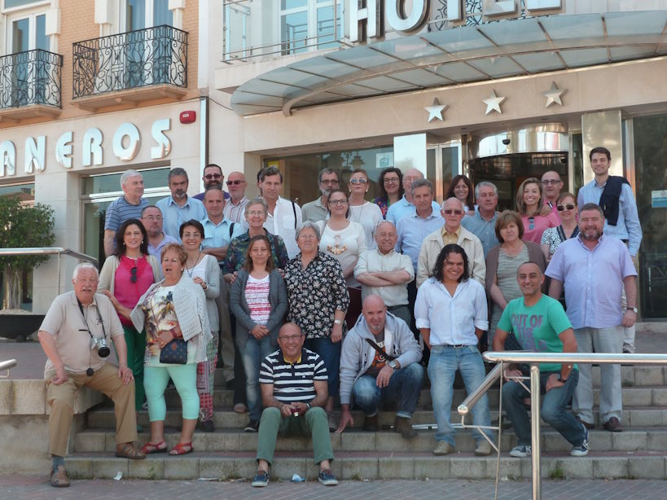
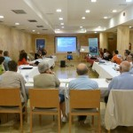
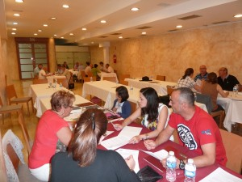

© 2015 Carmelo Martinez © 2015 International Urantia Association (IUA)

<figure id="Figure_1" class="image urantiapedia">

</figure>

The Urantia Association of Spain held its 14th meeting of readers from April 30th to May 3rd, 2015 in the wonderful and historic city of Cartagena. About 40 readers from all regions of Spain attended. We were also joined by the International Service Board Conference Committee Chair Antonio Schefer who came from the Netherlands to share this valuable time with us.

This year, we again used the 4 day/3 night format, which we had used in past years, and based on attendees’ feedback, it was very successful.

The theme this year was “Agora Nostra,” because it was our intention to re-create those public squares where people shared their views and ideas such as was often done in the ancient Greek culture. We also had a theme of using social media to disseminate _The Urantia Book_. We have already recorded and uploaded to the Internet some videos with presentations and discussions about several topics, such as the afterlife, personal religion, the life of Jesus, etc. These videos last about 20 minutes and are designed for readers and others who are familiar with the book. We also plan to make additional, 3-5 minute videos for non-readers. The idea is to give some revelation “pills” with topics of general interest in the world today, as a way to draw the attention of those seekers who don’t know _The Urantia Book_ yet.

<figure id="Figure_2" class="image urantiapedia image-style-align-left">

</figure>

Thursday April 30th in the afternoon, I welcomed all the attendees and presented the meeting program. I explained a bit about the meeting theme and the meaning we wanted to give to it, as well as the dissemination project using social media.

Friday May 1st in the morning we had two interesting presentations. The first one was _Appearance on the Cosmic Stage of Matter and Energy_, by Santiago Rodriguez, and the second one was _The Scribe from Damascus_, by Demetrio Gomez. Saturday May 2nd in the morning, Francisco Fuentes discussed _Time and Space. Our Universe and the Universe of The Urantia Book_, and Gines Aviles talked about the problem solving technique proposed by Rodan of Alexandria.

On Friday afternoon, we had a workshop about the controversial Paper 72, _Government on a Neighboring Planet_, which raised a heated discussion. And on Saturday afternoon David Carrera made a stunning and brilliant presentation about the dichotomy Reality-Unreality, drawing a picture that he called “the first practical map of the greatest and unique treasure that we take from this life: the soul.”

<figure id="Figure_2" class="image urantiapedia image-style-align-right">

</figure>

All the presentations were followed by public discussion on their subjects, which were always enlightening. The next issue of our newsletter, _Luz y Vida_ (Light and Life), will be dedicated in its entirety to the meeting and will include summaries of the presentations and the subsequent discussions.

In the evening after dinner, meditation sessions were facilitated by Mariano Perez and then, following a very Spanish habit, instead of going to sleep, we took the opportunity to mingle with old friends and discuss interpretations of the revelation we have not understood. Given the fact that this is not part of the formal program, and with absolute freedom as to format and duration, we humorously called these moments “territorio Comanche” (Comanche territory), even though things never became violent.

Sunday May 3rd in the morning we had a Question and Answers session about some topics in _The Urantia Book_ and the general assembly of members of the Urantia Association of Spain.

After lunch, we said goodbye, as always, with happy memories and longing to remain with each other. But now there are fewer days left until the 15th Meeting! See you all in Bilbao, the city of our next meeting in 2016.

Carmelo Martinez  
President, Urantia Association of Spain
 

## References

- Tidings newsletter: https://urantia-association.org/about-tidings-newsletter/
- This issue: https://urantia-association.org/newsletter/tidings-june-2015/
- This article: https://urantia-association.org/urantia-association-of-spain-meets