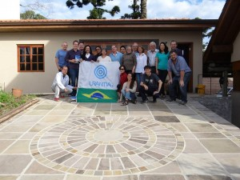

© 2015 Cesar Paulo © 2015 International Urantia Association (IUA)

<figure id="Figure_1" class="image urantiapedia image-style-align-left">

</figure>

The Brazilian Urantia Association met in Canela, Rio Grande do Sul, Brazil, on May 23, 2015, at the home of our host Edison Arpino Torres and his wife Susana. We are always received warmly and are welcomed to join together in search of knowledge and to share our insights gained from reading _The Urantia Book_.

Everyone in the group looks forward to this valuable time every month. We are united in our pursuit of strength and enlightenment with the mutual objective of understanding how best to do the will of the Father. Thanks to everyone who actively participated in sharing _The Urantia Book’s_ teachings, and experiencing the special presence of the Spirit of Truth. We all share a sincere desire to follow the path to a new reality during our lives on earth, and prepare ourselves for the eternal and progressive journey.

This meeting was dedicated to the subject developed by our sister Jeannie Vázquez de Abreu, “Wise Leadership for Effectively Promoting the Urantia Revelation”.

Our next meeting is scheduled for June 27, 2015.

There are also weekly and bimonthly meetings of face-to-face Study Groups of _The Urantia Book_ in the Brazilian cities of Canela, Caxias do Sul, Gramado, Porto Alegre, Novo Hamburgo, and São Francisco de Paula.

We hope that these examples will serve as motivation for the formation of new study groups everywhere in Brazil, and thus contribute to achieving the mandate to form thousands of study groups.
 

## References

- Tidings newsletter: https://urantia-association.org/about-tidings-newsletter/
- This issue: https://urantia-association.org/newsletter/tidings-june-2015/
- This article: https://urantia-association.org/readers-meet-inbrazil