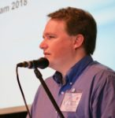

© 2019 Chris Wood © 2019 International Urantia Association (IUA)

<figure id="Figure_1" class="image urantiapedia image-style-align-left">

</figure>

In the early days of the Urantia community, we were challenged to address six basic tasks: translate _The Urantia Book_, publish it, distribute it across the world, foster the study of the book, train teachers, and train leaders. Today Urantia Association International and Urantia Foundation work hand in hand to accomplish these six tasks. The Foundation focuses primarily on translation, publication, and distribution, whereas the Association is dedicated to study, training teachers, and training leaders. It’s been more than 80 years since the papers were completed, but we remain dedicated to these basic tasks. Yes, our challenges have changed radically over the decades due to political developments, the rise of mass communications, and the internet—yet our dedication to these six pillars persists.
 

https://youtu.be/9K5MWcXe_s0

Every year the Urantia community grows with new people discovering _The Urantia Book_, new translations becoming available, multiple conferences and events being held throughout the world, and hundreds of study groups actively working to transform the words in the book into a living revelation of God within the lives of those who study and enact its teachings.

There are enough projects to fill the lives of dozens of generations of dedicated students. Urantia Association and our local and national affiliates are actively helping to match volunteers with potential projects. We want to help provide services to the growing Urantia community as well as to the world at large.

At the end of each year, we review our past accomplishments and rededicate ourselves to our mission. The challenges of fostering study groups, training teachers, and training leaders will not go away. The first generation of Urantia Book students lived their lives dedicated to these tasks and so too must the Urantia community of today dedicate itself to these same challenges in our day. The struggle itself is enough to fill our hearts.

In service,  
Chris Wood  
President, Urantia Association International

## References

- Tidings newsletter: https://urantia-association.org/about-tidings-newsletter/
- This issue: https://urantia-association.org/newsletter/tidings-december-2019/
- This article: https://urantia-association.org/presidents-message-december-2019