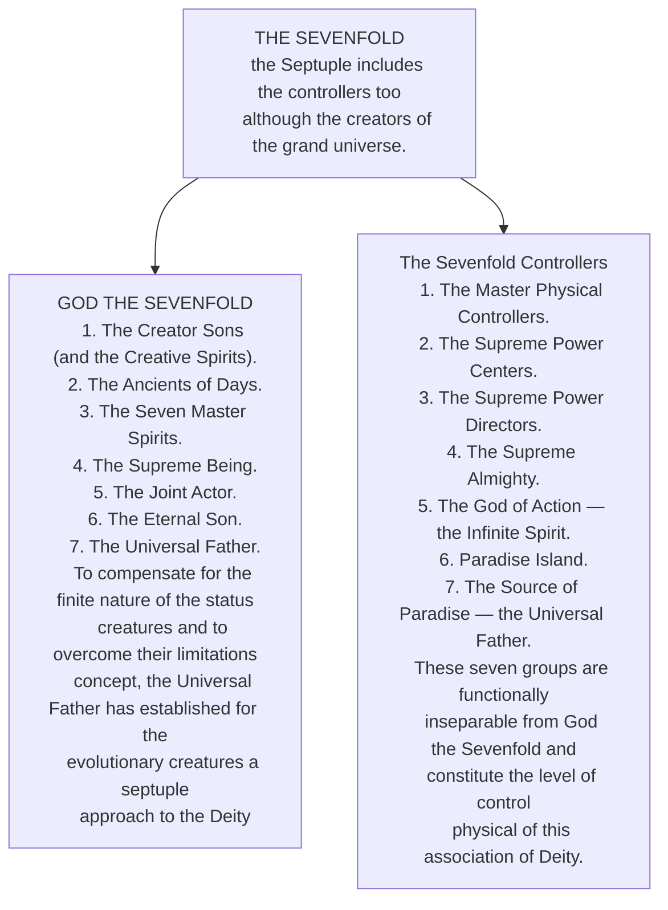

© 2021 Claude Flibotte © 2021 French-speaking Association of Readers of the Urantia Book

 
<figure class="table chapter-navigator">
  <table>
    <tbody>
      <tr>
        <td>
        <a href="/en/article/Dominique_Ronfet/Promets_moi">
          Promise Me
        </a>
        </td>
        <td>
        <a href="/en/index/articles_le_lien#le-lien-urantien-issue-96-décembre-2021">
          Le Lien Urantien — Issue 96 — December 2021
        </a>
        </td>
        <td>
        <a href="/en/article/Jean_Royer/Pause_Philosophique">
          Philosophical Pause
        </a>
        </td>
      </tr>
    </tbody>
  </table>
</figure>

## THE ORIGIN OF THIS GLOBAL VISION

My reflection began while reading the magazine Science \& Vie from August 2021 on pages 14 and 15 where there was a photograph of the heart of our galaxy in the direction of the constellation of Sagittarius taken, initially, by NASA's Chandra satellite equipped with an X-ray telescope. Subsequently, Daniel Wong, astronomer, superimposed another photo of the same region in radio waves taken by the South African MeerKAT radio telescope. The combination of the two wavelengths gives an overview of the high energy phenomena that reign there. We can distinguish gigantic magnetic bridges distributing its energy from the galactic center to the other regions of the Milky Way. All this reminded me of the work of the Supreme Centers of Power described in booklet 29.

## Portrait of reality

<figure id="Figure_4" class="image urantiapedia image-style-align-right">

<figcaption>Chandra (space telescope)  Placed in a high elliptical orbit of 10,000 x 140,000 km which allows long continuous observation periods, Chandra is used to study the X-ray radiation emitted by different celestial objects and processes such as the joint evolution of supermassive black holes and galaxies, the nature of dark matter and dark energy, the internal structure of neutron stars, the evolution of massive stars, planetary pronebulae and the interaction of exoplanets with their star. (Wikipedia)</figcaption>
</figure>

In the description of reality as explained by the revelators of the Urantia Book, we approach it from one of the poles of the entire reality of existence. This consists of the existential, infinite and eternal reality of the Deity inhabiting the Isle of Paradise and described in part in Papers 1 to 13. These Papers tell us about the gods, their perfect nature, their expression through creation and the purpose of the intermediary of the Supreme Creators and their creatures, their subinfinite children. This level of paradisiacal existence is absolute perfection. The other pole is filled by all primitive human beings, perfect in their original animality. Obviously, this global vision of existence concerns exclusively the level of consciousness of existing of the beings concerned in this presentation excluding inert matter.

The next stage of this reality is composed of the Central Universe of Havona described in Paper 14. This is the original and perfect creation of the Paradise Deities serving as a model for all the rest of the great plan of divine expression. Things and beings are eternally perfect, but since the existence of the following levels of reality, the addition of experiential knowledge qualifies their formation.

The logical continuation of the divine plan consists of the existence of the seven superuniverses, the domain of time and space, the ideal terrain for acquiring experiences starting from the imperfect to become perfect. It is at this level that we find the second pole mentioned above. We can find a reference to it in almost the entirety of the Urantia Book, from Paper 15 to Paper 118, and we can even include in the rest of the book the experiences of our Creator Son, the ideal model for human achievement towards the perfection of divinity.

 

## From Perfect to Imperfect

We see therefore according to this portrait of reality that the perfect seeks through imperfect existence the experience necessary to make perfect that which was not perfect at the beginning. This is how a whole new reality of existence of beings become perfect is realized contrasting with the perfect beings of Havona. This creative diversity representing the pinnacle of celestial beauty expressed by the beauty of the perfect Creator making possible the beauty of a creature become perfect!

**The energy in all of this!**

God is not merely spirit, he is also energy [^1]. It was precisely this image of the center of our galaxy that inspired me to see more clearly the role of the Universe Power Directors, primarily their descendants who are actively involved in the universes of time and space, the Supreme Power Centers of the grand universe. They operate in seven groups ([UB 29:2.2-8](/en/The_Urantia_Book/29#p2_2) ) mentally controlling the entire vast network of functions performed by the Master Physical Controllers and the Morontia Power Supervisors ([UB 29:2.9](/en/The_Urantia_Book/29#p2_9)).

Since the creation of the universes of time and space, the Havona Centers, the second group of Supreme Power Centers, are now necessary there since this event precipitated Havona into its second age. For the moment, and in Havona only, there exists perfect control of energy ([UB 29:2.12](/en/The_Urantia_Book/29#p2_12)).

On each of the capitals of the seven superuniverses, including Uversa, the capital of our superuniverse Orvonton, there are a thousand Superuniverse Centers, the third group. Three primary energy currents, each subdivided into ten segregations, enter these power centers and seven specialized and well-directed, although imperfectly controlled, power circuits emerge from their seat of unified action. This is the electronic organization of universe power (29:2.13). These sevenfold circuits of electronic organization reveal a variable sensitivity to local or linear gravity. They are movements of energies directed for specific purposes, analogous to the Gulf Stream, which bathes each superuniverse ([UB 29:2.15](/en/The_Urantia_Book/29#p2_15)). It is to these energy currents that the image I spoke to you about at the beginning of the text refers.

## ENERGY, EVEN CLOSER TO US

Coming a little nearer to our earthly existence, it is the one hundred _Local Universe Centers_ stationed on the headquarters worlds of the local universes which function to lower and still further modify the seven circuits of power emanating from their superuniverse headquarters so as to make them applicable to constellation and system service. In our case, they are stationed on Salvington. They are of invaluable assistance to our Creator Son, Michael of Nebadon, during the closing periods of universe organization and energy mobilization. Picture to yourself the space in our universe traversed by free, unobstructed motion.
differentiated energies and among them energy corridors connecting two power centers or two physical controllers. These individualized energy circuits are useful for interplanetary communications among other things ([UB 29:2.16](/en/The_Urantia_Book/29#p2_16)).

## EVEN CLOSER TO US

The fifth order of _Power Centers_, the _Constellation Centers_, are ten in number and are stationed in each constellation. They are projectors of energy to the hundred local tributary systems. From these beings issue the lines of power for communications, transportation, and as an energy supply to living creatures that depend on these physical energies ([UB 29:2.17](/en/The_Urantia_Book/29#p2_17)). I see in this last statement, the midwayers and the non-breathing beings.

## HOW DOES THIS CONCERN US?

A _Supreme Center of Power_ is permanently assigned to each local system. These system centers send out the circuits of power to the inhabited worlds of time and space. They coordinate the activities of the subordinate physical controllers and also act to insure the satisfactory distribution of power in the local system. The relays of circuits between the planets depend upon the perfect coordination of certain material energies and the efficient regulation of physical power ([UB 29:2.18](/en/The_Urantia_Book/29#p2_18)).

Individual planets are intrusted to the care of the _Master Physical Controllers_. They receive the circuited power lines sent from the power centers of their system. With extremely rare exceptions, an _Unclassified Center_ is assigned to a planet because of quite extraordinary energy relationships or this _Unclassified Center_ acts as a universal balance or energy governor ([UB 29:2.19](/en/The_Urantia_Book/29#p2_19)). One space body in a million is in this case, and I believe Urantia is one of them since it is located near an extremely powerful energy circuit.

How do the _Supreme Centers of Power_ concern us? I would answer that without them we would not exist! Since everything is energy, everything that constitutes our material world, plants, animals, our bodies are made of energy transformed into atoms, then into molecules and living cells ([UB 42:1.2](/en/The_Urantia_Book/42#p1_2)). The presence of the _Master Physical Controllers_ is always required when the _Life Carriers_ implant life on a planet.

## ANATOMY OF A SUPREME CENTER OF POWER

The power centers utilize vast mechanisms and coordinations of a material nature in connection with the living mechanisms of the various separate energy concentrations. Each individual power center is composed of exactly one million functional control units and these energy-modifying units are not stationary like the vital organs of the physical body of man; these “vital organs” of power regulation are mobile and truly kaleidoscopic in their possibilities of association ([UB 29:3.7](/en/The_Urantia_Book/29#p3_7)).

These beings, as well as the physical controllers I will mention later, are all created perfect and act perfectly. They never change function. They are entirely practical in all their acts and are always in service. They deal only with material or semi-physical energy power. They do not emit it, but modify, manipulate and direct it. They have the power to resist linear gravity. These supreme controllers of powers always operate from architectural spheres designed to facilitate their operations ([UB 29:3.9](/en/The_Urantia_Book/29#p3_9)). These beings are closely associated in some way with the cosmic supercontrol of the Supreme Being ([UB 29:3.3](/en/The_Urantia_Book/29#p3_3)).

> The spirit struggles of time and space have to do with the evolution of spirit dominance over matter by the mediation of (personal) mind; the physical (nonpersonal) evolution of the universes has to do with bringing cosmic energy into harmony with the equilibrium concepts of mind subject to the overcontrol of spirit. The total evolution of the entire grand universe is a matter of the personality unification of the energy-controlling mind with the spirit-co-ordinated intellect and will be revealed in the full appearance of the almighty power of the Supreme. ([UB 116:5.15](/en/The_Urantia_Book/116#p5_15))

> In the evolutionary superuniverses energy-matter is dominant except in personality, where spirit through the mediation of mind is struggling for the mastery. The goal of the evolutionary universes is the subjugation of energy-matter by mind, the co-ordination of mind with spirit, and all of this by virtue of the creative and unifying presence of personality. Thus, in relation to personality, do physical systems become subordinate; mind systems, co-ordinate; and spirit systems, directive. ([UB 116:6.1](/en/The_Urantia_Book/116#p6_1))

## The Master Physical Controllers

The _Master Physical Controllers_ are perhaps more interesting for us to know, since they operate on individual planets like ours. They can shapeshift in order to engage in a variety of autonomous transports. They can traverse space at almost the speed of the _Lone Messengers_, which is saying something! However, like all space traverses, they need the help of their companions and certain other types of beings to overcome the gravity of the planet and the resistance of inertia when they start from a material sphere ([UB 29:4.1](/en/The_Urantia_Book/29#p4_1)).

The _Master Physical Controllers_ are of seven orders. The first three are personal, but the last four appear to be rather automatic, but super-intelligent ([UB 29:4.13](/en/The_Urantia_Book/29#p4_13)). They adjust the fundamental energies not discovered on Urantia for interplanetary transportation and communications. These energies are also employed by the midwayers ([UB 29:4.14](/en/The_Urantia_Book/29#p4_14)).

Orvonton has three billion _Assistant Power Directors_ or three million per minor sector. In addition to their energy functions, they serve to instruct all those who study the sciences of energy control and transmutation techniques ([UB 29:4.16](/en/The_Urantia_Book/29#p4_16)).

Billions and billions of machine controllers are commissioned in Ensa, our minor sector. They are by far the most powerful assigned to an inhabited world. They possess the gift of antigravity surpassing all other orders of beings. Ten of them were stationed on our sphere at the time of the revelations of The Urantia Book. Their primary function is to facilitate the departure of seraphic transports enabling them to attain the speed of 899,580 km/s ([UB 23:3.2](/en/The_Urantia_Book/23#p3_2)). To do this, they all act in unison, while a coupled series of a thousand energy transmitters provide the initial life force for the departure ([UB 29:4.19](/en/The_Urantia_Book/29#p4_19)). Together or individually, they act upon energy. To get a vague idea of their functions, they act like our electrical transformers, switches, amplifiers, electronic transistors, etc.

_Energy Transformers_ usually number one hundred per inhabited world ([UB 29:4.22](/en/The_Urantia_Book/29#p4_22)). They are the planetary inspectors of seraphic departures. They are powerful living decision-making switches for action. They can also isolate a planet from powerful energy currents passing nearby.

The other four orders of _Master Controllers_ are barely people as we understand them. The _Energy Transmitters_ could be compared to our power lines for directing energy to a new circuit. They position themselves on the desired path, and thanks to their power of energetic attraction, they redirect the energy where it is expected. They can detect a weak current, then amplify it in order to transmit it intelligibly for the receivers of television broadcasts ([UB 29:4.29](/en/The_Urantia_Book/29#p4_29)). They are indispensable, along with the energy transformers, to maintain life on worlds with poor atmospheres and for non-breathers ([UB 29:4.31](/en/The_Urantia_Book/29#p4_31)).

The _Primary Associators_ are energy conservators somewhat similar to plants which store sunlight. They convert the energies of space into a physical state unknown to us. They are living catalysts capable of transformations to the point of producing some of the primitive units of material existence (29:4.32). They manipulate atoms, electrons and ultimatons to make them express different states of matter. They also release energy in times of deficit.

The _Secondary Dissociators_ are the opposite of the Associators. They are gifted with immense antigravitational faculties. They are concerned with the evolution of a form of energy little known to us at the time of this revelation (nuclear energy?) ([UB 29:4.35](/en/The_Urantia_Book/29#p4_35)).

Frandalanks have the function of automatically recording the status of all forms of force-energy, qualitatively and quantitatively. Chronoldeks are frandalanks that additionally record the presence of time ([UB 29:4.37](/en/The_Urantia_Book/29#p4_37)).

### CRAZY IDEAS OR NOT!

In this study, we have just seen that the pure energy of the Deity transmutes into multiple forms and manifestations that are not all recognized by us. When we have discovered the form of energy mentioned in [UB 42:1.3](/en/The_Urantia_Book/42#p1_3) and hoping that our humanity will have reached a high level of wisdom, we will be able to master the energetic rotation of the electrical units of matter to the point of modifying their physical manifestations ([UB 42:1.4](/en/The_Urantia_Book/42#p1_4)). Imagine the incredible possibilities that this would represent!

Several strange phenomena for us are reported quite regularly in the media. I am referring here to unidentified flying objects. Our civilization is very young, and without a doubt given the number of inhabited worlds older than ours existing in the universe, science has surely made giant steps compared to ours. On Jerusem, the Adamites travel in vehicles reaching speeds of 800 km/h ([UB 46:2.4](/en/The_Urantia_Book/46#p2_4)). So, how can we not imagine that visitors from other planets could study us! So, why don't they contact us?

The answer to this question seems obvious to me! We are so primitive! Who would want to contact us? The only real interest for them is to study us as we study the animal kingdom. Moreover, knowing that we are all cosmic brothers, would it not be wise of them to let us grow knowing that a divine plan is at work to allow us to do so! This is the famous first directive in Star Trek! Another reason, our world is in quarantine courtesy of the well-known insurrection, they are only following the instructions!

On the other hand, and invisibly for us, we know that we are constantly visited by cosmic students. A crowd of celestial beings are working on our rehabilitation including angels, midwayers, Melchizedeks, Life Carriers and so on! So, are we alone in the universe? The answer is definitely no, we are a multitude!

When searching in _The Urantia Book_ for the word “physical controllers”, no less than a hundred citations refer to them. This is to say how important they are in the economy of a planet and indispensable to our existence! We are familiar with the concept of the Father as a perfect spirit, it would be good to also conceive of him as the energy, life and support of his vast creation.

Claude Flibotte

Sainte-Julie — Quebec

<figure class="table chapter-navigator">
  <table>
    <tbody>
      <tr>
        <td>
        <a href="/en/article/Dominique_Ronfet/Promets_moi">
          Promise Me
        </a>
        </td>
        <td>
        <a href="/en/index/articles_le_lien#le-lien-urantien-issue-96-décembre-2021">
          Le Lien Urantien — Issue 96 — December 2021
        </a>
        </td>
        <td>
        <a href="/en/article/Jean_Royer/Pause_Philosophique">
          Philosophical Pause
        </a>
        </td>
      </tr>
    </tbody>
  </table>
</figure>

## Notes

[^1]: ENERGY is used as an all-encompassing term applied to the spiritual, mental, and material realms. The word force is generally used in the same manner. The use of the word power is usually used only to designate the electronic level of matter, the matter of the grand universe that responds to linear gravity. Power is also used to designate sovereignty. We cannot conform to your generally accepted definitions of force, energy, and power. Your language is so poor that we must assign multiple meanings to these terms. ([UB 0:6.2](/en/The_Urantia_Book/0#p6_2))