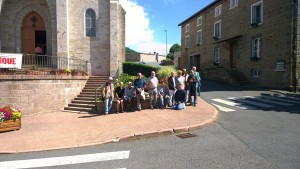
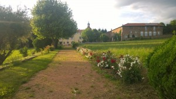

© 2015 Cyril © 2015 International Urantia Association (IUA)

<figure id="Figure_1" class="image urantiapedia image-style-align-left">

</figure>

The national meeting of Urantia Book readers took place this year from 18 to 21 June 2015 at the Neylière estate, near Lyon.

Seventeen readers were gathered at this calm and invigorating place, at an altitude of 650 metres, run by the Marist Fathers, to study the book on a particular theme, hold the Association’s general meeting and of course meet with other readers.

The subject of study dealt with the differences between evolution on a “normal” planet and evolution on Urantia, Urantia being a decimal planet and the location of a betrayal by its Planetary Prince and an Adamic default. The task was to reflect on the consequences, advantages and disadvantages of being born on such a world.
 

Here is a brief summary of our study:

The subject was introduced with a reminder of the Plan, or rather the Plans, for divine perfection, of:

- God the Father: the plan of progressive achievement, or ascension through evolution;
- God the Son: the bestowal plan of the sons for the revelation of the Father;
- God the Infinite Spirit: the ministry of mercy through himself and his personalities to execute the plan.

Paradise is the residence of absolute perfection and Havona is the model for it.

The seven superuniverses have been given one single injunction: Be you perfect as your Father in Paradise is perfect.

The study was carried out following the order of Paper 52, Planetary Mortal Epochs, which trace the seven periods of evolution from the commencement of human life to the era of light and life:

- 1st age: Pre-Planetary Prince man  
- 2nd age: Post-Planetary Prince man  
- 3rd age: Post-Adamic man  
- 4th age: Post-Magisterial Son man  
- 5th age: Post-Bestowal Son man  
- 6th age: Post-Teacher Son man  
- 7th age: The era of light and life

From the 1st age, when man emerges from the animal level, to the 7th age, the era of light and life, an evolution takes place which proceeds from the conflicts between tribes to a highly advanced civilisation characterised by such things as world peace, a true philosophy, and the interests of the universe.

In all domains, the scientific, the economic, the political and the spiritual, humans mature, also thanks to the aid of the different bestowals of the Sons.

The study of this paper has allowed us to comprehend the different epochs.

The table below sets out the principal differences between evolution on a normal planet and the evolution of Urantia from the 1st to the 3rd age.

Do not hesitate to read Paper 52 again to see the details of these periods:

Age | Normal world | Urantia
--- | --- | ---
1st age | Dark and bloody era Races appear successively | Experimental world: prolonged extremely brutal conflicts
2nd age | Prince's government: social progress Educational centres National unity Segregation of defective types Equality of the sexes | Rebellion: less progress, more numerous wars No educational centres Variations in advancement: tribal mode of existence No segregation yet No equality of the sexes yet
3rd age | No mating by Adam and Eve with humans Physical improvement Progress in inventions One amalgamated race | Fall of Adam & Eve Slow physical improvement, or lack of it Slow, diffuse progress Delay in amalgamating one race

Urantia has moved so far away from the divine plan following the default by the Planetary Prince coupled with the fall of Adam and Eve that it is difficult at any point to compare the evolution in terms of Ages.

In view of this, Urantia has benefited from emergency plans with “unique” characteristics such as the bestowal of Jesus (our Creator Son!), the gift of Adjusters and the Spirit of Truth. In the same way, it is extremely difficult to know in which period were are now, since on Urantia we possess elements of different ages.

Globally we have a very great retardation (3rd age) despite our great advancement in the domains of science and technology.

<figure id="Figure_2" class="image urantiapedia image-style-align-right">

</figure>

Reading this paper up to the 5th age has also allowed us to know the coming future evolution on Urantia, for example the unification of governments, the presence of a single race, peace on Urantia, only a few working hours per day and a good use of leisure, practising music and the arts.

Finally, we have realised the “good luck” or the “bad luck” of being born on Urantia rather than on a normal planet by reading Paper 50 section 7, ‘The Rewards of Isolation, which defines the Agondonters: “evolutionary will creatures who can believe without seeing, persevere when isolated, and triumph over insuperable difficulties even when alone.”

To end this report, we have to thank all the spiritual aids present during this weekend, all the absent readers who were present in thought with us, all the present readers who made for an interesting study of the book, fraternal fellowship during the breaks, meals and evenings, a good community of spirit and the constructive mood of our association’s general meeting.

We had an agreeable surprise during this weekend – the arrival of Antonio Schefer, President of the Conference Committee of the UAI, for a lengthy fellowship with us.
 

## References

- Tidings newsletter: https://urantia-association.org/about-tidings-newsletter/
- This issue: https://urantia-association.org/newsletter/tidings-august-2015/
- This article: https://urantia-association.org/french-national-meeting