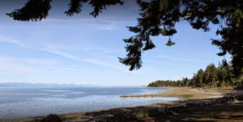

© 2019 Debbie Bartman © 2019 International Urantia Association (IUA)

## 26 to 30 August, 2019

<figure id="Figure_1" class="image urantiapedia image-style-align-left">

</figure>

Hello friends!  Two years have passed and it’s now time for our Biannual Vancouver Island Urantia Friends Campout! We have been holding this event since 2007 and, over the years, have had the pleasure of meeting Urantia Book readers from around the world. It’s normally a small group affair of about 15-25 people but we can always accommodate more.

This year, we will be meeting at [Miracle Beach Provincial Campground](http://www.env.gov.bc.ca/bcparks/explore/parkpgs/miracle_bch/) from Monday, August 26 to Friday, August 30 (four nights). This is a beautiful space and the ocean is spectacular! The campground is midway between Courtenay and Campbell River (an hour or so north of Nanaimo) on the east coast of Vancouver Island, British Columbia.

We have reserved a group campground situated on about two acres of flat land surrounded by thick forest on all sides. You can bring a tent or a small to medium sized camper vehicle. Toilets (outhouses), fresh water, and picnic tables are on-site, but there’s no electricity so you’ll have to rough it a bit. Fortunately, free hot showers and flush toilets are a short walk away. There’s a long beach of pebble and sand so don’t forget to bring your swimsuit and beach shoes. It’s also a popular spot for kayaking or canoeing, and there are about 2 km of walking trails.

<figure id="Figure_2" class="image urantiapedia image-style-align-right">

</figure>

It’s best to be well prepared because the nearest store is 5 km (3 miles) away and the nearest town is over 20 km. The campground has bags of ice available but not much else. Campfires are usually not allowed during the summer months, but propane-burning fire rings were acceptable in the past (always check with the park supervisor).

Please let me know if you want to do a workshop, study group or presentation. There is no over-riding theme; all ideas and topics are welcome. Presentations usually last 1-2 hours, one in the morning and another in the afternoon. The rest of our time is spent either in recreation or discussing all things Urantia. On Thursday evening, we will have a potluck Remembrance Supper honoring our friend, Creator-brother-father Michael.

Looking forward to seeing you there!

**Registration**

Registration fee is $65.00 Canadian which is $50.00 US. The price includes camping fees for the week. For registration and further info please contact Debbie at [nebadon373@hotmail.com](mailto:nebadon373@hotmail.com)

Love,  
Debbie Bartman

## References

- Tidings newsletter: https://urantia-association.org/about-tidings-newsletter/
- This issue: https://urantia-association.org/newsletter/tidings-march-2019/
- This article: https://urantia-association.org/vancouver-island-campout