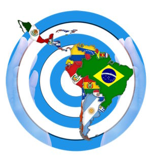
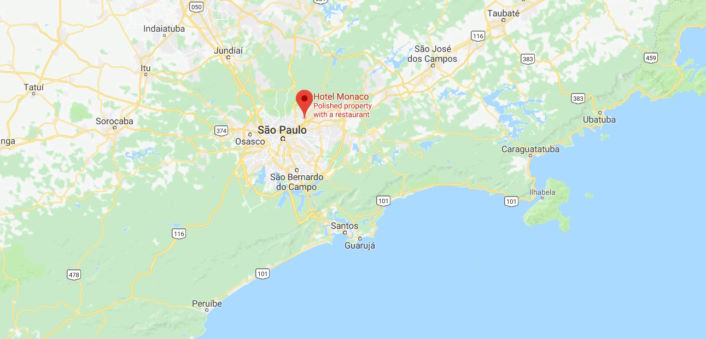

© 2018 Enrique Traver © 2018 International Urantia Association (IUA)

<figure id="Figure_1" class="image urantiapedia image-style-align-left">

</figure>

We are rapidly approaching the time when the 2nd Latin American regional conference will be held in São Paulo, Brazil on November 1—4, 2018. The theme for the conference will be “_Living the Teachings_” and will take place at the Monaco Hotel, in the city of Guarulhos (one of the towns of São Paulo) and which is very close to the São Paulo International Airport (Guarulhos).

This will be a unique opportunity to share experiences and knowledge, discover new friends and strengthen relationships, and learn from each other different ways of seeing the teachings of _The Urantia Book_ from the varying perspectives of our different cultures.

There will be many activities—some recreational, others dedicated to study, including presentations, workshops and group prayer. And, of course there will be plenty of time for relaxation, socializing, and entertainment.

The purpose of the event is not intended to establish a daily routine for living the teachings, but it will encourage discussion and reflection on how we may strengthen and develop spirituality in the individual, flowing into further discussions and debate on the individual’s role in the broader community in relation to the fostering and development of cosmic consciousness. Finally, we intend to discuss practical aspects for developing and forming study groups as well as dissemination of the teachings of the fifth epochal revelation.

We anticipate that conference attendees will represent 15 different Latin American countries, as well as other regions of the world.

The event will be held in three languages with simultaneous translations into Portuguese, Spanish and English. All presentations and written works will also be produced in these three languages. To follow the event in your preferred language you must have your own device (phone, tablet or notebook) as well as a headset to connect to one of the three Zoom meeting rooms that will be transmitting the entire conference to the world.

The Monaco Hotel offers double rooms, complete with all the comfortable facilities. You can choose to have an exclusive apartment (individual price, USD $70.00 per day) or share with friends or family (event package price.)

The package negotiated by the conference organizers includes all meals (breakfast, lunch and dinner) for R $184.00 per day, per person, which based on the current dollar exchange rate (3.70 R \$ / 1USD) is approximately USD $50.00 per day, or a total of USD $150.00 for the three-day event. There is an additional registration fee of R $111.00 (USD $30.00) per person. So the total cost for the conference is approximately USD $180.00.

Although the cost is reasonable, if you still have economic difficulties restricting you from attending, you may apply for a sponsorship that could cover the partial or total fee. Send your request to [contato@urantia.com.br](mailto:contato@urantia.com.br).

<figure id="Figure_2" class="image urantiapedia">

</figure>

If you wish to take a tour of Brazil, be sure to plan your tour before or after the conference. Our organizational team will be happy to advise you on a suitable tour package.

For further information please visit the conference website at: [urantiaconference.com](http://urantiaconference.com/) or send an email to [contato@urantia.com.br](mailto:contato@urantia.com.br).

Please come and join us! We look forward to seeing you in November!

Enrique Traver  
President UAB—Brazil

## References

- Tidings newsletter: https://urantia-association.org/about-tidings-newsletter/
- This issue: https://urantia-association.org/newsletter/tidings-june-2018/
- This article: https://urantia-association.org/latin-american-conference-2018-brazil