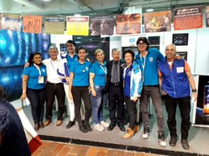

© 2019 Esperaza Tovar © 2019 International Urantia Association (IUA)

<figure id="Figure_1" class="image urantiapedia image-style-align-left">

</figure>

Once again, the Urantia Bogotá Association, with the support of Urantia Association International, was present at the renowned International Bogotá Book Fair: FILBO 2019.

This year we had a large stand located in one of the best pavilions of the fair—the pavilion of the universities—that brought us a more intellectual audience with deeper questions than usual. We were challenged to broaden our answers and discussions, therefore devote more time to each visitor. It was very pleasant to talk with the young university students of this city, with their outstanding thirst for knowledge and desire to understand things of a spiritual nature.

Of the 605,000 visitors who attended the fair this year, we handed out brochures to 6,000 people. These contained summary information on each part of the book. Another 30,000 flyers were given to the visiting public, inviting them to learn about the book.

During the book fair, three talks were given about _The Urantia Book_, more than 70 books were sold, and more than 100 email addresses were collected.

We had the usual enthusiastic collaboration of volunteers; 33 from Bogotá, three from Cali, Colombia, and one from Arequipa, Peru.

After the book fair, we held an introductory virtual talk about _The Urantia Book_ with those who provided us with their contact information.

Warm regards,  
Esperaza Tovar Alvarado  
Secretary Urantia Bogotá Association
 

## References

- Tidings newsletter: https://urantia-association.org/about-tidings-newsletter/
- This issue: https://urantia-association.org/newsletter/tidings-december-2019/
- This article: https://urantia-association.org/bogota-international-bookfair-2019