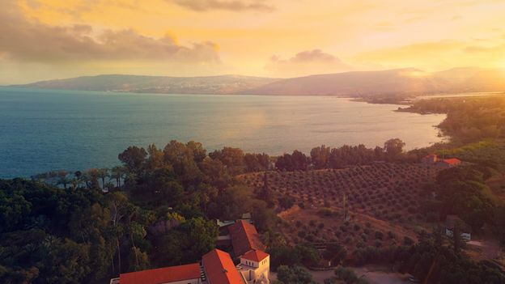

© 2021 Gabriel Rymberg © 2021 International Urantia Association (IUA)

<figure id="Figure_1" class="image urantiapedia">

</figure>

## Sharing Jesus’ life and teachings and building a temple of the unseen Father near the Sea of Galilee

The _Center for Unity_ is a live endeavor, and the concept has been changing and evolving. Seven years ago, I woke up and right before I opened my eyes, I saw the Sea of Galilee just like this picture. While there was no doubt in my mind it was the Sea of Galilee, nothing else was clear.

Several months later, a friend from Switzerland came to visit and asked me to take her sightseeing around the Sea of Galilee. We went hiking around the Mount of Beatitudes and climbed a hill. When we reached the top, I was staring down at the Sea of Galilee, and it looked exactly as in my dream.That’s when a vague idea started to take place. I felt as if I wanted to do something in connection with the location of the Sea of Galilee but kept asking myself what my next step would be; I have been asking myself that question ever since. I would ask and then listen to see if I could get some clarity that might indicate that “this is the way.”

In 2016, the emerging idea of the _Center for Unity_ was called _Urantia Holy Land Pilgrim Center._ It was to be a top-notch hotel and conference facility. By early 2017, the words “a temple for our Father” came to mind.

The hotel and conference center proved to be a dead-end. We tried to acquire land to build a hotel and we even prepared a detailed business plan to finance it, only to realize that what we really wanted to build was a temple for the Father, a house of worship.

As I write these words, I’m filled with the joy of knowing that if this is our Father’s will, and if this is the right time, in less than five years we will inaugurate on Earth the third temple of the unseen Father.

I started sharing this vision and found people were attracted to it and wanted to contribute. Yet the vision was still blurry, and I was confused. And so were the people I attracted. Suffice to say we had some very challenging team meetings before I pulled the plug and resorted to waiting for more clarity.

By July 2017, the second piece of the puzzle presented itself. Alongside the temple, there would be a _Multimedia Center_ dedicated to spreading the Master’s teachings to all people, highlighting the existing unity in all faiths, an immersion in personal experience, and sharing the Master’s teachings as they are reflected in those various faiths.

Yet that was not the last word. A larger vision was waiting to emerge. In March 2020, the entire world went into lockdown due to the outbreak of the COVID-19 pandemic. In one day, the entire world economy slowed, and so did almost all travel. A year and half later travel had somewhat bounced back but still, the number of pilgrims arriving to the Sea of Galilee is only about ten percent of pre-pandemic levels. How long before things get back to the “new normal” is anyone’s guess.

The next piece of the puzzle had to do with making the “Multimedia Center” accessible online, to anyone in the world. It is now called the **_Jesus Metaverse_** (which, according to a Nvidia Blog, means “…a shared virtual 3D world, or worlds, that are interactive, immersive, and collaborative.”)

It is now August 2021, and we have concrete plans and a team to actualize this dream. We will soon share the full details of the _Center for Unity_ with the Urantia Book student community.

For more information visit our website at: [thecenterforunity.org](https://thecenterforunity.org/) or email us at: [contact@thecenterforunity.org](mailto:contact@thecenterforunity.org).

## References

- Tidings newsletter: https://urantia-association.org/about-tidings-newsletter/
- This issue: https://urantia-association.org/newsletter/tidings-september-2021/
- This article: https://urantia-association.org/center-for-unity