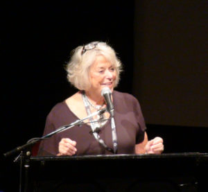

© 2018 Gaetan Charland © 2018 International Urantia Association (IUA)

<figure id="Figure_1" class="image urantiapedia image-style-align-left">

</figure>

Sue Tennant, long-time supporter of the Urantia revelation and a dear friend of mine and to many reading this, left this world for the mansion world adventure in March this year.

I meet Sue in 1999 at her home in Silver Springs for a meeting with other readers for the chartering and inauguration of the Urantia Association of Canada. From that first meeting, I knew that Sue Tennant was one of those people dedicated to the welfare of humanity; she was generous, humble and hardworking, and was a woman driven by her love for her fellow brothers and sisters and by her faith in God and his plan.

She gave a good part of her later life promoting unity in the Urantia movement by providing retreats for young and seasoned readers alike at her home in Silver Springs. Always would she minister to everyone with care and attention—as if every person was part of her own family.

Sue acquired many skills during her life that enabled her to be of real service to her fellow men and women. She was loving and inspired in all she accomplished; she was happily married for almost 50 years and was also a mountain climber, Interfaith minister, philanthropist, culinary and wine enthusiast and a devoted mother.

Sue’s legacy of loving service lives on in her pivotal work as founder of FreeSchools World Literacy where thousands of young girls in Bihar, India have learned to read for as little as $15 a year. FreeSchools also became a registered charity in Canada, USA and Australia.

Sue was a true expression of love and faith through service to others, she will be greatly missed. Farewell to our dear friend Sue, until we meet again…

## References

- Tidings newsletter: https://urantia-association.org/about-tidings-newsletter/
- This issue: https://urantia-association.org/newsletter/tidings-september-2018/
- This article: https://urantia-association.org/farewell-sue-tennant