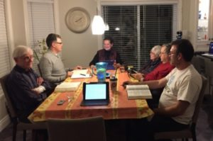

© 2017 Gaétan G. Charland © 2017 International Urantia Association (IUA)

<figure id="Figure_1" class="image urantiapedia image-style-align-left">

</figure>

Hello to study group hosts and participants. In the November edition of _Tidings_, I wrote an article on [Study Groups and Young People](http://urantia-association.org/newsletter/tidings-november-2016/#23084) which attracted the attention of a few readers. I have obtained permission from these readers to publish their comments so you will have the opportunity to read what they have said about this topic. Please feel free to respond to those comments or to any articles I write, or have written about study groups that are published in this newsletter.

There is a great need for spiritual nourishment in this world. For _The Urantia Book_ to succeed in its mission “_to expand cosmic consciousness and enhance spiritual perception_” \[Foreword 0:0.2, page 1.2\] many more study groups are needed. But it is also necessary for study group hosts to stay focused on the goals of striving to make study groups effective tools in the training of leaders and teachers, and assisting students in learning how to integrate the teachings of _The Urantia Book_ into their lives.

In my own desire to increase the effectiveness of the study group that I have been hosting for many years, I have introduced a variety of reading and studying techniques in an effort to insure that the interest of nRew and old readers alike would not falter. While I have not always been successful, I have learned many lessons that have kept the group strong all these years.

We have developed a new innovation for our group due to the fact that there are numerous reasons why people cannot attend, not the least of which is that the winter in Quebec can often make travel hazardous. Therefore we have made our group accessible via a teleconferencing program called Zoom. Mind you, it’s not a full-fledged online study group where anyone from around the world can join, but occasionally we have visitors who want to see what a study group is like.

<figure id="Figure_2" class="image urantiapedia image-style-align-right">

</figure>

For this experience, the only things needed are a computer with a camera and microphone or a tablet that can sit close to the area where the group is meeting and, of course, a subscription to Zoom which is simple to arrange and not very expensive. I have a subscription that I could share with anyone who may be interested as long as you do require a meeting at the same time as ours. This is a great way to attract new members to your group. It offers them a way to participate if they are too far away to travel to any groups. It can also be a good introduction to a study group while being minimally intimidating to some new readers.

In this day and age with online virtual study groups, there are really no reasons why any reader cannot participate in a study group. The Study Group Directory itself lists 74 virtual groups in different languages as well as 368 regular study groups. The Study Group Directory’s team has managed translations in five languages in addition to English. Your browser’s default language is automatically displayed if it is supported, or you can select a language from a pull-down menu. If your group is not yet listed in the directory, please list it so readers in your area can find you.

As for young readers, we are still contemplating on how to help them create their own study group, or at least attract them to the existing one. The Study Group Committee is working to create a survey that will be sent to every reader on our database asking them a few questions about their interests and ideas about study groups. If you have any suggestions about the type of questions we should ask, please let me know.

Enjoy your study group!

Gaétan G. Charland  
Study Group Chair  
Urantia Association International  
[studygroups@urantia-association.org](mailto:studygroups@urantia-association.org)

## References

- Tidings newsletter: https://urantia-association.org/about-tidings-newsletter/
- This issue: https://urantia-association.org/newsletter/tidings-march-2017/
- This article: https://urantia-association.org/study-groups-key-tool