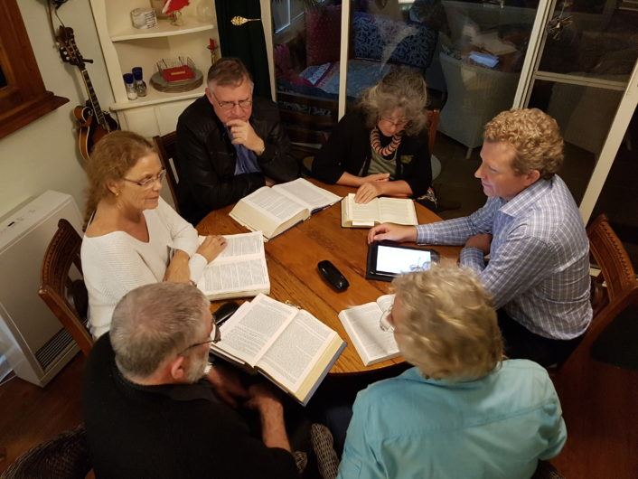

© 2022 Gaétan Charland © 2022 International Urantia Association (IUA)

<figure id="Figure_1" class="image urantiapedia image-style-align-left">

</figure>

As a student of _The Urantia Book_ and longtime host and member of study groups, I have always been more than interested in their value to the mission of _The Urantia Book_. I have throughout the years organized many activities to promote not only the creation of new study groups, but also to explore their purpose in the plan to disseminate the teachings of the book. I also believe that study groups are an ideal place to create new kinds of spiritual leaders and teachers who are in harmony with the teachings of Jesus.

In this article, I list some of the reasons why it is important for each reader to participate in a study group and what I believe is their mission, philosophy, and purpose. Together, we will explore the question: **“Why should I participate in a study group?”**

This question is quite legitimate, and I try to give a reasonable answer supported by _The Urantia Book_, particularly by the life of Jesus. I also draw from the guidelines issued by _The Urantia Book_ revelators as stated in the Publication Mandate. I will also share with you many testimonies of study group hosts and their members who were deeply touched by their participation in a study group.

We all know that, after reading _The Urantia Book_, the complexity of the concepts stated, the depth and diversity of the truths revealed, and the language and words used to describe what is revealed can very often lead us to understand only a small part of what we have read. Because of all this complexity, if we are isolated in our study, it is easy to construct and crystallize an incomplete conception of the truths revealed in the book.

Many hosts and study group members have often found that some long-time readers who have not attended study groups have great difficulty integrating into a study group because of the crystallized understandings they have acquired over years of staggered reading in isolation, a situation aggravated by the lack of sharing with other readers. This is one of many reasons why it is important for readers to join a study group if they wish to deepen their understanding and participate in the mission of the revelation.

Association with other readers in the context of a study group protects us from the crystallization of concepts and perceptions, helps us to clarify, broaden, and deepen our understanding of the concepts and truths revealed in _The Urantia Book_. It stimulates the reader’s intellectual and spiritual growth, encourages the sharing and integration of spiritual truths, strengthens our faith and trust in a divine plan of eternal adventure, helps reduce confusion of ideas, encourages spiritual brotherhood, helps expand cosmic awareness, and enhances spiritual perception.

In the introduction to _The Urantia Book,_ the revelators inform us about the state of our minds, and here is what a Divine Counselor tells us:

> IN THE MINDS of the mortals of Urantia — that being the name of your world — there exists great confusion respecting the meaning of such terms as God, divinity, and deity. Human beings are still more confused and uncertain about the relationships of the divine personalities designated by these numerous appellations. [Foreword [UB 0:0.1](/en/The_Urantia_Book/0#p0_1)]

Who among us has not found it difficult to understand what this Divine Counselor was telling us in the Foreword of the book? Who among us, after several readings, still does not have some difficulty understanding certain concepts, let alone appropriating spiritual truths?

The revelators have also given certain guidelines to better supervise the wise and progressive dissemination of the revelation, here are two of the guidelines given in the [Publication Mandate](/en/article/The_Publication_Mandate).

> The book is being given to those who are ready for it long before the day of its world-wide mission. Thousands of study groups must be brought into existence and the book must be translated into many tongues. Thus, will the book be in readiness when the battle for man’s liberty is finally won and the world is once more made safe for the religion of Jesus and the freedom of mankind.

## Thousands of study groups must be brought into existence

Why thousands of study groups? Almost all the world’s religions have used study groups for hundreds of years as an effective way to study and disseminate their teachings, and this is how they have been able to spread throughout the world with minimal obstacles of any kind. The revelators have certainly observed how the world religions have spread in our world and have suggested to us this way of doing things after having seen the effectiveness of this method of dissemination in our cultures.

Study groups are very easy to set up and offer a simple and progressive way of learning. They are a very wise strategy for disseminating the teachings of _The Urantia Book_ without arousing resistance from various religious groups or political systems in many countries of the world. They integrate themselves well in any culture, are free, and do not require any special location to meet or need particular materials to attend; all that is needed is a book and the will to participate in a very important worldwide mission.

As readers, we have been offered a great opportunity, which is to participate in one of the most important planetary projects in existence today, but we also have a great responsibility to share what we have so generously received, and one way that is easily within our reach is to start a study group, or at least become one of its participants. We can hardly imagine and fully realize the spiritual benefits of such an action, or the positive influence that our participation in a study group can have on those around us. Too often we underestimate the consequences of our actions and the intellectual and spiritual influence the revelation has in our lives.

Here is what the revelators say:

> (You) who have dedicated (your) lives to the service of the Book and the Brotherhood can little realize the import of (your) doings. (You) will doubtless live and die without fully realizing that (you) are participating in the birth of a new age of religion on this world. (Publication Mandate)

In the life of Jesus, we can see how he trained his apostles. If we take a close look, the method used for the training of the apostles was very much like that of a study group, where everyone, after the teaching of the Master, would meet in a group to discuss their understanding of the lessons received. All this was done in private under the supervision of Jesus and lasted for several years. And even after all these years of training and teaching by the Master, they still found it difficult to understand his teachings. So, imagine our situation, do we believe that studying alone in isolation will help us succeed in understanding what _The Urantia Book_ is trying to teach us? I doubt it!

## What readers say about their experiences in a study group

I have heard a multitude of testimonials from readers about the benefits of a study group, but to list them all here would take several pages of text. For the sake of brevity, I have selected and summarized some of these testimonials. Here is what they say:

> The study group is one of the most precious moments of my week. It reconnects me with a fundamental reality, but so often eclipsed, veiled by the routine of daily activities. This fraternal meeting allows me to progress and maintain contact with the highest aspirations of my human life. It is a weekly meeting with my brothers and sisters in spirit with whom I walk, pray, and deepen my faith and my knowledge of spirituality. It is a great privilege to feel understood and supported by this brotherhood for which I feel a great attachment. The study group of The Urantia Book readers’ fellowship is for me like a spiritual bridge over space and time.

> Since I read _The Urantia Book_, I know that God indwells me through the Thought Adjuster, but since I have been a diligent member of a study group, I now feel God’s presence in me and I live more and more according to his will.

> The study groups have helped me to improve my understanding of the 5th Revelation. The reading of the texts and the exchanges between readers bring me light and guide me in my daily actions. The meetings each week are necessary appointments because by reading these texts and by uniting in the search to find God, they create a beautiful solidarity. This experience of fraternity encourages us to live it in our surroundings and through service.

**Here are some other comments**

- The study group helped me deepen my understanding of the teachings.
- It has made a significant difference in my life.
- It has changed my perceptions of _The Urantia Book._
- It opened me to a better spirituality.
- It made me discover the book again.
- It has been an immense source of inspiration.
- It taught me the importance of brotherhood.
- I finally understood the scope of the message of the gospel of Jesus.
- I feel more and more like a son of God.

There are tremendous benefits to starting a study group or becoming one of its participants.

<figure id="Figure_2" class="image urantiapedia">

</figure>

## Mission, philosophy, and purpose of a study group

Many study groups in existence today, and those that will be formed in the future, can benefit from a more enlightened vision consistent with the mission of the revelation which is, in essence, the dissemination of the teachings of _The Urantia Book_. To be consistent with the book’s mission, every study group should be guided by the directives issued by the revelators, which are included in the Publication Mandate,

In a study group where the host knows the mission and purpose of the study groups, the approach of the group will certainly be more effective in achieving goals that will significantly contribute to the realization of the mission of the revelation. So, let’s take a closer look at the mission, philosophy, and purpose of study groups as they might be defined in accordance with the teachings of _The Urantia Book_ and specifically in relation to the teachings of Jesus and the Publication Mandate.

### Mission and philosophy

The mission of a study group in harmony _with The Urantia Book,_ is to expand cosmic consciousness and enhance spiritual perception while bringing to life the Gospel of Jesus based on the Fatherhood of God and the brotherhood of man.

Philosophically and spiritually, study groups could be defined as a gathering of sons of God in association with the Spirit of Truth who unite in a sincere desire to study and bring to life the teachings of _The Urantia Book_. This teamwork is fostered by the Union of Souls [[UB 160:2.7](/en/The_Urantia_Book/160#p2_7)]. By such teamwork, the teachings of _The Urantia Book_, and specifically the gospel of Jesus, will be effectively disseminated and will transform the world.

We need to remember that we are in a relationship with a revelation that is under Michael’s supervision. When we contribute to this revelation through study groups, and when we gather in a context of study and sharing, Michael is present among us. We could say that we are in a sacred space where the Spirit of Truth not only accompanies us but collaborates effectively with our divine Monitor to spiritualize us. It is also likely that celestial observers are watching us while our guardian angels rejoice in our association as potential sons of God.

A study group is much more than just a social gathering of readers who wish to fellowship and study with people of common interest. Not only does it have an intellectual nature, but also a spiritual dimension that goes far beyond our mortal understanding. Study groups have immense repercussions and influence not only for our family members but also our social and cultural environments. They are the light in the darkness of a materialist and secularist world. They are the support and the ally of the revelation to our planet while giving hope to future generations of religionists. They are the melting pot where the ambassadors of the spiritual brotherhood are formed.

Study group hosts are most likely to be under the supervision of the seraphic Religious Guardians [[UB 114:6.7](/en/The_Urantia_Book/114#p6_7)]. Their contribution to the mission of the revelation is assuredly imbued with a sacred nature that is blessed by our planetary supervisors. Study group hosts and their members are associated with a revelation of truth that is part of the natural evolution of religion on this world. They are the quiet, patient leaders and supporters of the revelation who advance the truth in all areas of society.

In Paper 195 we are told:

> The world needs to see Jesus living again on earth in the experience of spirit-born mortals who actually reveal the Master to all men. [[UB 195:10.1](/en/The_Urantia_Book/195#p10_1)]

## Study Group Goals

Study groups are certainly an appropriate place to learn and practice this statement. Therefore, it is necessary that study group hosts have an effective and practical knowledge of the teachings of Jesus as described in _The Urantia Book._ The most important message Jesus left to his apostles and followers to free our world from the effects of Lucifer’s rebellion has been virtually replaced by another message that has focused on the crucifixion, the resurrection, and the atonement doctrine.

The message that makes up the essence of the Gospel of Jesus and that we need to bring to life today is the **Fatherhood of God and the brotherhood of man**. This is a simple but extremely powerful message when combined with a sincere desire to do God’s will and to be guided by the Spirit of Truth. Study groups can and should create an environment conducive to the study and practical acquisition of this truth.

Here is what the Publication Mandate tells us in this regard:

> The future is not open to (your) mortal comprehension, but (you) will do well to diligently study the order, plan, and methods of progression as they were enacted in the earth life of Michael when the Word was made flesh. You are becoming actors in an ensuing episode when the Word is made Book. Great is the difference in these dispensations of religion, but many are the lessons which can be learned from a study of the former age.

> (You) must again study the times of Jesus on earth. (You) must carefully take note of how the kingdom of heaven was inaugurated in the world. Did it evolve slowly and unfold naturally? Or did it come with a sudden show of force and with spectacular exhibition of power? Was it evolutionary or revolutionary?

In these two passages, reference is made to the life of Jesus, and they urge us to study in great detail the order, plan, and methods of progression as they were applied during Michael’s life on earth. They also invite us to study the time of Jesus and how he inaugurated the kingdom of heaven on this world.

The Publication Mandate goes even further by encouraging us to develop ways to train leaders and teachers. What better place than study groups to accomplish and achieve this important goal in concert with Urantia Book schools that have been created and made available to us.

By coordinating and organizing study groups with the goal of bringing the teachings of _The Urantia Book_ to life, and to foster the training of teachers and leaders, we will provide a great service to the spiritual mission of the revelation and contribute to its success.

As a study group host, we have a responsibility to the revelation, so it is important to engage our group in a way that supports its mission. We need to deepen our knowledge of the pedagogy Jesus used when he taught not only his apostles but also the people he met on his travels. To be more effective in facilitating a study group, it is highly recommended that the host and the members of their group participate in courses that are currently available in various Urantia Book online schools.

We must remember, a study group is not just a social gathering where we simply read, but a place where we gather to study and learn how to bring the teachings of _The Urantia Book_ to life. Imagine a world where many thousands of study groups all over this planet will one day permeate religions, society, philosophy, education, science, finance, industry, and politics with their spiritual and intellectual influence, then will the world be at the dawn of the Era of Light and Life.

I conclude by inviting you to meditate on these two quotes.

> The call to the adventure of building a new and transformed human society by means of the spiritual rebirth of Jesus’s brotherhood of the kingdom should thrill all who believe in him as men have not been stirred since the days when they walked about on earth as his companions in the flesh. “[[UB 195:10.6](/en/The_Urantia_Book/195#p10_6)]

> Religion does need new leaders, spiritual men and women who will dare to depend solely on Jesus and his incomparable teachings. “[[UB 195:9.4](/en/The_Urantia_Book/195#p9_4)]

I pray this article will help you to better understand the importance of the spiritual mission and purpose of study groups. Your continued contribution to the revelation as either a host or participant is of immense value to its success. Don’t wait for the perfect time to start one or to become a member of an existing group, the time is now!

## References

- Journal newsletter: https://urantia-association.org/journal-online-archives/
- This issue: https://urantia-association.org/newsletter/journal-may-2022/
- This article: https://urantia-association.org/why-participate-in-study-group