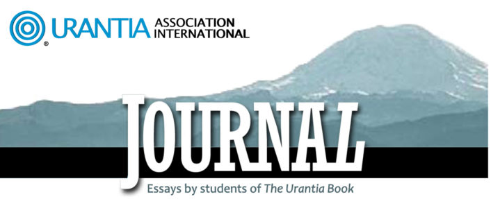
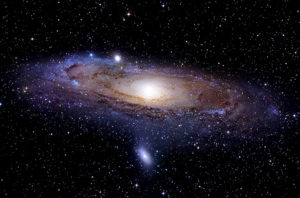
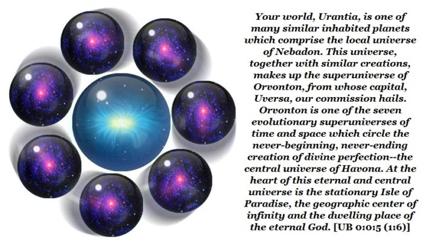
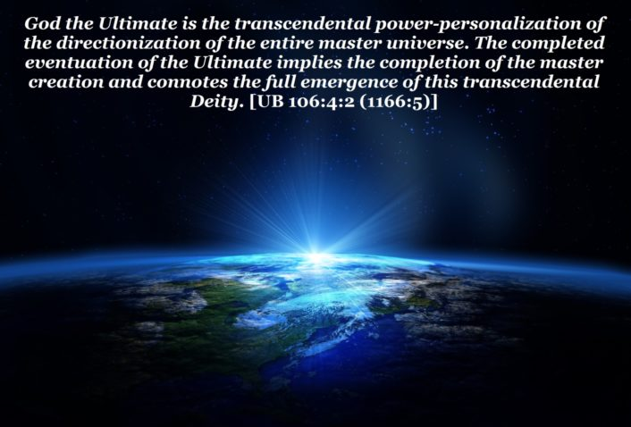
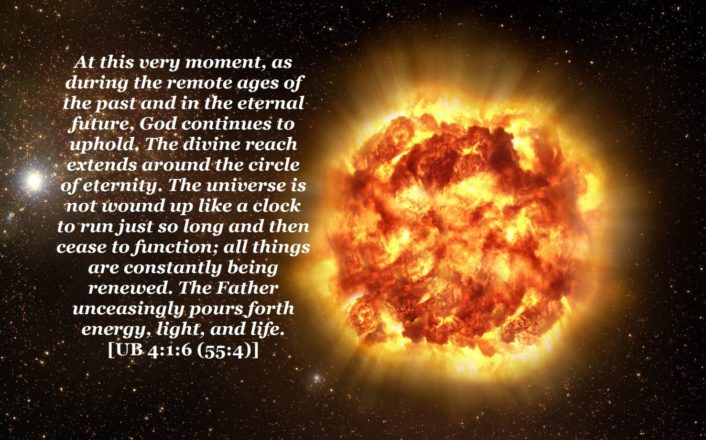

© 2017  © 2017 International Urantia Association (IUA)

<figure id="Figure_1" class="image urantiapedia">

</figure>

## In This Issue

- Journal Editorial November 2017 – Suzanne Kelly, USA
- Massive Orvonton – Nigel Nunn, Australia
- Animating the Human Mind with Cosmic Software – Julian McGarry, Australia
- The Supremacy of the Grand Universe – Stuart Kerr, USA
- The Ultimacy of the Master Universe – Stuart Kerr, USA
- The Absoluteness of the Cosmos Infinite – Stuart Kerr, USA
- The Circle of Eternity – Stuart Kerr, USA
- About the Journal

## Journal Editorial November 2017

_Suzanne Kelly, USA_

<figure id="Figure_2" class="image urantiapedia image-style-align-left">

</figure>

Greetings fellow readers. This year brings changes to our _Journal_ format, which is now an online publication and will be produced twice a year, with an occasional Special Issue containing articles and presentations from the many outstanding conferences around the world.

This issue focuses on time and space, distance and destiny. Our first “out of this world” contribution is from Nigel Nunn, Australia, and is an enormously thrilling and informative ride through **_Massive Orvonton_**_._ Utilizing star maps and a coloss-odometer, Nigel gives us a whole new understanding of star travel from a “You are here and it will take you this many light years to get there perspective.” _S__ince it’s 250,000 light years from the outskirts (near Nebadon) to Uversa, and since Uversa is centrally located, should we assume that Orvonton extends (more or less) a similar distance on the opposite side? If so, then this implies a ‘length’ for Orvonton on the order of **400,000 to 500,000** light_ _years_. And if this isn’t enough to gravita you, Nigel’s dance with the divisions of matter will spin you around at Force Organizer speeds and give you a new perspective: _“__If we were Force Organizers looking down onto Orvonton (from above), what would we see? Since each major sector has its own center of rotation” [[UB 15:3.12](/en/The_Urantia_Book/15#p3_12)], and all ten “are in orbit about Uversa” [[UB 15:3.13](/en/The_Urantia_Book/15#p3_13)], I imagine we’d see something like ten electromagnetically **bright** spirals of gravita, embedded in ten whirlpools of electromagnetically **dark** ultimata:”_ Stellar article, Nigel!

[Read more](/en/article/Suzanne_Kelly/journal_editorial_november_2017)
 

## Massive Orvonton

_Nigel Nunn, Australia_

<figure id="Figure_3" class="image urantiapedia image-style-align-left">

</figure>

As students of the Urantia papers, should we take seriously “the Isle of Paradise?” What about “space potency” and “force organizers?” If we can accept such things, then it seems reasonable to take one more step, and take seriously their description of the ultimaton, “the first measureable form of energy.” [[UB 42:1.2](/en/The_Urantia_Book/42#p1_2)]

Given all this, we find ourselves face to face with a fascinating challenge: how to connect ultimatons to the actual physics and technologies that allow mobile phones and GPS satellites to work. As we know, the chips inside our phones exploit some kind of “quantized mechanics,” while the satellite navigation system requires the sort of relativity “faintly glimpsed” [[UB 195:7.5](/en/The_Urantia_Book/195#p7_5)] by Einstein.

Sadly, our current best ideas for explaining how all this works—our “standard models” for quantum field theory and relativity—are incompatible with each other. But what if _The Urantia Book_ could show these two theories how to “play together?” This is the question I explore in the first half of an upcoming video. In the second half, I consider some of the implications of what _The Urantia Book_ reveals, first with regard to black holes, and then with regard to the Milky Way. The next few pages give a brief preview.

[Read more](/en/article/Nigel_Nunn/massive_orvonton)
 

## Animating the Human Mind with Cosmic Software

_Julian McGarry, Australia_

<figure id="Figure_4" class="image urantiapedia image-style-align-left">

</figure>

Nigel has a lovely way of making something rather complex into something accessible and understandable for the average mortal. His explanation of how the seven adjutants prepare our minds for the subsequent indwelling of our Thought Adjuster and the Spirit of Truth was really helpful to me. As children of the information age, the world of computers offers us many metaphors that can help us grasp the processes of this “mind arena of choice.” [[UB 118:7.5](/en/The_Urantia_Book/118#p7_5)] I see the human brain as being the “hardware” that the Life Carriers have laboured for millions of years to develop. For any hardware to work, it must be capable of detecting, receiving, and processing the “software” that animates it. In our case, that software begins as a fundamental operating system—the seven adjutants—circuits radiating a level of consciousness from the Divine Minister throughout the local universe, animating biochemical hardware that is capable of responding to their rhythmic pulsations [[UB 36:5.5](/en/The_Urantia_Book/36#p5_5)]. Without a properly functioning operating system, a computer is not capable of performing the higher functions encoded within sophisticated software. Likewise, we would not be able to make superior moral choices and participate in the worship of our heavenly Father—building a soul—were it not for the potential created by the mind circuits of our local universe Mother Spirit.

Another metaphor that helps me to understand this amazing process is the common radio receiver. It is a box that sits in our homes or pockets that is capable of receiving and when animated, emitting intelligent data. No matter how fancy the box is, no matter how faithful the speakers and amplifiers are for reproducing sound, it will forever be mute unless it has a receiver that is capable of being tuned into the broadcast signal. It appears that the cerebral cortex is the latest hardware that humans possess that enables them to detect the rhythmic pulsations of wisdom and worship. Our neocortex enables us to literally think about our thinking, be aware of our awareness, or be conscious of our consciousness (ie. superconsciousness) [[UB 130:4.9](/en/The_Urantia_Book/130#p4_9)]. We have the right machinery and the right software to develop the three cosmic intuitions, the basic platform from which we can make choices. And then at the tender age of 5 or 6, our Father downloads the ultimate program, our Thought Adjuster [[UB 108:2.1](/en/The_Urantia_Book/108#p2_1)], which can only be accessed at the superconscious level [[UB 110:1.2](/en/The_Urantia_Book/110#p1_2)] and can only adjust our thinking if we already possess the right operating system humming along nicely.

So what does that make the Spirit of Truth?…an augmentor?..a transformer? [[UB 143:2.4](/en/The_Urantia_Book/143#p2_4)]. It seems to enable us to do something that psychology can’t even begin to explain. Facts and reason become _truth,_ an inner realization or experience of higher reality that goes beyond words, the perfect complement to the Thought Adjuster. From the point of view of mainstream psychology, this is pretty radical stuff! Mind… consciousness being animated from an external source? I wonder if they will ever invent a super MRI machine that will be able to detect the seven adjutants. I guess not, and that is why all of this has had to be revealed to us.
 

## The Supremacy of the Grand Universe

_Stuart Kerr, USA_

<figure id="Figure_5" class="image urantiapedia">

</figure>

Our Paradise Father sets the stage for our particular creation (the Deity realm of Supremacy) as a finite reality; it is conditioned by time and space, it has a beginning and it has a foreordained destiny. This creation is experiential—events occur in time-conditioned sequences, and they are constrained within limiting spatial boundaries. The Universal Father is not restricted or conditioned by the limitations he has imposed on his time-space creations. He is above time and space; he is not handicapped, or bound, by his creation. His reality, as it exists on his eternal abode of Paradise, is absolute reality—it is eternity existence, it is existential. The finite reality that characterizes his Supreme creation can be envisioned as being projected in space and actualized in time, and this reality is intended to be experiencible. The experiential events of time flow ever onward as the moving image of eternity within a finite space that represents the fleeting shadows of Paradise realities.

[Read more](/en/article/Stuart_Kerr/supremacy_grand_universe)

## The Ultimacy of the Master Universe

_Stuart Kerr, USA_

The four outer space levels that complete the boundaries of the master universe around the nuclear core of the grand universe are destined to eventuate—evolve the Deity level of Ultimacy. This absonite level of the Ultimacy of Deity transcends the time-space constraints that characterize the finite grand universe. That is to say, the absonite transcends the time-space constraints of the finite. This superfinite level is both antecedent to and consequent of the finite progressions of the time-space Deity level of Supremacy. It pre-dates and influences the current universe age of finite Supremacy, and it is post-Supreme responsive to those significant events occurring within the seven superuniverses of the grand universe.

<figure id="Figure_6" class="image urantiapedia">

</figure>

Just as God the Supreme is both spiritually and personally present in Havona, God the Ultimate is also present in Havona in an absonite (superfinite) and superpersonal sense. Whereas God the Supreme is exerting a spiritual influence on the time-space creation of the grand universe, God the Ultimate effects his influence in transcendence of time and space to the outer borders the four outer space levels of the master universe. In the same sense that the emergence of the Supreme Being is the culmination of all evolutionary-experiential reality, the Ultimate is the fulfillment of all transcendental-eventuating reality. God the Ultimate is power-superpersonalizing throughout the master universe.

[Read more](/en/article/Stuart_Kerr/ultimacy_master_universe)

## The Absoluteness of the Cosmos Infinite

_Stuart Kerr, USA_

God expresses his creative will on three different “experiential” levels of reality—the finite level of the Supreme, the absonite level of the Ultimate, and the superultimate level of the Absolute. These three levels of universe expression take on different forms and phases of creative Deity expression. The term experiential here designates reality that is subject to evolutional growth, where potential realities must evolve and emerge to become fully actualized, and where perfection is a goal to be achieved. Experiential is used to distinguish these three sub-infinite and non-absolute levels of progressive reality expression from the existential (changeless) and infinite level of eternity—the absolute level of Paradise. Paradise is the eternal center of the universe of universes and the abiding place of the Universal Father, the Eternal Son, and the Infinite Spirit. The three experiential levels of creation are expressive of different modes of Paradise Deity manifestation, and each sub-Paradise level of creation is personalizing a Deity being of expressed divinity. All three of these derivative Deity personalities are not yet fully existent; they are in process of actualization. They have origins, though they are eternal in destiny.

[Read more](/en/article/Stuart_Kerr/absoluteness_cosmos_infinite)

## The Circle of Eternity

_Stuart Kerr, USA_

<figure id="Figure_7" class="image urantiapedia">

</figure>

God inhabits and rules the circle of eternity. His eternal nature is a never-beginning and never-ending circle. The Father exercises ever-expanding consciousness and ceaseless self-realization within this never-ending circle of eternity,

> … _He upholds the worlds in space and swings the universes around the endless circle of the eternal circuit_. [[UB 3:2.2](/en/The_Urantia_Book/3#p2_2)]

Reality is without limitation within the cosmic circle of eternity—it is universal, eternal, absolute, and infinite. Within the eternity cycle, divinity transcends and masters time-space. The universe of universes eternally circles around the Paradise source and center of all things and beings.

God’s purposes and plans for his creation may seem to vary from one universe location to another and they may depend on whether we are looking at their impact on the microcosmic or the macrocosmic aspects of his creation, but looking out from the circle of eternity there is perfect unity of intent and implementation.

[Read more](/en/article/Stuart_Kerr/the_circle_of_eternity)

## About the Journal

<figure id="Figure_8" class="image urantiapedia" alt="journal">

</figure>

The _Journal_ is produced twice yearly and contains essays, articles and study aids by readers and for readers of _The Urantia Book._ Any interpretations, opinions, conclusions, or artistic representations, whether stated or implied, are those of the authors and do not necessarily represent the views and opinions of Urantia Association International, the National or Local Urantia Associations, or the editorial team of the Association's _Journal_.

You can view the entire collection of issues in the archives. All issues before 2017 are downloadable PDF format.

The Journal is currently published in English, French and Spanish. (There are some older issues that were published in Finnish.) You can view the French and Spanish Journals by clicking on the language choices in the pull down menu at the top of the page.

- Subscriptions
- Journal Team
- Submission Policy
- Citation Guidelines

[Read more](https://urantia_association.org/about_the_journal_2)