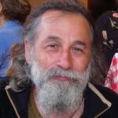
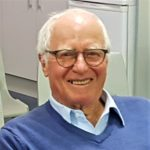

© 2021  © 2021 International Urantia Association (IUA)

<figure id="Figure_1" class="image urantiapedia">

</figure>

# Journal – November 2021

<table cellpadding="0" style="height:auto !important;display:inline;margin: 0;max-width: 100% !important;" cellspacing="0"><tbody><tr><td></td></tr><tr><td style="font-size: 12px; text-align: center; padding: 10px;font-family: sans-serif;">Image by Heung Soon</td></tr></tbody></table>

## In This Issue

- Editor’s Note – November 2021
- Safe and True – David Kulieke, USA
- A Urantian in Second Life – Jean Ascher, Norway
- Application of Scientific Thinking to Cosmology in The Urantia Book – William Wentworth, Australia
- A Cosmic Vision – Claude Flibotte, Canada
- About the Journal
- Ways to Donate to Urantia Association International

## Editor’s Note – November 2021

Welcome to the November 2021 edition of the Urantia Association's _Journal_, a publication dedicated to the thoughts, observations, and experiences of Urantia Book students from around the world.

Our first article, _Safe and True_ by David Kulieke, is a tribute to his life as an educator and a scholar. As presented here, this article is an edited version of the original publication (Urantia Foundation), one that truly deserves a wider audience. David was a passionate advocate of improving education and critical thinking skills. While teaching English literature and writing, he often introduced his students to concepts and ideals expressed in _The Urantia Book,_ giving us some valuable lessons for spreading the teachings without necessarily using the book.

The second article, _A Urantian in Second Life_ by Jean Ascher, also demonstrates how the teachings of the book can be dispersed in an active but casual manner, although in an entirely different context. Jean is an artist and a performer who uses every opportunity to integrate Urantia Book philosophy with his (virtual) circus performances.

[Read more](https://urantia-association.org/journal-editorial-november-2021)

## Safe and True

_David Kulieke, USA_

(_Editor's Note: David Kulieke sadly passed away recently and we send our sincere condolences to his wife, family and friends. David was a long-time reader, educator and scholar and_ _will be sorely missed in the Urantia Book reader community. This article is an edited version of a presentation he gave at The Urantia Book Seminar on Education, March 2017._)

The fifth epochal revelation has been presented before its time. Even if its believers were more successful in finding new readers, only a small fraction of the world's population is ready to read _The Urantia Book._ One might validly ask whether, even at the height of its influence many years from now, a large portion of humanity will actively read the book.

Yet epochal revelations are integral to the slow progress of Urantia towards light and life, especially given all of the missteps this planet has taken. If _The Urantia Book_ is to be of significant influence in bringing light to Urantia, both in its own regard and as a vehicle to revivify aspects of the fourth revelation, its followers must not only bring the book to those who are ready, they must find ways to convey its teachings to the rest of the world.

It takes transformed individuals to transform the world. As _The Urantia Book_ puts it, _"The social characteristics of a true religion consist in the fact that it invariably seeks to convert the individual and to transform the world"_ [160:5.5].

The book also suggests that education is one key to transforming those individuals. We are told, "_Culture presupposes quality of mind; culture cannot be enhanced unless mind is elevated_" [50:6.4].

[Read more](https://urantia-association.org/safe-and-true)

## A Urantian in Second Life

_Jean Ascher, Norway_

_(Editor's Note: Jean Ascher is the translator of_ Urantia Bogen, _the Danish version of_ The Urantia Book_. He also assists students of the book by translating their articles and secondary works into Danish. Jean is a talented circus artist and uses his creative talents in unique ways to spread the Urantia Book teachings.)_

My show name is Yman Juran and I was born inside my first real life virtual game, called Second Life (SL) on the 27th of February 2007. I was almost like a newborn babe, had never before played any computer game, and knew absolutely nothing about any game, its ethics, way of function, style, or what I was able to do and experience, but I was soon to learn.

Second Life is a virtual space where imagination, fantasy, fiction, and historic reality can be expressed with beauty, goodness, and intelligence. But before we start the journey into Second Life, into the grid and on the many simulators (sims), the reader needs to know a few basics. A sim is 256 m x 256 m (65,536 m²) of land and total grid size is 2065 km2. You initially join the world by creating yourself as an avatar. Whatever you select to be, you can always change later. An avatar is basically just a living creature, and you can be whatever you like from superhuman, to angel, magician, elf, yourself, robot, mermaid, dragon, beetle, crow, or even animals such as a seadryke or a snail.  But be aware that behind each living creature you meet is a living personality sitting behind his or her computer somewhere in the world. You can either chat (type) or talk directly with them, even Skype.

[Read more](https://urantia-association.org/a-urantian-in-second-life)

## Application of Scientific Thinking to Cosmology in The Urantia Book

_William Wentworth, Australia_

Ken Glasziou was a scientist and student of _The Urantia Book_ who took pains to make his reasoning comprehensible to the general reader. As one of those general readers, I was often interested in what he had to say. Recently my attention was drawn to something he wrote in an article in 2002 entitled “[Mathematics and Science Catch up with _The Urantia Book_](https://anzura.urantia-association.org/2021/07/29/mining-archives-glasziou/)_,”_ where he was pointing out the significance of mathematics and some of its limitations as well.

Science develops so rapidly that I don’t really know whether his comments are still relevant, but it led me to think about the application of scientific thinking to cosmology as _The Urantia Book_ explains it.

Scientists have been trying to develop a theory which accounts for everything in the cosmos, both large scale and small, from the largest clusters of galaxies to the smallest particles within atoms. Some of the most accomplished physicists and mathematicians have given themselves to this effort, so far without success, since they restrict themselves to consideration of only a part of the whole of which the cosmos consists.

[Read more](https://urantia-association.org/application-of-scientific-thinking-to-cosmology-in-the-urantia-book)

## A Cosmic Vision

_Claude Flibotte, Canada_

My reflection began during a reading of the magazine _Science & Vie_ published August 2021 where there was a photograph of the center of our galaxy in the direction of the constellation of Sagittarius taken, initially, by the Chandra satellite of NASA equipped with an X-ray telescope. Then, Daniel Wong, astronomer, superimposed another picture of the same region in radio waves taken by the South African radio telescope MeerKAT. The combination of the two wavelengths gives a glimpse of the high energy phenomena that prevail there. We can distinguish gigantic magnetic bridges distributing their energy from the galactic center to the other regions of the Milky Way. All this reminded me of the work of the Supreme Power Centers described in Paper 29 of _The Urantia Book_.

**Energy in all this!**

God is not only spirit, he is also energy. It is precisely this image of the center of our galaxy that inspired me to see more clearly the role of the Universe Power Directors, principally their descendants who are active in the universes of time and space, the Supreme Power Centers of the grand universe. They operate in seven groups mentally controlling the whole vast network of functions performed by the Master Physical Controllers and the Morontia Power Supervisors [29:2].

[Read more](https://urantia-association.org/a-cosmic-vision)

## About the Journal

The _Journal_ is produced twice yearly and contains essays, articles and study aids by readers and for readers of _The Urantia Book._ Any interpretations, opinions, conclusions, or artistic representations, whether stated or implied, are those of the authors and do not necessarily represent the views and opinions of Urantia Association International, the National or Local Urantia Associations, or the editorial team of the Association's _Journal_.

You can view the entire collection of issues in the archives. All issues before 2017 are downloadable PDF format.

The Journal is currently published in English, French and Spanish. (There are some older issues that were published in Finnish.) You can view the French and Spanish Journals by clicking on the language choices in the pull down menu at the top of the page.

- Subscriptions
- Journal Team
- Submission Policy
- Citation Guidelines

[Read more](https://urantia-association.org/about-the-journal-2)

## Ways to Donate to Urantia Association International

<table cellpadding="0" style="height:auto !important;max-width: 50% !important;float: left; margin-right: 15px;" vspace="5" hspace="10" align="left" cellspacing="5"><tbody><tr><td></td></tr><tr><td style="font-size: 12px; text-align: center; padding: 10px;font-family: sans-serif;">Artist: Carlos Rubinsky</td></tr></tbody></table>

The world is changing fast and Urantia Association International is in a unique position to foster the Urantia revelation in so many ways. With localized teams in the form of associations springing up across the globe, we are ready to help anyone, anywhere, to study and spread the teachings that we all hold so dear.  

The Association has only one paid staff member to manage and coordinate our worldwide activities. All other services are rendered by devoted students who donate their time (and often their treasure) to the projects that help bring us closer to our heavenly Father. Thank you to our faithful volunteers and donors!  

Here is a selection of ways to donate to Urantia Association: 

[Read more](https://urantia-association.org/ways-to-donate-to-urantia-association-international)