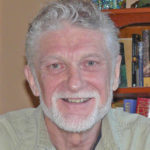

© 2021 International Urantia Association (IUA)

<figure id="Figure_1" class="image urantiapedia image-style-align-left">

</figure>

Welcome to the November 2021 edition of the Urantia Association’s _Journal_, a publication dedicated to the thoughts, observations, and experiences of Urantia Book students from around the world.

Our first article, _Safe and True_ by David Kulieke, is a tribute to his life as an educator and a scholar. As presented here, this article is an edited version of the original publication (Urantia Foundation), one that truly deserves a wider audience. David was a passionate advocate of improving education and critical thinking skills. While teaching English literature and writing, he often introduced his students to concepts and ideals expressed in _The Urantia Book,_ giving us some valuable lessons for spreading the teachings without necessarily using the book.

The second article, _A Urantian in Second Life_ by Jean Ascher, also demonstrates how the teachings of the book can be dispersed in an active but casual manner, although in an entirely different context. Jean is an artist and a performer who uses every opportunity to integrate Urantia Book philosophy with his (virtual) circus performances.

The third article, _Application of Scientific Thinking to Cosmology in The Urantia Book_ by William Wentworth, is a must-read for anyone interested in the unification of science and religion, particularly as religion is portrayed in the book. William addresses the scientific community’s rejection of teleological arguments—that the universe has purpose and design. As he says, “…reality is a far more complicated phenomenon than that assumed by material science.”

Our final article, _A Cosmic Vision_ by Claude Flibotte, is also cosmological in scope. Claude does a thorough job of summarizing the work, function, and circuits of the Universe Power Directors, all the way from Paradise to the inhabited planets. He brings to mind that the Power Directors are servants of God in the material-energy realms and that, “…pure energy of Deity transmutes into many forms and manifestations, not all of which are recognized by us.”

We hope you are inspired by the many different ways in which the philosophy, religion, and cosmology of _The Urantia Book_ can be shared with people from all walks of life.
 

## References

- Journal newsletter: https://urantia-association.org/journal-online-archives/
- This issue: https://urantia-association.org/newsletter/journal-november-2021/
- This article: https://urantia-association.org/journal-editorial-november-2021