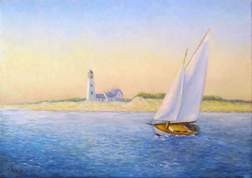
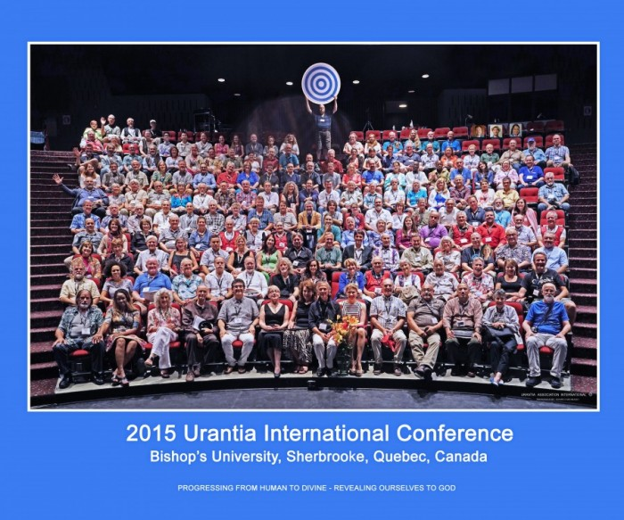
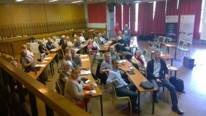
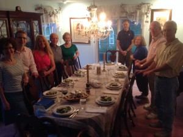

© 2015 International Urantia Association (IUA)

<figure id="Figure_1" class="image urantiapedia">

</figure>

\[caption id="attachment\_17289" align="aligncenter" width="500"\]<figure id="Figure_1" class="image urantiapedia image-style-align-left">

<figcaption><em>Homenaje a Edward Hopper by Carlos Rubinsky</em></figcaption>
</figure>

Homenaje a Edward Hopper by Carlos Rubinsky\[/caption\]

## In This Issue

- President’s Message August 2015 – Chris Wood
- 2015 International Conference – Quebec, Canada – Alain Cyr
- Quebec Conference Reflections – Jeff W.
- Success Stories – Urantia Books Distribution in Malawi – Grevet Moyo
- French National Meeting – Cyril
- Summer Conference in Finland – Raimo Ala-Hynnila
- The Dutch Urantia Annual Meeting Day – Jaap Terra
- Jesus’ Birthday in NY-Pennsylvania – Joyce Anderson
- Spiritual Unity in New England – Meredith Hartt Tenney and Dr. David S. Tenney
- International Service Board at Work – 2nd Quarter Report for 2015
- 2014 Annual Report
- Upcoming Events

## President’s Message August 2015

Chris Wood

<figure id="Figure_1" class="image urantiapedia image-style-align-left">

<figcaption><em>Chris-Wood-framed</em></figcaption>
</figure>

A summer of celebration is turning into an autumn of progress and dedicated effort to extending the reach and depth of the Urantia Revelation.

This summer I attended two conferences which took time to honor the 60th Anniversary of the first printing of _The Urantia Book_ and the first attempts to create a formal social organization dedicated to the Urantia teachings. From those early efforts in Chicago, collective reach has expanded tremendously. _The Urantia Book_ is now available in 17 languages, 24 countries have joined Urantia Association International and 12 more countries have organized communities on the cusp of joining. With the perspective of time we can appreciate just how far we have come and how far we will go in the next 60 years!

In Quebec we held the 9th Urantia Association International Conference hosted by the Urantia Association of Quebec and the Urantia Association of Canada. These International conferences are moments to reflect, study, celebrate, and plot the course for the years to come. The international Service Board met to discuss the challenges of the year ahead, and the International Representative Council met to discuss progress in each country in our Association.

[Read more](/en/article/Chris_Wood/presidents_message_august_2015)

## 2015 International Conference – Quebec, Canada

Alain Cyr

<figure id="Figure_1" class="image urantiapedia image-style-align-left">

</figure>

If you were present at this event, I suspect you took great pleasure in participating. I had the opportunity of being there and I saw a lot of light pouring out from the participants. For all and any who couldn’t make it I offer this short summary.

The plenaries were much in line with the theme of the conference, “_Progressing from Human to Divine”;_ every speaker demonstrated how they let God penetrate their daily lives. The choice of workshops, facilitated either in English or French, was abundant. For the early birds who showed up promptly in the amphitheatre, the ambiance was stirred up with the inspiring music of Rebecca Oswald. Later, the evening entertainment included various singers such as Marc Belleau and his quartet, Bob Solone and his piano session, and a wonderful group of singers from abroad whose names escape me; not to mention a couple of spontaneous jam sessions improvised in one of the halls at our disposal. Evening dancing and socializing was also at our convenience in the campus bar. A star gazing event was made possible on the warm and breezy evening which gave course to a clear sky presenting a blue moon.

[Read more](/en/article/Alain_Cyr/2015_international_conference_quebec_canada)

## Quebec Conference Reflections

Jeff W.

<figure id="Figure_1" class="image urantiapedia image-style-align-left">

<figcaption><em>Quebec Conf-milling around</em></figcaption>
</figure>

The international conference that Line and Gaetan Charland, and others organized in Quebec was unforgettable for me for many reasons, but most of all because of the new initiatives of cooperation that our hardworking and dear President Chris Wood announced between Urantia Association and the Fellowship in upcoming conferences.  One for which I have a date is a joint conference planned for June 9-12, 2016, in San Antonio. Other announcements will be shared as appropriate. There’s one in Budapest; and another in Latin America.

When I attended the Summer Study Session, I could feel it. People are being drawn together – the unseen friends are moving like nothing I’ve ever witnessed before. Anger is being flushed, friendships are being formed, and love is breaking out. Members of Urantia Foundation are involved, too. I heard a number of reports about people who had not associated across organizational lines who are now doing so.

[Read more](/en/article/Jeff_W/quebec_conference_reflections)

## Success Stories – Urantia Books Distribution in Malawi

Grevet Moyo

On February 12th, 2015, I received 120 copies of _The Urantia Book_ from the Urantia Foundation through Urantia Association International’s President Chris Wood. This was the largest shipment that I had received here in Malawi.

I, and our Vice President Brian Mambo, distributed the books to a number of cities. We visited various places and met with people in their homes, offices, prisons, universities, hospitals, and communities. While working on these distributions, we were able to talk with people who became new members of our study group. Below are some of our success stories.

#### Encounter with Members of Seventh Day Adventist

On the first day of distributing books, I met with ten members of the Seventh Day Adventist church. They asked politely what I was carrying in the carton, and I responded positively that it contained copies of _The Urantia Book_ and from that response, we had a long conversation.

One of them, named Gift Chirwa, asked questions such as: “What is Urantia? What does this book talk about? Where did you get it and how can I know more about the teachings of this book?”

[Read more](/en/article/Grevet_Moyo/success_stories_urantia_books_distribution_in_malawi)

## French National Meeting

Cyril

<figure id="Figure_1" class="image urantiapedia image-style-align-left">

<figcaption><em>French Meeting-group</em></figcaption>
</figure>

The national meeting of Urantia Book readers took place this year from 18 to 21 June 2015 at the Neylière estate, near Lyon.

Seventeen readers were gathered at this calm and invigorating place, at an altitude of 650 metres, run by the Marist Fathers, to study the book on a particular theme, hold the Association’s general meeting and of course meet with other readers.

The subject of study dealt with the differences between evolution on a “normal” planet and evolution on Urantia, Urantia being a decimal planet and the location of a betrayal by its Planetary Prince and an Adamic default. The task was to reflect on the consequences, advantages and disadvantages of being born on such a world.

Here is a brief summary of our study:

[Read more](/en/article/Cyril/french_national_meeting)

## Summer Conference in Finland

Raimo Ala-Hynnila

<figure id="Figure_1" class="image urantiapedia image-style-align-left">

<figcaption><em>Finland Summer Conf 2</em></figcaption>
</figure>

There were about 40 participants at our summer conference which was held 12-14 of June. Most were from Finland, but we were excited to welcome four foreign visitors: Vice President Karmo Kalda and his wife Margit from the Estonian Urantia Association; Antonio Schefer, Chair of Urantia Association International’s Conference Committee, and our Hungarian friend Eva Pap. The theme was “Great thinkers and minds of our time in the light of _The Urantia Book_.”

[Read more](/en/article/Raimo_Ala_Hynnila/summer_conference_in_finland)

## The Dutch Urantia Annual Meeting Day

Jaap Terra

<figure id="Figure_1" class="image urantiapedia image-style-align-left">

<figcaption><em>Dutch Meeting</em></figcaption>
</figure>

organized the eighth Annual Urantia Day. After commemorating the birth of Jesus of Nazareth, the day was devoted to study and becoming acquainted with new readers and renewing old friendships.

As last year, the Annual Meeting Day took place at Groot Kievitsdal, a conference center and restaurant beautifully located in the woods of the Estate Pijnenburg in Hilversum.

As usual there were a good number of attendees with 46 readers of _The Urantia Book_ from The Netherlands and Belgian Flanders.

Three presenters discussed the following subjects:

[Read more](/en/article/Jaap_Terra/the_dutch_urantia_annual_meeting_day)

## Jesus’ Birthday in NY-Pennsylvania

Joyce Anderson

<figure id="Figure_1" class="image urantiapedia image-style-align-left">

<figcaption><em>NY-Penn Jesus birthday</em></figcaption>
</figure>

On August 21 and 22, Joyce and Dave Anderson hosted the Urantia Association of NY-Pennsylvania Jesus Celebration at their home in Niskayuna, NY. Ten association members gathered on Friday evening for a Remembrance Supper, dinner and fellowship, including a lively discussion of how to encourage more young people to read the book and become involved in study groups.

On Saturday morning, most of us met to walk or run along the Mohawk River. Our formal program commenced at 10 am with a discussion of the readings. We then shared favorite stories of Jesus’ life, from early childhood through to his final hours on earth. The focus of many of these stories was how Jesus encouraged people of various backgrounds to recognize truth. We also discussed how expertly he used narrative to impart his message, in ways that still speaks very powerfully to us today. Our discussion continued over a vegetarian lunch. We concluded with some uplifting music by Sweet Honey in the Rock.

[Read more](/en/article/Joyce_Anderson/jesus_birthday_in_ny_pennsylvania)

## Spiritual Unity in New England

Meredith Hartt Tenney and Dr. David S. Tenney

<figure id="Figure_1" class="image urantiapedia image-style-align-left">

<figcaption><em>New England Unity Group</em></figcaption>
</figure>

had not met for several years, while the Fellowships’ Connecticut Society was equally inactive. Neither group had enough strength in numbers to keep going. Urantia Book readers seldom gathered, and the sense of spiritual community in the region was disappearing, but all that has changed.

Five years ago, a core group of readers came together to form a single, unified organization for readers in New England. We sought to create grassroots healing of old schisms within the Urantia movement and promote spiritual unity. We agreed that all Urantia Book readers would be welcome, and that membership would be open to any reader regardless of their individual affiliation. We invited participants who were members of the Urantia Association of the United States, others who were members of the Fellowship, and many who were members of both, or neither. Our newly formed organization, _Urantia Book Service Corps of New England,_ (UBSCNE), pays membership dues to both organizations and seeks to offer support and service to both these organizations and other Urantia-affiliated groups and projects.

[Read more](/en/article/Meredith_Hartt_Tenney_and_David_S_Tenney/spiritual_unity_in_new_england)

## International Service Board at Work – 2nd Quarter Report for 2015

### President

Chris Wood worked closely with the Conference Chair to establish co-hosting agreements for the Association to partner with the Blue Club on the continental conference to be held in Budapest in 2016, and the 2016 Latin American conference to be held in Colombia. He also worked with the Education Chair of _The Urantia Book_ Fellowship towards gaining approval from the Fellowship to combine its 2016 Annual Summer Study Session with the 2016 Annual National Conference of the Urantia Association of the United States (UAUS) that’s being held in San Antonio, Texas. 

### Vice President

Andres Ramirez is also the Chair of the Representative Council. He has made contacts with Association leaders throughout Latin America and participated as a member of the ISB Executive Team and the planning team for the 2016 Latin American Conference in Bogota. 

[Read more](/en/article/IUA_Tidings/IUA_2015_international_service_board_at_work_2nd_quarter_report_for_2015_2)

## 2014 Annual Report

<figure id="Figure_1" class="image urantiapedia image-style-align-left">

<figcaption><em>Annual Rpt cover](../../../image/article/IUA_Tidings/Annual-Rpt-cover-300x388.jpg)It’s a little late this year but the Association’s 2014 Annual Report is now available on the website. You can view and download it at [http://urantia-association.org/about-uai/governance-policies</em></figcaption>
</figure>

.

In this report you can read about Urantia Association International’s activities and achievements throughout 2014 and about its goals for the future. It also includes a comprehensive financial report. Please don’t hesitate to contact [Central Office](http://urantia-association.org/about-uai/contact-us/) with any comments, suggestions or questions.

## Upcoming Events

Urantia Association International has a new Events Calendar. Check it out at [http://urantia-association.org/events-list](http://urantia-association.org/events-list). Upcoming events can now be viewed in a List or Calendar view.

Urantia Book reader events provide opportunities for students to gain a deeper understanding of the ideas and concepts presented in _The Urantia Book_ and help to facilitate a personal commitment to the ideals of spiritual living. We hope you can make it along to some of these events and experience the joys of meeting and studying with fellow readers.

## References

- Tidings newsletter: https://urantia-association.org/about-tidings-newsletter/
- This issue: https://urantia-association.org/newsletter/tidings-august-2015/