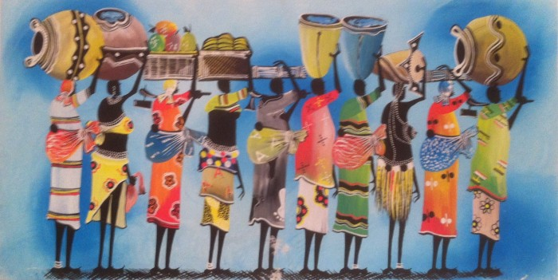
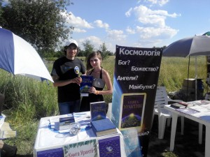
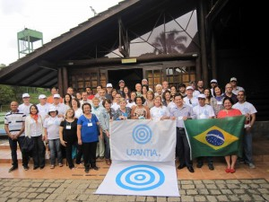
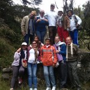

© 2015 International Urantia Association (IUA)

<figure id="Figure_1" class="image urantiapedia">

</figure>

<figure id="Figure_1" class="image urantiapedia image-style-align-left">

<figcaption><em>group</em></figcaption>
</figure>

## In This Issue

- President’s Message October 2015 – Chris Wood
- Three Summer Exhibitions in Ukraine – Anton Miroshnichenko
- Jointly Sponsored Conference in the USA – Editor
- Urantia Young Adult International (UYAI) Study Group – Antonio Schefer
- Italian Conference Report – Georges Michelson-Dupont
- Brazil National Meeting – Paulo Cesar Zapello
- ANZURA Annual Urantia Book Readers’ Conference – Kathleen Swadling
- UAIUK Summer Meeting, 2015 – Chris Moseley
- Venezuela Conference for Urantia Book Readers – Marybeni Rosas
- Study Group Directory – Gaetan Charland
- Donate while Shopping with Amazon – Editor
- Upcoming Events

## President’s Message October 2015

Chris Wood

[<figure id="Figure_1" class="image urantiapedia image-style-align-left">

<figcaption><em>Chris-Wood-framed](../../../image/article/IUA_Tidings/Chris-Wood-framed-150x150.jpg)</em></figcaption>
</figure>

Recently, a group of four young Urantia Book students stayed with me and my family for a weekend and of course they wanted to be of service. What task did we set upon this nurse, engineering student, and two small businessmen? They spent eight hours folding letters and preparing our fall fundraiser for the post office. Time itself is often the most valuable gift.

At my local church there was a presentation of “stewardship” which focused on Time, Talent and Treasure. Of course my mind turned to the Urantia Community. The Publication Mandate tells us, “The Book belongs to the era immediately to follow the conclusion of the present ideological struggle.” Our generation is a stewardship generation. I know the vast amount of time Urantia Book students give to build our community. Ten of thousands of hours each week are dedicated to building study groups, placing books in libraries, negotiating shipping to Africa, and, yes, folding letters.

[Read more](/en/article/Chris_Wood/presidents_message_october_2015)

## Three Summer Exhibitions in Ukraine

Anton Miroshnichenko

<figure id="Figure_1" class="image urantiapedia image-style-align-left">

<figcaption><em>Anton Miroshnichenko</em></figcaption>
</figure>

This summer readers presented _The Urantia Book_ at the following three events that were held in the Ukraine:

The “Country of Dreams” Festival
This festival was held in Kiev at the Country Museum “Pyrogovo” on 20 to 21 June. We presented the Russian and English versions of _The_ _Urantia Book_ at the literary festival site there. Many visitors passed our table and received a brochure with general information about the book. They could also treat themselves to candy and pull out a special quotation from _T__he Urantia Book._ People who were interested in the book stopped at our table to talk and ask questions. We were very pleased to introduce the book to festival goers and we hope that some of them who received information will become readers in the future. Overall we were left with a good impression of the event.

<figure id="Figure_1" class="image urantiapedia image-style-align-left">

<figcaption><em>Ukraine Expo</em></figcaption>
</figure>

#### [Read more](https://urantia-association.org/three-summer-exhibitions-in-ukraine)

## Jointly Sponsored Conference in the USA

Editor

### _Jesus, the Master Teacher_ 

June 9 – 12, 2016 San Antonio, Texas, USA

#### Celebrating a Partnership Between the Urantia Association of the United States and The Urantia Book Fellowship

Urantia Association of the United States (UAUS) is pleased to announce that the next national conference for the United States will be jointly sponsored by UAUS and The Urantia Book Fellowship (the Fellowship), in June of 2016. The organization of this event will be sponsored by the Lone Star Urantia Association (the Texas Local Association of UAUS) and the Education Committee of The Fellowship.

This momentous event will be held at Trinity University in San Antonio, Texas and will be exploring _Jesus, the Master Teacher_ – covering a wide variety of topics and how to apply them in our lives. The conference and pre-and post-conference events will also be held on this beautiful campus. Their website at [https://new.trinity.edu](https://new.trinity.edu/) has a virtual tour that you can visit before the conference begins.

[Read more](/en/article/IUA_Tidings/IUA_2015_jointly_sponsored_conference_in_the_usa)

## Urantia Young Adult International (UYAI) Study Group

Antonio Schefer

<figure id="Figure_1" class="image urantiapedia image-style-align-left">

<figcaption><em>UYAI study group picture</em></figcaption>
</figure>

Beginning November 23, we will launch a series of free online study group sessions centered on the teachings of _The Urantia Book_. The sessions will be held weekly and will consist initially of the following modules:

- What _The Urantia Book_ teaches about in-depth study, in combination with relevant practical exercises
- Lessons on teaching and public speaking, along with opportunities for participants to deliver practice speeches
- Growing up with Jesus: How to enhance balanced growth and become leaders by learning what Jesus did at every stage of development, from early childhood to later adult life
- The truths of science in a philosophy of living:
   Connecting the truths of science with the new philosophy of living inspired by Jesus’ teaching on coordinating science and religion in our lives

[Read more](/en/article/Antonio_Schefer/urantia_young_adult_international_uyai_study_group)

## Italian Conference Report

Georges Michelson-Dupont

[<figure id="Figure_1" class="image urantiapedia image-style-align-left">

<figcaption><em>Georges Michelson-Dupont- Italian Conference](../../../image/article/IUA_Tidings/Georges_Michelson_Dupont_300.jpg)</em></figcaption>
</figure>

The first meeting of Italian readers of _The Urantia Book_ took place in Verona, the beautiful and historic city of Romeo and Juliet.

Danielle La Scala, who organized the meeting, is a former resident of France and Switzerland. The meeting was held from Friday, August 28, to Sunday, August 30. Of the eight Italians who wrote that they would attend the gathering, only three were present for the full meeting. Memo Z., the chief translator of the Italian translation, came Saturday and Sunday, and one person came just for Saturday afternoon. In addition to Danielle, my wife, Marlène, and I, Antonio Schefer from the Netherlands, representing Urantia Association International , were in attendance. A Swiss man from Lausanne was also present as well as three French readers, a woman and two men, from Marseille, France.

[Read more](/en/article/Georges_Michelson_Dupont/italian_conference_report)

## Brazil National Meeting

Paulo Cesar Zapello

<figure id="Figure_1" class="image urantiapedia image-style-align-left">

<figcaption><em>Brazil Conf 4</em></figcaption>
</figure>

The National Meeting for Brazilian Urantia Book readers was held in Curitiba, Paraná 9 to 12 October. Regardless of the economic crisis in Brazil, 60 people attended this event. We were pleased to welcome the Brazilian pioneer reader, Mr. Caio Mario Café, and also Andres Ramires from Colombia.

This year we celebrated the 10th Brazilian event, with three magical days of in-depth involvement from all participants. The agenda included four plenary presentations, three workshops, an interactive quiz, and a celebration party. All attendants were constantly active and deeply involved.

[Read more](/en/article/Paulo_Cesar_Zapello/brazil_national_meeting)

## ANZURA Annual Urantia Book Readers’ Conference

Kathleen Swadling

## Faith and Courage – the Pathway to Paradise and Beyond

<figure id="Figure_1" class="image urantiapedia image-style-align-left">

<figcaption><em>ANZURA Group 2015</em></figcaption>
</figure>

conference was held 9 to 12 October at the Sydney Academy of Sport & Recreation on the shores of the beautiful Narrabeen Lagoon on the Northern Beaches of Sydney. The members of the Sydney Study Group hosted the conference and apart from the Sydney readers, other attendees travelled from Brisbane, Canberra, Finland, Hobart, Melbourne, Newcastle, New Zealand, NSW Central Coast, Queensland’s Gold Coast, and Wollongong. A special thanks went to our visitors who travelled all the way from Finland, Irmeli Sjolie and Matti Hokka.

Given that the members of the Sydney Study Group are keen to hone their skills in presenting topics from _The Urantia Book_, the conference planning committee decided to allocate short presentation time slots to allow for a diversity of presentations. Not only did this approach give the presenters a unique opportunity to delve into an in depth study of their topic and to exercise their presentation abilities, it also kept the conference attendees engaged and interested and left them with much food for thought.

Following is a list of the presentation titles and their presenters: 

[Read more](/en/article/Kathleen_Swadling/anzura_annual_urantia_book_readers_conference)

## UAIUK Summer Meeting, 2015

Chris Moseley

<figure id="Figure_1" class="image urantiapedia image-style-align-left">

<figcaption><em>UK group-Summer meeting 2015</em></figcaption>
</figure>

, readers and members of the regular study groups in Britain have been holding an annual event we call the ‘Summer Meeting’, where readers gather to discuss a particular theme in the book over a relaxing weekend. We started with meetings in readers’ back gardens, with a simple ‘pot luck’ meal on the Sunday, but since the formation of UAIUK in 2003, the venues have been hired, and the guests have been paying, and the theme and programme have been prepared well in advance. Each year one of us chooses some ‘retreat’ centre in a tranquil beauty spot somewhere in Britain – once even in Ireland. We let others pamper us with the catering and accommodation; we enjoy unfamiliar scenery away from our usual haunts, while we concentrate our minds on higher things.

This year, 2015, was no exception in that sense. Since Jesus’ birthday, 21st August, happened to fall this year at the start of the weekend, why not let the Summer Meeting coincide with that? Usually our timetable for the meeting is adjusted to suit the vacant weekends during the summer at the time of booking the chosen venue, but Jesus’ birthday weekend found Ty’n Cellar Farm, near Margam, South Wales, with a suitable number of vacancies. It turned out to be yet another lovely venue for our Summer Meeting.

[Read more](/en/article/Chris_Moseley/uaiuk_summer_meeting_2015)

## Venezuela Conference for Urantia Book Readers

Marybeni Rosas

<figure id="Figure_1" class="image urantiapedia image-style-align-left">

<figcaption><em>Venezuela Meeting 1</em></figcaption>
</figure>

Readers met in Mérida State, Venezuela 9 to 12 October. This was the eleventh annual meeting of readers to be held in Venezuela. The theme of the conference was “Reactivating the Brotherhood of Jesus According to _The Urantia Book_”. Following are some comments from some of the attendees and organizers:

[Read more](/en/article/Marybeni_Rosas/venezuela_conference_for_urantia_book_readers)

## Study Group Directory

Gaetan Charland

#### Dear Friends of _The Urantia Book_,

<figure id="Figure_1" class="image urantiapedia image-style-align-left">

<figcaption><em>Gaetan Charland</em></figcaption>
</figure>

As most of you would know, the mission of Urantia Association International is: “To foster study of _The Urantia Book_ and to disseminate its teachings,” and according to the Publication Mandate, “Thousands of study groups must be brought into existence.”

A few years ago a joint service project was initiated—volunteers of Urantia Foundation, Urantia Association International and The Urantia Book Fellowship created an online Study Group Directory. This Internet resource has been well received and hundreds of study groups around the world are currently listed, making it easy for new or experienced students to locate and attend a study group. To this day, the directory has been translated into French, Spanish, Russian, and Portuguese.

Much work remains to be done if we are to accomplish the mission we were given so long ago; the directory needs to be translated into many more languages so that readers from every part of the world can find a study group in their area. And we also need every host to participate by registering their group in the directory. It’s easy to create a profile that provides your meeting information and contact details so that readers can find you and new friendships can grow! The directory also offers the option to list virtual study groups such as the ones taking place with Skype or Google Hangout.

[Read more](/en/article/Gaetan_Charland/study_group_directory)

## Donate while Shopping with Amazon

Editor

### Shop with AmazonSmile and send a portion of your shopping dollars to Urantia Association International!

#### What is AmazonSmile?

AmazonSmile is a simple and automatic way for you to support Urantia Association International every time you shop, at no cost to you. When you shop at [smile.amazon.com](http://smile.amazon.com/), you’ll find the exact same prices, vast selection and convenient shopping experience as Amazon.com, with the added bonus that Amazon will donate a portion of the purchase price to the Association.

#### How do I shop at AmazonSmile?

To shop at AmazonSmile simply go to [smile.amazon.com](http://smile.amazon.com/) from the web browser on your computer or mobile device. You may also want to add a bookmark to [smile.amazon.com](http://smile.amazon.com/) to make it even easier to return and start your shopping at AmazonSmile.

[Read more](/en/article/IUA_Tidings/IUA_2015_donate_while_shopping_with_amazon)

## Upcoming Events

Check out Urantia Association International’s Events Calendar at [http://urantia-association.org/events-list](http://urantia-association.org/events-list). Upcoming events can be viewed in a List or Calendar view.

Urantia Book reader events provide opportunities for students to gain a deeper understanding of the ideas and concepts presented in _The Urantia Book_ and help to facilitate a personal commitment to the ideals of spiritual living. We hope you can make it to some of these events and experience the joys of meeting and studying with fellow readers.

If you’re planning a Urantia Book reader event in your region and would like help in promoting it, please send us your information and we’ll consider it for our Events Calendar.

## References

- Tidings newsletter: https://urantia-association.org/about-tidings-newsletter/
- This issue: https://urantia-association.org/newsletter/tidings-october-2015/