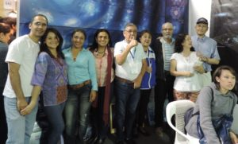
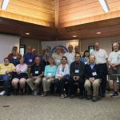
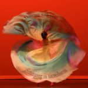

© 2017 International Urantia Association (IUA)

<figure id="Figure_1" class="image urantiapedia">

</figure>

<figure id="Figure_2" class="image urantiapedia image-style-align-left">

</figure>

## In This Issue

- President’s Message – June 2017 – Chris Wood
- 2018 Urantia International Conference
- Announcements
- Unity Initiative Report – Chris Wood
- Bogotá Book Fair – Andres Ramirez, Colombia
- Spanish Urantia Book Readers Meet – Olga Lopez, Spain
- Our Trilogy Mission – London, Birmingham & Ghana – Pato Banton & Antoinette Rootsdawtah
- Study Groups and Us—Survey Results – Gaetan Charland
- Youth & Study Groups – Alice Wood, Wisconsin USA
- Young Readers & Study Groups – Cheryl Glicker, Michigan USA
- Southeast Urantia Gathering, USA – Gaetan Charland, Quebec
- Dutch Speaking Urantia Conference—21st August – Jaap Terra, The Netherlands
- Daughters of God Women’s Retreat – Line St Pierre, Quebec
- Story from India – Author Unknown
- Upcoming Events

## President’s Message – June 2017

_Chris Wood_

<figure id="Figure_3" class="image urantiapedia image-style-align-left">

</figure>

I taught university courses for a few years and my favorite course to teach was _Introduction to Philosophy_. Introductory courses translate a subject’s ideas into common language, while in-depth courses teach you a new language to better develop these ideas. I liked the idea of taking what might literally be a lifetime of work and dedication and cutting it down to one hour’s worth of reading and one hour’s worth of lecture. You have to provide enough of a hook to each subject that it might grab the attention of a student, enough depth that it will show the worthiness of dedicating a career to its study, enough hints at future studies to give those students paths forward, but also enough of a structure and closure that the ninety-nine percent of students who listen and are not fascinated can still recall later in life, “Oh, yeah, Utilitarianism. It’s great for group decision making but I think it’s flawed as an individual moral system.”

[Read more](/en/article/Chris_Wood/president_message_june_2017)

## 2018 Urantia International Conference

### 12-15 April 2018

<figure id="Figure_4" class="image urantiapedia image-style-align-left">

</figure>

invites you to attend the 10th International Conference of Urantia Association International in **Amsterdam, The Netherlands**.

Our conference theme is **‘Jesus as a Teacher’** and we are inviting students of _The Urantia Book_ from all over the world. The subtitle is ‘Are You Ready to Live His Teachings In the 21st Century?’ This question calls us to explore what we know about Jesus’ teachings, his personal religion, and his message to us today. The program will inspire us to be true followers of Jesus and his teachings, and become the leaders and teachers of the future. 

#### The Conference

In the beautiful surroundings of the flower fields near Amsterdam, the ‘Conference Centre Leeuwenhorst in Noordwijkerhout’ will be the venue for our gathering. This conference centre offers everything we need to host a successful event. The conference will emphasize studying together, sharing with each other, and most of all, experiencing spiritual brotherhood.

[Read more](/en/article/IUA_Tidings/IUA_2017_2018_urantia_international_conference)

## Announcements

### Annual Report 2016

<figure id="Figure_5" class="image urantiapedia image-style-align-left">

<figcaption><em>](../../../image/article/IUA_Tidings/Annual-Report-2016-150x150.jpg)The Association’s 2016 Annual Report is now ready for you to review and download from our website at: [../../../image/article/IUA_Tidings/UA\_AR2016\_Final.pdf</em></figcaption>
</figure>

.

(You can also find this PDF by going to [https://urantia-association.org/about-uai/governance-policies](https://urantia-association.org/about-uai/governance-policies) and scroll down to find the Annual reports.)

### Revised Home Page for Website

<figure id="Figure_6" class="image urantiapedia image-style-align-left">

<figcaption><em>](../../../image/article/IUA_Tidings/New-Home-Page-150x150.jpg)The Association’s Home Page of the website has been revised to reflect the social nature of our organization. Some colour and style changes on the secondary pages have also been revised. Check it out at: [https://urantia-association.org</em></figcaption>
</figure>

.

[Read more](/en/article/IUA_Tidings/IUA_2017_announcements)

## Unity Initiative Report

_Chris Wood_

<figure id="Figure_7" class="image urantiapedia image-style-align-left">

<figcaption><em>Trinity Flag of Michael</em></figcaption>
</figure>

In October 2016, a small group of leaders from Urantia Association International and the Urantia Book Fellowship met in Chicago to discuss the potential unification of our two organizations. This meeting was approved by the Association’s International Service Board and Representative Council, and the Fellowship’s Executive Committee. It was not the first time our community has met to discuss ways to achieve better harmony and cooperation between the two groups, but at this meeting, those present produced a proposal outlining steps that could be taken toward organizational unity. This “Transition to Unity Proposal” was then presented to the leadership boards and councils of both the Association and the Fellowship to be embraced, rejected or amended.

In February 2017, the General Council of the Fellowship passed two resolutions, one of which embraced the short term cooperative steps recommended in the “Transition to Unity Proposal,” but fell short of including statements about their desire for unity and the proposed initial structure of a united organization. The second resolution reaffirmed the Fellowship’s commitment to its continued operation of Uversa Press in relation to its printing of _The Urantia Book_.

The Association has no intention of being a competitor of Urantia Foundation. If organizational unity is to be achieved, the publishing of _The Urantia Book_ needs to be separated from any united social organization, and ideally left to the Foundation. However, the Fellowship’s stand is that its continued publishing of _The Urantia Book_ is an important part of its service to the Urantia community.

[Read more](/en/article/Chris_Wood/unity_initiative_report)

## Bogotá Book Fair

_Andres Ramirez, Colombia_

<figure id="Figure_8" class="image urantiapedia image-style-align-left">

</figure>

The International Book Fair in Bogotá, Colombia was held April 25 to May 8, 2017 with a booth hosted by Urantia Association of Bogotá and with financial support from Urantia Association International. More than 40 volunteers participated in the booth. Guest volunteers from some Latin American countries were invited to come and volunteer to learn from this highly experienced group on how to host a successful book fair booth. Volunteers from Costa Rica, Ecuador, and Colombia answered the invitation and gained valuable hands-on experience.

Over 500,000 visitors attended the book fair, 23,000 flyers introducing _The Urantia Book_ were handed out to visitors coming through the booth, 85 email addresses were collected, and 60 soft-cover books provided by Urantia Foundation were sold. The Bogotá team also made contact with 33 schools where they will be donating books to their libraries and holding conferences for students and teachers.

[Read more](/en/article/Andres_Ramirez/bogota_book_fair)

## Spanish Urantia Book Readers Meet

_Olga Lopez, Spain_

<figure id="Figure_9" class="image urantiapedia image-style-align-left">
th to May 1st  in the Hotel Tryp in Guadalajara (near the capital, Madrid.">
</figure>

In attendance were almost 50 people hailing from the north, east, and south of Spain. Antonio Schefer’s presence was appreciated as he again came The Netherlands to represent Urantia Association International.

The theme of this meeting was “God in Man,” which is the title of section 6 in Paper 108 (_Mission and Ministry of Thought Adjuster_). The main subject of discussion were the Thought Adjusters: what they are, what they do for us, and what we will become together. On this occasion, our goal was to coordinate the presentations so they could approach different aspects of the Thought Adjusters and our relationship to them.

[Read more](/en/article/Olga_Lopez/spanish_urantia_meeting)

## Our Trilogy Mission – London, Birmingham & Ghana

_Pato Banton & Antoinette Rootsdawtah_

<figure id="Figure_10" class="image urantiapedia image-style-align-left">

</figure>

en route to Africa. Even more thrilling was the knowledge that some of our Urantia family in Europe had expressed their desire to fly over and join us too!

### Part 1—Hallmark Hotel, East London, UK 

Initially, the London gathering was intended to be a full day of studying _The Urantia Book_ with some live music (performed by us) intertwined, but because many of us were meeting for the first time, we decided to change the format into a group discussion which would allow us to get to know each other better, to learn about our individual journeys since finding _The Urantia Book_ and to see how we could improve on applying the teachings in our daily lives. Of course the music was still interwoven throughout the program, but now, everyone was involved in contributing to the celebration!

[Read more](/en/article/Pato_Banton_and_Antoinette_Rootsdawtah/pato_banton_london_birmingham_ghana)

## Study Groups and Us—Survey Results

_Gaetan Charland_

<figure id="Figure_11" class="image urantiapedia image-style-align-left">

</figure>

Two months ago a survey was sent to English, Spanish, Portuguese, and French readers on the email list of Urantia Association International. This survey was created with the goal to find better ways to serve the growing community of study groups, and with the objective to find the different characteristics inherent in the many kinds of study groups existing throughout the world.

On behalf of the Study Group Committee I’d like to thank everyone who devoted a few minutes of their time to respond to this survey.

I’d like to share a summary of this survey with you so you can—in your own ways—find some answers or solutions that may make your study groups more responsive to the needs of different kinds of readers and cultures.

[Read more](/en/article/Gaetan_Charland/study_groups_and_us_survey_results)

## Youth & Study Groups

_Alice Wood, Wisconsin USA_

<figure id="Figure_12" class="image urantiapedia image-style-align-left">

</figure>

I worry that we are swimming upstream when we try to insert younger adults into study groups made up entirely of older people. Many times I have been one of the token young adults at Urantia events, and while I am glad that I attended them, being the odd man out always held an undertone of discomfort; and I did, at one point, stop attending a study group when I felt like I simply could not fit in. I think that I was more tolerant of the age difference than the average person, and to ask that of every younger attendee is asking a lot.

I have been enjoying studying the book independently for the past several years. I do, however, long for the community aspect of simply spending an evening with other students of _The Urantia Book_. A younger friend of mine says that she does not attend a study group because she just doesn’t like to sit with a group to study; she prefers to learn about the book through normal, informal conversation. If we have no alternative group to attend, we would, to a large extent, be left out of the Urantia community.

[Read more](/en/article/Alice_Wood/youth_study_groups)

## Young Readers & Study Groups

_Cheryl Glicker, Michigan USA_

<figure id="Figure_13" class="image urantiapedia image-style-align-left">

</figure>

Venezuelan reader had to say, it would appear that young readers might be more interested in group study if the group itself consisted of only young readers. She did not mention this, but my thought is that perhaps one, more experienced student as a guide or clarification source would be helpful, if not downright indispensable! to such a group. One problem I foresee with this model is, of course, finding young readers with the time, venue, resources and dedication to host and/or facilitate such groups. Obviously, the easiest way for the first three issues to be addressed is to establish these study groups online. As for the dedication required, that depends wholly on the spiritual investment of the founding young reader.

[Read more](/en/article/Cheryl_Glicker/young_readers_study_groups)

## Southeast Urantia Gathering, USA

_Gaetan Charland, Quebec_

<figure id="Figure_14" class="image urantiapedia image-style-align-left">

</figure>

On the weekend of May 5 a group of 20 Urantia Book readers from different states including Alabama, Tennessee, Mississippi, Florida and Georgia met at a beautiful nature center in Alabama for the whole weekend. Mark Kurtz, who was the main organizer for this event had created a program that covered interesting topics for all those present. During this gathering a few readers had been chosen to make presentations on different topics. The beautiful camaraderie that was present at this gathering was the confirmation of its spiritual maturity and encouraged everyone to share their longing for the welfare of the revelation.

This was spiritual brotherhood in the making!

## Dutch Speaking Urantia Conference—21st August

_Jaap Terra, The Netherlands_

<figure id="Figure_15" class="image urantiapedia image-style-align-left">

</figure>

is organizing this year’s 2017 annual Urantia Conference for Dutch speaking students of _The Urantia Book_ on August 21st. We will also be celebrating the birth of Jesus of Nazareth, the incarnation of Michael of Nebadon.

Last year we enjoyed an upward trend in the number of attendees compared to previous years; we hope this development continues.

This year’s conference will focus on: _Jesus as a Human Being, as the Living Way, as the Leading Example._ We will be exploring how Jesus developed as a human being prior to his public work.

[Read more](/en/article/Jaap_Terra/dutch_urantia_conference)

## Daughters of God Women’s Retreat

_Line St Pierre, Quebec_

### <figure id="Figure_16" class="image urantiapedia image-style-align-left">

</figure>

Dancing with God—Emerging in Sacredness

September 21 to 24, 2017
Urantia Foundation, Chicago

As our series of women’s retreats continues at Urantia Foundation, the “Daughters of God” facilitator team is inviting you to an intimate, experiential, and fun weekend.

In their next retreat, “Dancing with God-Emerging in Sacredness,” four Daughters of God have designed a program where they will co-create a milieu of trust within a spiritual circle, to explore together questions such as:

- What does this statement mean to you: “Jesus never failed to exalt the sacredness of the individual?”
- “Angels never invade the sanctity of the human mind.” How do you relate to this?
- How do you become aware of the sacred in the drudgery of everyday life?

[Read more](/en/article/Line_St_Pierre/daughters_of_god_womens_retreat)

## Story from India

_Author Unknown_

<figure id="Figure_17" class="image urantiapedia image-style-align-left">

</figure>

A water bearer in India had two large pots, each hung on each end of a pole which he carried across his neck. One of the pots had a crack in it, and while the other pot was perfect and always delivered a full portion of water at the end of the long walk from the stream to the master’s house, the cracked pot arrived only half full. For a full two years this went on daily, with the bearer delivering only one and a half pots full of water in his master’s house. Of course, the perfect pot was proud of its accomplishments, perfect to the end for which it was made. But the poor cracked pot was ashamed of its own imperfection, and miserable that it was able to accomplish only half of what it had been made to do.

After two years of what it perceived to be a bitter failure, it spoke to the water bearer one day by the stream. “I am ashamed of myself, and I want to apologize to you.” “Why?” asked the bearer. “What are you ashamed of?” “I have been able, for these past two years, to deliver only half my load because this crack in my side causes water to leak out all the way back to your master’s house. Because of my flaws, you have to do all of this work, and you don’t get full value from your efforts,” the pot said.

[Read more](/en/article/IUA_Tidings/IUA_2017_story_from_india)

## Upcoming Events

Check out Urantia Association International’s Events Calendar at [http://urantia-association.org/events-list](http://urantia-association.org/events-list). Upcoming events can be viewed in a List or Calendar view.

Urantia Book reader events provide opportunities for students to gain a deeper understanding of the ideas and concepts presented in _The Urantia Book_ and help to facilitate a personal commitment to the ideals of spiritual living. We hope you can make it to some of these events and experience the joys of meeting and studying with fellow readers.

If you’re planning a Urantia Book reader event in your region and would like help in promoting it, please send us your information and we’ll consider it for our Events Calendar.

## References

- Tidings newsletter: https://urantia-association.org/about-tidings-newsletter/
- This issue: https://urantia-association.org/newsletter/tidings-june-2017/