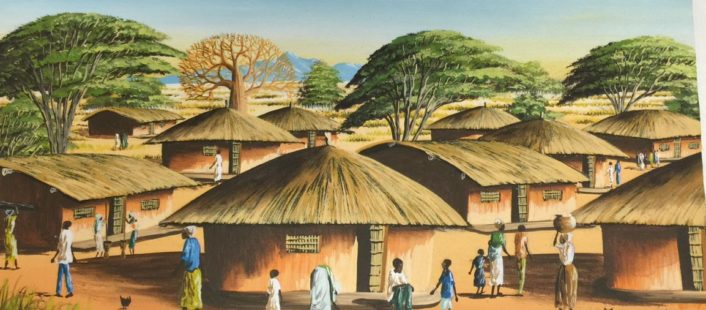
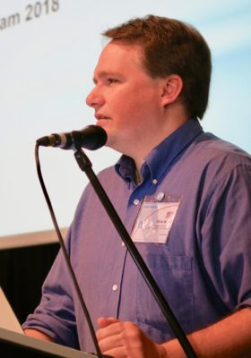
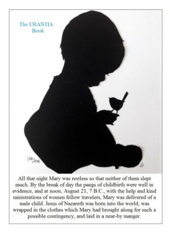
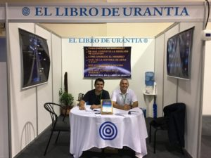
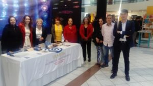
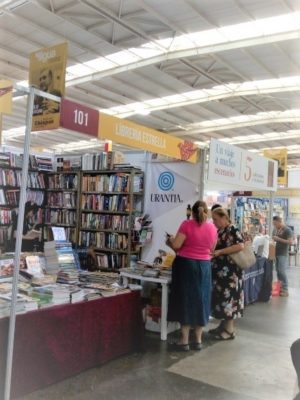
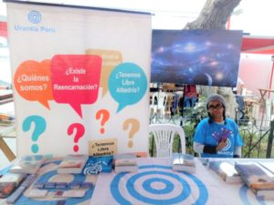
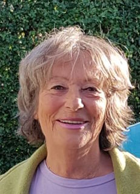
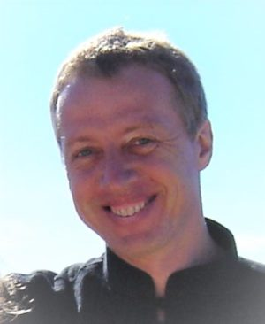

© 2019 International Urantia Association (IUA)

<figure id="Figure_1" class="image urantiapedia">

</figure>

_(To print a hard copy of this Tidings click the “Print Version” button above. After the print version appears, right-click into any white space and choose “Print.”)_

<figure id="Figure_2" class="image urantiapedia">

</figure>

## In This Issue

- President’s Message – September 2019 – Chris Wood, USA
- 2nd European Urantia Association Conference – Antonio Schefer, The Netherlands
- Young Adults Pre-European Conference Retreat – Alex Hehlert, Germany
- Remembering Jesus on His Birthday – Rick Warren, USA
- Feria del Libro de Bolivia 2019 – Santa Cruz – Jose Ernesto Arias, Bolivia
- Ecuador Book Fair 2019 – Efrain Vivanco, Ecuador
- Guatemala Book Fair – Gerardo Leche, Guatemala
- ANTFIL – an Alternative Fair in Peru – Cecilia Barreto, Peru
- Study Group Testimonial – Susan Hemmingsen, New Zealand
- Farewell Mark Bloomfield – Kathleen Swadling, Australia
- Upcoming Events
- International Service Board
- About Tidings Newsletter

## President’s Message – September 2019

_Chris Wood, USA_

_<figure id="Figure_3" class="image urantiapedia image-style-align-left">

</figure>

_Religionists, as a group, must never concern themselves with anything but religion, albeit any one such religionist, as an individual citizen, may become the outstanding leader of some social, economic, or political reconstruction movement._ [[UB 99:3.15](/en/The_Urantia_Book/99#p3_15)]

_Indirectly, cultural civilization is influenced by the attitude of these individual religionists as they become active and influential members of various social, moral, economic, and political groups._ [[UB 99:3.3](/en/The_Urantia_Book/99#p3_3)]

Whenever we gather as a group at a conference, there is a question that often gets raised: “What exactly are we as a group?” and “Is Urantia a religion?” In many ways we resemble a religion. We are a group of religionists; as a group, and as official organizations, we do not concern ourselves with the social, economic or political issues; we actively encourage each other and others to get to know God and to become more like him.

The difference is that throughout our history organized religions have become ingrained in the social, economic and even political realms. Group thinking replaces individual choice, and group ideas of deity replaces individual relationships with the Father. As a group of religionists, we need to actively work to keep our mission focused on God and our relationship with God.

But as individuals, we are charged with getting directly involved in society. We have the ability slowly to adjust the trajectory of the social, economic, and political realms with our spiritual and universal insights.

[Read more](/en/article/Chris_Wood/presidents_message_september_2019)
 

## 2nd European Urantia Association Conference

_Antonio Schefer, The Netherlands_

<figure id="Figure_4" class="image urantiapedia">

</figure>

From 11-14 July 2019, the Urantia Association of Estonia hosted the 2nd European Urantia Conference at Tallink City Hotel with the theme “Sowing Seeds.” This event was the 2nd Continental Conference in Europe and took place almost three years after the Budapest conference. Eighty-seven participants celebrated friendship and brotherhood, in one of the best-preserved medieval cities of Europe, which is listed as a UNESCO World Heritage Site.

[Read more](/en/article/Antonio_Schefer/2nd_european_conference)

## Young Adults Pre-European Conference Retreat

_Alex Hehlert, Germany_

<figure id="Figure_5" class="image urantiapedia image-style-align-left">

</figure>

_(This is an extract summary on the Young Adults’ pre-conference retreat of Alex Heh’s personal testimonial of his experiences at the conference. Used by permission.)_

In July I traveled to Tallinn, the capital city of Estonia, to attend the 2nd European Urantia Association Conference. A number of young Urantia Book readers and I arrived some days earlier to attend the pre-conference retreat that was held from Sunday July 7 to Thursday July 11. This retreat was a joint event organized by Urantia Association’s UYAI (Urantia Young Adult International) and the Fellowship’s YaYas (Youth and Young Adults). I don’t exaggerate when I say that this event—held in a beautiful city and with lots of wonderful lovely people—was one of the most profound experiences in my life so far. By the end of the first night I felt I was able to leave my past behind and start a new life. It didn’t take long for me to stop thinking in my mother tongue (German) and start thinking (and feeling) in English.

[Read more](/en/article/Alex_Hehlert/young_adults_pre_european_conference)
 

## Remembering Jesus on His Birthday

_Rick Warren, USA_

<figure id="Figure_6" class="image urantiapedia image-style-align-left">

</figure>

Happy birthday to Jesus of Nazareth, Michael of Nebadon our Creator Father, on this, the 2026th anniversary of the inauguration of his 7th self-bestowal, right here on Urantia. What might he ask for on this anniversary?
 

> _…Jesus wished to develop spiritual insight into eternal realities and to stimulate initiative in the originality of living; he concerned himself exclusively with the underlying and permanent spiritual needs of the human race…._ [[UB 140:8.31](/en/The_Urantia_Book/140#p8_31)]

> _…Jesus wanted not only the mortals of this world but the onlookers of innumerable other worlds to know that, when doubts exist as to the sincerity and wholeheartedness of a creature’s devotion to the kingdom, it is the invariable practice of the Judges of men fully to receive the doubtful candidate…._ [[UB 139:12.7](/en/The_Urantia_Book/139#p12_7)]

> _…Jesus wanted his children on earth to live as though they were already citizens of the completed heavenly kingdom…._ [[UB 140:8.25](/en/The_Urantia_Book/140#p8_25)]

## Feria del Libro de Bolivia 2019 – Santa Cruz

_Jose Ernesto Arias, Bolivia_

<figure id="Figure_7" class="image urantiapedia image-style-align-left">

</figure>

The twentieth annual book fair took place in Santa Cruz de la Sierra, Bolivia from May 31 to June 11. The fair had 200 exhibitors and more than 80 book presentations. More than 50 international writers and about 100 national writers attended it, with the presence of the European Union as Guest of Honor. In the middle of all this exhibition was also present the most important book to all of us volunteers attending this fair: _The Urantia Book._

The volunteers of our booth spent twelve days explaining the importance of this book for humanity. Many children, young students, and adults were also present. Despite the normal skepticism of some people, there were 273 souls that were sensitive to the truths of this book and left us their contact details to receive more information.

[Read more](/en/article/Jose_Ernesto_Arias/bolivia_book_fair_2019_santa_cruz)
 

## Ecuador Book Fair 2019

_Efrain Vivanco, Ecuador_

<figure id="Figure_8" class="image urantiapedia image-style-align-left">

</figure>

This year’s book fair in Ecuador was held at the Puce Pontifical Catholic University of Ecuador from 3—7 June. Although we are not yet officially recognized as the National Association of Urantia Book Readers of Ecuador (AUEC), this year we participated in the Puce Fair as AUEC.

We were located at booth number 17, which we arranged with posters alluding to _The Urantia Book_ and graphics of the Master Universe. We were joined by a collaboration of Urantia Book students from the Readers Group of the Garden of Edentia, the Valley of the Chillos, and the city of Quito.

[Read more](/en/article/Efrain_Vivanco/ecuador_book_fair_2019)
 

## Guatemala Book Fair

_Gerardo Leche, Guatemala_

<figure id="Figure_9" class="image urantiapedia image-style-align-left">

</figure>

In the month of July 2019, from July 11 to July 21, The International Book Fair was held in Guatemala City. The headquarters was Foro Majadas in Zone 11 of the capital.

For Urantia Guatemala, it was the opportunity to continue presenting _The Urantia Book_, making it known to different population segments and sharing its content through conversations—to illustrate the Fatherhood of God and the Brotherhood of Man.

Our booth was Stand 101, in which during two weekends, our volunteers interacted with the general public, trying to establish contacts, especially with young people. We consider their curiosity and open minds to be fertile soil to present the concepts of the Truth of the Cosmos, the Beauty of the Universe, and the Goodness of our Beloved Father. During our days of service, we tried to make contact with children and young students who visited the fair.

[Read more](/en/article/Gerardo_Leche/guatemala_book_fair)
 

## ANTFIL – an Alternative Fair in Peru

_Cecilia Barreto, Peru_

<figure id="Figure_10" class="image urantiapedia image-style-align-left">

</figure>

Why did Urantia Peru choose to participate in the ANTFIL 2019? When traditional systems continue to maintain obsolete formats that do not consider the changes that are rapidly being made in humanity, new avant-garde movements led by young people emerge. ANTIFIL (an alternative fair) has arisen in response to the traditional International Book Fair in Lima, Peru, and is entirely organized by young people.

A strong driver for the traditional book fairs is profit. Why is there an entrance fee, when the exhibitors and big publishers already pay an exorbitant amount for showing their products? And everything has a price tag: the stands, the arts, the culture, the exhibitions… that is to say the market of consumption is in the foreground.

[Read more](/en/article/Cecilia_Barreto/antfil_an_alternative_fair_in_peru)
 

## Study Group Testimonial

_Susan Hemmingsen, New Zealand_

_<figure id="Figure_11" class="image urantiapedia image-style-align-left">

</figure>

_(Editor’s note: This was written in response to a new study group attendee who wanted a group in New Zealand to study other spiritual works in addition to_ The Urantia Book_).

I have canvassed opinions of other members of our group, including those who didn’t attend Tuesday’s meeting. The overwhelming response expressed, was that the purpose of our online meeting is simply to study _The Urantia Book_. That is our purpose and our “raison d’etre.” For us, that means we take turns to choose papers then read and discuss what we read. During the discussion, we all have an opportunity to share how particular passages impact our lives, discuss our interpretation of a passage, and make references to other parts of the book that add depth to our understanding.

Personally speaking, I have found over the years, that no matter how many times I read the book, I always find things I didn’t understand before—things I’ve missed, or things that need reinforcing—so for me, reading is a continuous mission and a pleasurable adventure. I feel that feeding my intellect enhances my spiritual quest as well as my understanding of the ways of the world and its people.
 

Every day I receive “Thoughts to Ponder” from Urantia Foundation, and this one on Wednesday seemed relevant regarding why we study _The Urantia Book_ at our online and face-to-face meetings: 

> _Things are time conditioned, but truth is timeless. The more truth you know, the more truth you are, the more of the past you can understand and of the future you can comprehend._ [[UB 118:3.2](/en/The_Urantia_Book/118#p3_2)]

I believe that my own personal spiritual growth is dependent on the choices I make, every minute of every day. I feel that every interaction with another human being, be it family, friend, or stranger, gives me an opportunity to do the will of God if I make myself open to the promptings of my Thought Adjuster. I can ignore a request for help or react in a less than positive way to someone, or I can listen to my inner voice that confirms my thought to help, listen or react positively. When I am choosing to do the right thing, I know I am serving God, and little by little will grow spiritually. I’d be stating the obvious when I say I have a long, long way to go…

## Farewell Mark Bloomfield

_Kathleen Swadling, Australia_

<figure id="Figure_12" class="image urantiapedia image-style-align-left">

</figure>

Mark Bloomfield, just 54 years of age, died recently from injuries after a tragic incident in Swansea, Wales. The matter is under investigation with the police and a man has been charged. This horrific event made the British news because of Mark’s links with Mother Teresa. The **BBC News** reported: 

_A charity worker who worked with Mother Teresa in India has died after an alleged attack in Swansea. Mark Bloomfield, 54, died on Saturday after he was found injured in High Street in the city centre last Thursday… The family of Mr Bloomfield, originally from Stratford Upon Avon, paid tribute to his charity work across the world saying he “had built a legacy”. They said that as a special assistant to_ _Mother Teresa in Calcutta__, he was an essential contributor to her mission._

Mark was a Field Representative of Urantia Foundation in the late 1990’s and early 2000’s. He was highly skilled in placing Urantia Books in public libraries, seminaries, universities and other centers of learning. He was renowned in _The Urantia Book_ reader community for his extraordinary and tireless service to the revelation by personally hand-seeding around 9,000 Urantia Books throughout the world. He was particularly inspired to seed the revelation in developing countries where he’d lived and worked for many years as a humanitarian missionary. Having experienced firsthand the heart-wrenching and atrocious plight of women and children, he decided to devote his life to treating the cause of the world’s problems rather than the symptoms, by getting _The Urantia Book_ into the hands of educated people in places where innocent millions were caught up in the cycle of ignorance and poverty.

[Read more](/en/article/Kathleen_Swadling/farewell_mark_bloomfield)
 

## Upcoming Events

Check out Urantia Association International’s Events Calendar at [http://urantia-association.org/events-list](http://urantia-association.org/events-list). Upcoming events can be viewed in a List or Calendar view.

Urantia Book reader events provide opportunities for students to gain a deeper understanding of the ideas and concepts presented in _The Urantia Book_ and help to facilitate a personal commitment to the ideals of spiritual living. We hope you can make it to some of these events and experience the joys of meeting and studying with fellow readers.

If you’re planning a Urantia Book reader event in your region and would like help in promoting it, please send us your information and we’ll consider it for our Events Calendar.

## International Service Board

Members of the International Service Board (ISB) are elected by a vote of the Representative Council (RC). The officers and committees of the ISB and the Executive Administrator plan, coordinate, and carry out the activities of Urantia Association that are international in scope and have been authorized by the Representative Council. They also serve as an information resource for the constituent associations by compiling and sharing information and experiences of other associations. Read on for the list and functions of the current ISB personnel.

[Read more](https://urantia-association.org/international-service-board)

## About Tidings Newsletter

The __Tidings__ newsletter is a quarterly on-line publication that serves as Urantia Association International’s primary communication tool for reaching out to the Association’s membership, supporters, donors, volunteers, and general readership friends. It provides news and information on the many activities and events of the National and Local Associations around the globe as well as information and announcements from Central Office, the International Service Board (ISB), and the Representative Council (RC). It serves to keep members in touch with one another and gives readers a sense of belonging—of being an integral part of a truly international movement that is designed to promote the Urantia revelation to all corners of the world.

**Note:** _Tidings_ also occasionally provides news of other Urantia-related activities and events that may be of interest to our supporters and friends. Please note that any interpretations, opinions, conclusions, or artistic representations, whether stated or implied, are those of the authors and do not necessarily represent the views and opinions of Urantia Association International, the National or Local Urantia Associations, or the editorial team of the Association’s _Tidings_.

[Read more](https://urantia-association.org/about-tidings-newsletter/#more-36620)

## References

- Tidings newsletter: https://urantia-association.org/about-tidings-newsletter/
- This issue: https://urantia-association.org/newsletter/tidings-september-2019/