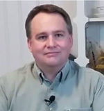
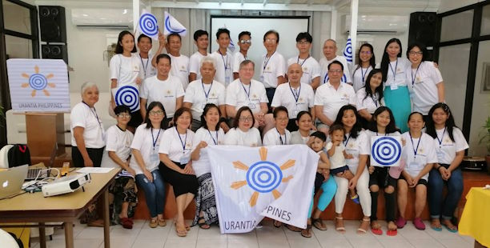
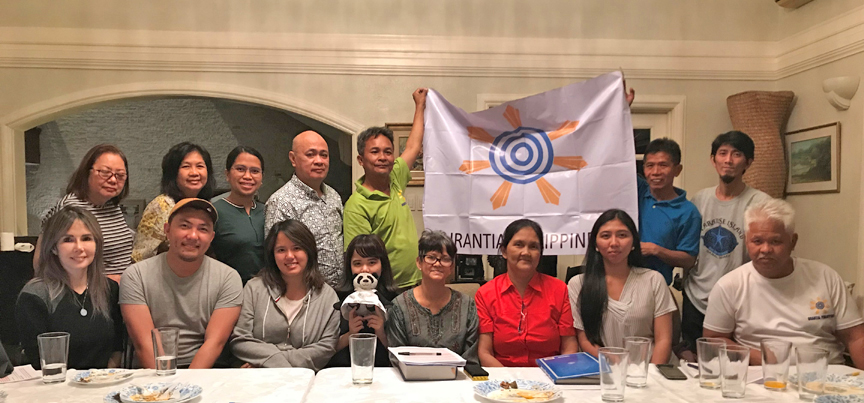
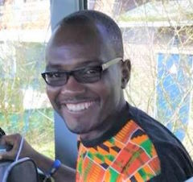

© 2020 Chris Wood, Nestor Seda Jr., Eugene Asidao, Kathleen Swadling © 2020 International Urantia Association (IUA)

<figure id="Figure_1" class="image urantiapedia">

</figure>

<figure id="Figure_2" class="image urantiapedia">

</figure>

## In This Issue

- President’s Message – June 2020 – Chris Wood, USA
- First Urantia Book Conference of the Philippines – Nestor Seda Jr. and Eugene Asidao, Manilla, Philippines
- The Urantia Book in the Philippines – Eugene Asidao, USA
- Virtual Study Groups and Conferences – Kathleen Swadling, Australia
- Meditation Mantras for Adjuster Attunement
- Urantia Hackathon 2020 — A Call for Team Volunteers – The Urantia Hackathon 2020 Ideation Team
- African Continental Coordinator
- New Secretary for Urantia Association
- About Tidings Newsletter
- International Service Board

## President’s Message – June 2020

_Chris Wood, USA_

<figure id="Figure_3" class="image urantiapedia image-style-align-left">

</figure>

Two themes of _The Urantia Book_ that stand out to me are the journey to perfection of an individual and the journey to perfection of a global society. As individuals, we are born into a world and get to grow and transform as we learn about the experiential relationships between morality and ethics and duty and service. Our ascension career will be a tapestry of good works as we become more and more perfect in our worlds, just as God is in his. 

As a society, we began as families and slowly grew into tribes, clans, cities, and nations. As we travel and exchange languages, thoughts, literature, and culture, we come to realize the folly of sectarian divides. We are a global family of brothers and sisters united by our material origin and our spiritual destiny.  

[Read more](/en/article/Chris_Wood/presidents_message_june_2020)
 

## First Urantia Book Conference of the Philippines

_Nestor Seda Jr. and Eugene Asidao, Manilla, Philippines_

<figure id="Figure_4" class="image urantiapedia">

</figure>

The first Urantia Book National Educational Conference for the Philippines was held in November 2019 at the Gems Hotel and Conference Center in Antipolo City. The theme was “Introducing the Fifth Epochal Revelation.” The goal was to inform interested individuals on the basic teachings of _The Urantia Book_ and to link up with the different regional groups of Urantia Book readers in the Philippines. 

**The selected topics presented were:** 

[Read more](/en/article/Nestor_Seda_Jr_and_Eugene_Asidao/urantia_book_conference_philippines)

## The Urantia Book in the Philippines

_Eugene Asidao, USA_

<figure id="Figure_5" class="image urantiapedia">

</figure>

At the age of 49, I started to increase my efforts as a spiritual truth-seeker. Before that, in my early adult years, I was involved in social service work fields centered on peace and justice issues, but I was always attracted to spirituality. I acquired many books on religion and spirituality and one of those was _The Urantia Book_. I read a few papers that interested me but put it aside to become part of my classic book collection.

During my time of searching spirituality, I went to different study groups, teachers, gurus, and I checked them all. I did different types of spiritual and esoteric practices of meditation, affirmation, and prayers.

I also organized a spiritual forum in my home that attracted between 10 to 25 people. We explored all types of spiritual disciplines, from near-death experiences, Ascended Masters, spiritual healing, meditations, prayers, etc. One of the speakers we invited was James Woodward, who had worked in Reader Services at Urantia Foundation. He came to our meetings and gave us an introductory presentation on _The Urantia Book_. 

[Read more](/en/article/Eugene_Asidao/urantia_book_philippines)

## Virtual Study Groups and Conferences

_Kathleen Swadling, Australia_

<figure id="Figure_6" class="image urantiapedia">

<figcaption><em>Image courtesy of LedyX</em></figcaption>
</figure>

The era of virtual study groups and conferences is upon us! With the entire world in lockdown due to the Covid-19 Coronavirus, unexpected opportunities have been arising in Urantia Book reader communities. Students are discovering how easy it is to meet with other readers from all over the world from the comfort of their own homes! Thanks to conference calling programs such as Zoom, study groups and conferences are happening with very little organization at virtually no cost. 

### Urantiathons – 24-Hour Online Conference Events 

“Urantiathon” is a new phrase that’s been coined to describe events like the two recent online 24-hour conferences that were held via Zoom and sponsored by Urantia Association International—one on 21st March (_A Reward of Isolation_) and the other on 2nd May (_We’re in this Together_).  

[Read more](/en/article/Kathleen_Swadling/virtual_study_groups)

## Meditation Mantras for Adjuster Attunement

<figure id="Figure_7" class="image urantiapedia">

</figure>

### Suggestions of a Solitary Messenger 

The following list of meditation mantras is taken from the practical suggestions and spiritual attitudes required for Adjuster contact as presented by a Solitary Messenger in _The Urantia Book,_ Papers 107-111. I've taken the liberty of paraphrasing these directives in a positive and active voice and, therefore, all interpretations and possible errors are my own. I encourage all readers to verify the content for themselves. This is by no means a comprehensive list of the many spiritual suggestions and techniques for Adjuster communion given to us throughout the book.  

**The Adjusters _are_ the will of God…** [[UB 108:4.2](/en/The_Urantia_Book/108#p4_2)] 

[Read more](/en/article/IUA_Tidings/IUA_2020_meditation_mantras)

## Urantia Hackathon 2020 — A Call for Team Volunteers

_The Urantia Hackathon 2020 Ideation Team_

<figure id="Figure_8" class="image urantiapedia image-style-align-left">

</figure>

**In the middle of this pandemic, have you perhaps stopped to wonder: “What will the future look like after all this has passed?”** 

We have as well, and would like to invite you to join us in crafting together some practical solutions to help us face the upcoming post-Covid-19 challenges with a steadier mind and a blossoming heart. Of course, with the guidance and inspiration in the beauty, goodness, and truth of _The Urantia Book_.   

We all know Urantia is in an acute crisis due to the current coronavirus pandemic. As in every crisis, this one will offer opportunities for personal progress and spiritual growth. We believe that one such unique opportunity will be to seed the teachings and insights from the revelation in the minds and hearts of members of our global communities in practical, utilitarian ways. We will focus on spirit-led active service.  

[Read more](/en/article/IUA_Tidings/IUA_2020_urantia_hackathon_volunteers)

## African Continental Coordinator

<figure id="Figure_9" class="image urantiapedia image-style-align-left">

<figcaption><em>Collins Lomo</em></figcaption>
</figure>

The future of _The Urantia Book_ in Africa very much depends on having a group of core readers who are committed to the ideals of the book—readers who are willing to work towards providing dependable support and direction to the growing readership on the continent. As such, we are pleased to announce that Collins Lomo from Accra, Ghana has been elected as Urantia Association’s new Continental Coordinator for Africa.  

Collins has been fostering the development of Urantia Book reader activity in Ghana and various other African countries since 2014. He represented Africa at the Urantia Association’s 2018 International conference in the Netherlands and facilitated the joint conference held in Lagos, Nigeria in December of 2019.  

[Read more](/en/article/IUA_Tidings/IUA_2020_african_continental_coordinator)
 

## New Secretary for Urantia Association

<figure id="Figure_10" class="image urantiapedia image-style-align-left">

</figure>

John Nugent from Missoula, Montana was recently elected to be the new Secretary for Urantia Association International. (John replaced Joycee Patterson who needed to step down as Secretary for personal reasons).

John has been a student of _The Urantia Book_ for close to 50 years, having been introduced to it while in the Jesuit Seminary.  

John holds a BA in Philosophy from Gonzaga University and a Masters degree from San Francisco Theology Seminary. He has a special interest in the instruction from the Publication Mandate, "You must again study the times of Jesus on Earth." He says that he considers the three greatest influences on the "times of Jesus" to be the Jewish culture, the Pagan practices and religious rituals, and the Greco Roman philosophy and political governing philosophy.  

Over the years John attended national and local conferences, participated in study groups, and was a member of both the Urantia association in Southern California (SURF) and the Urantia Book Los Angeles association (UBLA). Since moving to Montana he has been hosting his own small study group. 

John is retired after a career in health care administration and was married to his late wife for 45 years. He has two adopted sons. Welcome to the Board John and thank you for stepping up to be of service. We look forward to working with you.  
 

## About Tidings Newsletter

The __Tidings__ newsletter is a quarterly on-line publication that serves as Urantia Association International’s primary communication tool for reaching out to the Association’s membership, supporters, donors, volunteers, and general readership friends. It provides news and information on the many activities and events of the National and Local Associations around the globe as well as information and announcements from Central Office, the International Service Board (ISB), and the Representative Council (RC). It serves to keep members in touch with one another and gives readers a sense of belonging—of being an integral part of a truly international movement that is designed to promote the Urantia revelation to all corners of the world.

**Note:** _Tidings_ also occasionally provides news of other Urantia-related activities and events that may be of interest to our supporters and friends. Please note that any interpretations, opinions, conclusions, or artistic representations, whether stated or implied, are those of the authors and do not necessarily represent the views and opinions of Urantia Association International, the National or Local Urantia Associations, or the editorial team of the Association’s _Tidings_.

[Read more](https://urantia-association.org/about-tidings-newsletter/#more-36620)

## International Service Board

Members of the International Service Board (ISB) are elected by a vote of the Representative Council (RC). The officers and committees of the ISB and the Executive Administrator plan, coordinate, and carry out the activities of Urantia Association that are international in scope and have been authorized by the Representative Council. They also serve as an information resource for the constituent associations by compiling and sharing information and experiences of other associations. Read on for the list and functions of the current ISB personnel.

[Read more](https://urantia-association.org/international-service-board)

## References

- Tidings newsletter: https://urantia-association.org/about-tidings-newsletter/
- This issue: https://urantia-association.org/newsletter/tidings-june-2020/