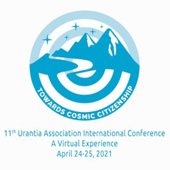
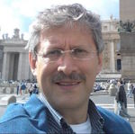
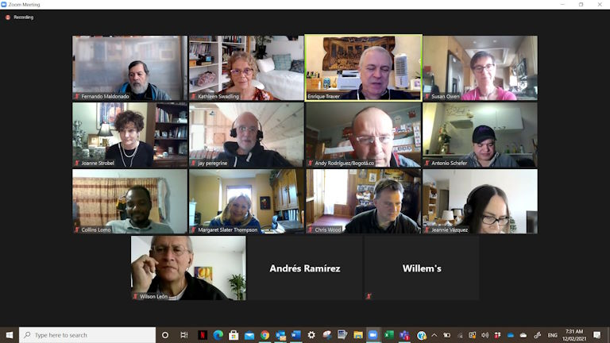
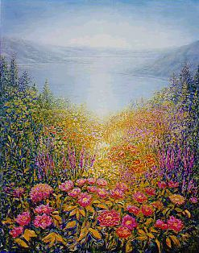

© 2021 Chris Wood, Jeannie Vasquez, Wilson Leon, Line St Pierre, James Woodward © 2021 International Urantia Association (IUA)

<figure id="Figure_1" class="image urantiapedia">

</figure>

<figure id="Figure_2" class="image urantiapedia">

</figure>

## In This Issue

- President’s Message – March 2021 – Chris Wood, United States
- Update – 11th Urantia Association Conference – A Virtual Experience – Conference Committee
- Fourth 24-hour Urantiathon – Faith, Joy, and Peace – Conference Committee
- Iberoamerican Urantiathon – Jeannie Vasquez, Uruguay
- Spiritualizing Everyday Life – Wilson Leon, Colombia
- Dancing with God – Living in Love in Trying Times Online Retreat – Line St Pierre, Quebec, Canada
- Focus on the Father – Stop Resisting – James Woodward, United States
- Derivative Works – Novels by Rick Warren – Publications Committee
- International Service Board News – Admin
- About Tidings Newsletter
- Ways to Donate to Urantia Association International

## President’s Message – March 2021

_Chris Wood, United States_

<figure id="Figure_3" class="image urantiapedia image-style-align-left">

</figure>

It has been a true honor to serve Urantia Association for the last eight years. I have been blessed to help guide this group of global, loving, God-seeking people as they have come together for the common purpose of sharing an epochal revelation.  

Right now, I am reminded of a Raymond Carver poem about a spring of water that gradually grows into a river and eventually merges into the ocean. Cathy Jones, one of the key pioneers in the formation of Urantia Association worked tirelessly to unite a scattered group of springs into a stream. Gaetan Charland, our first President, dedicated his efforts into guiding this stream as it grew, and with a leap of faith, he handed that work over and allowed me the joy of shaping this growing global movement. And now I see us racing toward the river ahead and it is with supreme confidence in the future that I am handing the office of President over to Enrique Traver from Brazil. 

[Read more](/en/article/Chris_Wood/presidents_message_march_2021)
 

## Update – 11th Urantia Association Conference – A Virtual Experience

_Conference Committee_

<figure id="Figure_4" class="image urantiapedia image-style-align-left">

</figure>

### Towards Cosmic Citizenship… Your Time Has Come!

<figure id="Figure_5" class="image urantiapedia image-style-align-left">

</figure>

Due to the pandemic, unfortunately you won’t be able to come to Cusco, Peru but Cusco can come to you in your homes via a virtual unforgettable experience. Don’t miss this upcoming 11th Urantia Association International Conference on **24 – 25 April 2021.**

Uniting continents, we will have speakers and workshop ifacilitators of various ages from all over the world with presentations translated into four languages (English, French, Spanish, and Portuguese) as well as workshops being provided in those four languages.
 

### Program

**Day 1: Sonship with God, Cosmic Citizenship, and Planetary Evolution**

**Conference Opening**
Words from Urantia Association International President – Enrique Traver (Brazil)

**Welcoming to Peru & Introduction**

**How Do Ancient Cultures Provide Opportunities to Inspire Cosmic Citizenship?**
_by Lourdes Burga-Cisneros – Urantia Peru Association President (Cusco, Peru)._

Cusco, Peru, is a site with traces of the blood of Adam and Eve who hoped to spread a spiritual message; whose footsteps we could wisely follow with the help of the Spirit of Truth.

[Read more](/en/article/IUA_Tidings/IUA_2021_update_urantia_association_conference_virtual_experience)

## Fourth 24-hour Urantiathon – Faith, Joy, and Peace

_Conference Committee_

<figure id="Figure_6" class="image urantiapedia image-style-align-left">

<figcaption><em>Image de Gerd Altmann</em></figcaption>
</figure>

As the Coronavirus lingers—keeping many of us locked down in isolation—we felt it was time to bring our Urantia Book reader community together again to nourish our souls and discuss our favorite book. Another incredible 24-hour virtual event was held over the weekend of 24 – 25 January where we enjoyed presentations from around the world and engaged in stimulating discussions. With Faith, Joy, and Peace being our topics of focus, this experience was spiritually uplifting and soul nourishing. We were even treated to a preview of the program for the virtual International Conference in Peru this April with the theme _Towards Cosmic Citizenship—Your Time Has Come._  

[Read more](/en/article/IUA_Tidings/IUA_2021_fourth_24_hour_urantiathon)
 

## Iberoamerican Urantiathon

_Jeannie Vasquez, Uruguay_

<figure id="Figure_7" class="image urantiapedia image-style-align-left">

</figure>

Along the same lines as the previous 24-hour Urantiathons, Urantia Association International hosted Iberoamerican Urantiathon on 28 – 29 November, 2020. This time the webinars were presented in Spanish and Portuguese with simultaneous translations into English, Spanish, and Portuguese.

The program featured 19 hour-long presentations offered by students from Brazil, Spain, Venezuela, Ecuador, USA, Australia, Colombia, Argentina, Mexico, and Guatemala. 

The Latin-American community gathered together to listen to presentations from members of the new Iberoamerican generation of Urantia Book students as well as experienced students who offered valuable lessons about themes so diverse as "Kingdom of Heaven," "From Tribe to Cosmic Citizenship," "The Spheres of Light and Life," "Beauty, Art, and Spirituality," and "The Goodness and Beauty of Truth." We also listened to motivating experiences about the path of spiritual growth. 

[Read more](/en/article/Jeannie_Vazquez_de_Abreu/iberoamerican_urantiathon)
 

## Spiritualizing Everyday Life

_Wilson Leon, Colombia_

### Interview with Isabel Reinoso Manrique, President of Urantia Association Colombia 

<figure id="Figure_8" class="image urantiapedia image-style-align-left">

</figure>

**Isabel, what new project are you considering for this time of "pandemic?"** 

Because of the obligatory lock-down, we set out to organize virtual study groups. I learned a lot of new technology with great results. Originally, I had a single study group and now I have seven virtual study groups during the week, and every Friday at 7:00pm I give an introductory talk on _The Urantia Book_ for new readers interested in the book. 

Now, considering that our reality has changed forever, several Urantia Book reader friends feel we need to develop "transition communities" and correct the mistakes we made when we first created the ecovillages.\* 

These “transition communities" that we are creating represent a middle ground that allows us, on the one hand, to take advantage of all that Mother Nature can offer, such as healthy eating and an outdoor life, yet on the other hand offers all the advantages of technology and progress, as long as it does not adversely affect the well-being of the planet, its peoples, and societies. 

[Read more](/en/article/Wilson_Leon/spiritualizing_everyday_life)
 

## Dancing with God – Living in Love in Trying Times Online Retreat

_Line St Pierre, Quebec, Canada_

<figure id="Figure_9" class="image urantiapedia image-style-align-left">

</figure>

After more than 15 months without being able to meet, we wondered if it would be possible to create the proper atmosphere in an online retreat. 

The four of us, the Daughters of God, had to do the experiment first, and assess the possible discomfort or technical difficulties before gathering a small group in “the cloud!” With a touch of this new retreat experience on Zoom, and more preparation on our part, our plan was put into action! 

We invited women who had already participated in one of our retreats in order to get a better sense of how the interaction could happen when we're on Zoom and when we look at the screen and don't really know who is really being addressed. Since these attendees already knew how the in-person retreats worked, they should be able to adjust their participation to the small screen. 

[Read more](/en/article/Line_St_Pierre/dancing_with_god_2)
 

## Focus on the Father – Stop Resisting

_James Woodward, United States_

### The Teaching

<figure id="Figure_10" class="image urantiapedia">

</figure>

> _The secret of his unparalleled life was this consciousness of the presence of God; and he attained it by intelligent prayer and sincere worship—unbroken communion with God—and not by leadings, voices, visions, or extraordinary religious practices._ [[UB 196:0.10](/en/The_Urantia_Book/196#p0_10)]

### The Takeaway  

The _consciousness of the presence of God_ is the secret of the most _unparalleled_ religious life that was ever lived by a human in this universe. And this holy attainment was attained by _intelligent prayer and sincere worship—unbroken communion with God_.  

### The Personal Plan  

Think about God _all the time_, as often as you can remember. Don’t be anxious as to the exact contents of those thoughts—have faith that your onboard divine interpreter will adjust them. The heavenly marching orders are: “Be you perfect” and we have all been taught that practice makes perfect.  

[Read more](/en/article/James_Woodward/focus_on_the_father_stop_resisting)

## Derivative Works – Novels by Rick Warren

_Publications Committee_

<figure id="Figure_11" class="image urantiapedia image-style-align-left">

</figure>

_The Urantia Book_ encourages us to be creative in the way we share our understanding of truth. And the number of study aids and derivative works produced by creative and imaginative students of the book is staggering.  

Rick (or Richard) Warren, long time student and scholar of _The Urantia Book_ and loyal supporter of Urantia Association International, is a prolific writer of novels that classify as “derivative works” of the Urantia revelation. Rick served on the Association’s ISB as Dissemination Chair and was later a member of the Communications Committee until a few years ago when he resigned and told us he needed to focus his time and energy on writing a book. That book turned out to be _Resurrection Hall—A Mansion World Odyssey_, the first in a series of novels he has been producing ever since.   

[Read more](/en/article/IUA_Tidings/IUA_2021_novels_by_rick_warren)
 

## International Service Board News

_Admin_

<figure id="Figure_12" class="image urantiapedia">

</figure>

In December, members of the International Representative Council (IRC) met to conduct elections for several International Service Board (ISB) positions that are currently held by members whose terms are due to expire 1 April 2021 (Officer terms on the ISB are for four years and members may serve for a maximum of two terms).  

The two positions of President and Chief Financial Officer (CFO) held by Chris Wood and Bradley Tharpe respectively need new officers as Chris and Brad have served their two terms and need to step down. The other positions are held by officers whose first terms have expired; all agreed to run for a second terms. We are pleased to announce the results of these elections as follows: 

- President: Enrique Traver (Brazil) 
- CFO: Jay Peregrine (USA) 
- Conference Chair: Antonio Schafer (Netherlands) 
- Membership Chair: Fernando Maldonado (Mexico) 
- Education Chair: Jeannie Vazquez (Uruguay) 
- Translations Chair: Gabriel Rymberg (Israel) 

[Read more](/en/article/IUA_Tidings/IUA_2021_isb_news_2)

## About Tidings Newsletter

The __Tidings__ newsletter is a quarterly on-line publication that serves as Urantia Association International’s primary communication tool for reaching out to the Association’s membership, supporters, donors, volunteers, and general readership friends. It provides news and information on the many activities and events of the National and Local Associations around the globe as well as information and announcements from Central Office, the International Service Board (ISB), and the Representative Council (RC). It serves to keep members in touch with one another and gives readers a sense of belonging—of being an integral part of a truly international movement that is designed to promote the Urantia revelation to all corners of the world.

**Note:** _Tidings_ also occasionally provides news of other Urantia-related activities and events that may be of interest to our supporters and friends. Please note that any interpretations, opinions, conclusions, or artistic representations, whether stated or implied, are those of the authors and do not necessarily represent the views and opinions of Urantia Association International, the National or Local Urantia Associations, or the editorial team of the Association’s _Tidings_.

[Read more](https://urantia-association.org/about-tidings-newsletter/#more-36620)

## Ways to Donate to Urantia Association International

<figure id="Figure_13" class="image urantiapedia image-style-align-left">

<figcaption><em>Artist: Carlos Rubinsky</em></figcaption>
</figure>

The world is changing fast and Urantia Association International is in a unique position to foster the Urantia revelation in so many ways. With localized teams in the form of associations springing up across the globe, we are ready to help anyone, anywhere, to study and spread the teachings that we all hold so dear.  

The Association has only one paid staff member to manage and coordinate our worldwide activities. All other services are rendered by devoted students who donate their time (and often their treasure) to the projects that help bring us closer to our heavenly Father. Thank you to our faithful volunteers and donors!  

Here is a selection of ways to donate to Urantia Association: 

[Read more](https://urantia-association.org/ways-to-donate-to-urantia-association-international)
 

## References

- Tidings newsletter: https://urantia-association.org/about-tidings-newsletter/
- This issue: https://urantia-association.org/newsletter/tidings-march-2021/