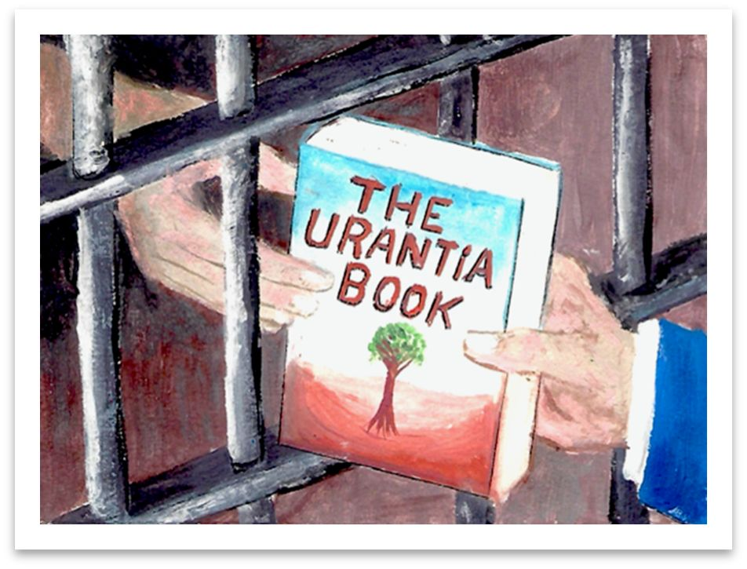
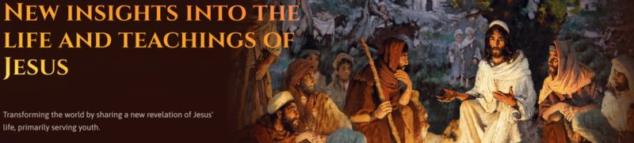
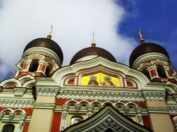
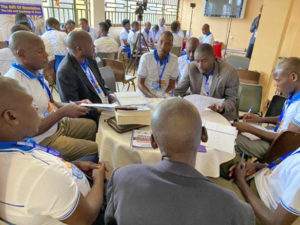
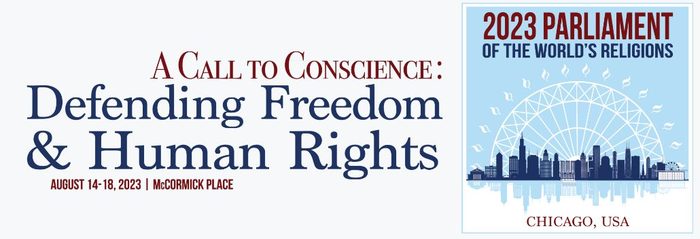

© 2022 International Urantia Association (IUA)

<figure id="Figure_1" class="image urantiapedia">

</figure>

<figure id="Figure_2" class="image urantiapedia">

<figcaption><em>Marco Federmann</em></figcaption>
</figure>

## In This Issue

- President’s Message – September 2022  – Enrique Traver, Brazil 
- 3rd European Urantia Conference 2022  – Gines Aviles Martinez, Spain
- Prison Inmate Response Team (PIRT) Mission Statement  – Myra Hight, PIRT Chair
- The Jesus Metaverse
- I Found the Key – Line St-Pierre, Canada
- Estonian “Brotherhood Day” – Karmo Kalda, Estonia
- The Urantia Uganda Conference 2022 – Khatukhira Bernard, Uganda
- Parliament of the World’s Religions
- About Tidings Newsletter

## President’s Message – September 2022

_Enrique Traver, Brazil _

<figure id="Figure_3" class="image urantiapedia image-style-align-left">

</figure>

Dear Friends,

I am impressed to know that so many of us are present and active in study groups. And many who believe the truth of this revelation have formed true family associations that are actively engaged in various projects of learning and disseminating the teachings. It's just wonderful to see all this happening.

Many of us embrace the challenge of serving our Father and others by becoming workers for the kingdom of God. Those who love _The Urantia Book_ revelation approach this purpose with great enthusiasm and true devotion.

When we act enthusiastically to attract more souls to the kingdom of God, there are many different approaches. But no matter which approach we use, we certainly want everyone to feel the same attraction to the revelation as we do.

However, I have observed that some of us are convinced that “converting_”_ our fellows  in favor of this revelation is a great grace and a precious service to others and to the Father. We often deliver impassioned speeches or go out of our way to build up arguments to demonstrate why others must change and how, upon discovering _The Urantia Book,_ each of us must behave in the future. At times, some of us are astonished when faced with confronting situations caused by students o_f The Urantia Book_ that, according to our understanding, should not have occurred or are not acceptable. In some situations, our over-zealousness towards non-students of the teachings may cause the encounter to become argumentative when trying to convince that person to change.

[Read more](/en/article/Enrique_Traver/presidents_message_september_2022)
 

## 3rd European Urantia Conference 2022

_Gines Aviles Martinez, Spain_

**20 to 23 October 2022** 

<figure id="Figure_4" class="image urantiapedia">

</figure>

**Overcoming Materialism, Enlightening Europe** 
 

Dear Brothers and Sisters,  

This year we have prepared a dynamic and unique European Conference intended to be a light for our siblings from the continent. It will be held 20 to 23 October at Torremolinos, Málaga, Spain. 

Data shows that secularism triumphs in Europe and that biblical ideas are not well received.\* However, there is a very important nuance: the majority still believe in God. Therefore, is there any opportunity for the teachings of _The Urantia Book_? Whatever: Let's take it!  

In this new venture we have a plan. We will dive into the waters of self-mastery to gain a clearer idea of how to become better versions of ourselves. And we will do  this through practice in a series of workshops. 

[Read more](/en/article/Gines_Aviles/3rd_european_urantia_conference_gines)

## Prison Inmate Response Team (PIRT) Mission Statement

_Myra Hight, PIRT Chair_

**PIRT’s mission is to enlighten the spirits and minds of incarcerated men and women by disseminating _The Urantia Book_ to inmates and providing subsequent correspondence to support the inmate’s efforts to study the teachings.** 

<figure id="Figure_5" class="image urantiapedia">

<figcaption><em>Drawn by a Texas inmate and printed with permission.</em></figcaption>
</figure>

PIRT is a sub-committee functioning under the Association’s Dissemination Committee; 2022 marks this committee’s 17th year of service. Since the inception of PIRT, approximately 6,000 inmate letters have been processed, 2,800 Urantia books have been donated directly, and 400 books have been seeded into prison libraries.

This year, PIRT experienced the loss of its dear Chairperson, David Linthicum, who was Chair for 13 of its 17 years, with the exception being his term as Dissemination Chair. David left his mortal body for mansonia on June 1st, 2022. He is missed by all who served with him in their collective effort to “assist the Father in finding his lost sheep.” David was a tireless servant involved in many activities besides PIRT and his love touched countless souls.

[Read more](/en/article/Myra_Hight/pirt_2022)

## The Jesus Metaverse

### Calling for Presentation Curators

<figure id="Figure_6" class="image urantiapedia">

</figure>

> _What a transcendent service if, through this revelation, the Son of Man should be recovered from the tomb of traditional theology and be presented as the living Jesus to the church that bears his name, and to all other religions!_ [[UB 196:1.2](/en/The_Urantia_Book/196#p1_2)]

### About the Jesus Metaverse and the Center for Unity

<figure id="Figure_7" class="image urantiapedia image-style-align-left">

<figcaption><em>Gabriel Rymberg</em></figcaption>
</figure>

The Center for Unity is currently developing a Jesus Metaverse app that is a strategic, technologically savvy and innovative way to share Jesus with young adults focused on the untold story of Jesus. Our core focus is “to transform the world by sharing a new revelation of Jesus' life, creating experiences that produce spiritual transformations.”

The user experience in the Jesus Metaverse is based on carefully curated content, presented in a visually engaging and easy to use manner. The media presentations are the basic “building blocks” of the experience. The quality of the experience, the service we provide to our users, therefore relies on two main factors: 1) The quantity and quality of the content and, 2) the quality of the design and implementation of the software.

For a deeper view into the Jesus Metaverse, take a look at this [presentation](https://bit.ly/JesusMetaverse-Deck-May-2022) and the [jesusmetaverse.org](https://bit.ly/JM-site-direct) website.

We are currently looking for Presentation Curators who will be tasked with finding specific pieces of content for Metaverse “nodes.”

[Read more](/en/article/IUA_Tidings/IUA_2022_the_jesus_metaverse_calling)
 

## I Found the Key

_Line St-Pierre, Canada_

<figure id="Figure_8" class="image urantiapedia image-style-align-left">

</figure>

How many of us are saddened to see the world today in such decay? I realize that we all have this need to feel comforted and at peace about what will happen after our time on earth. What will we leave as a spiritual legacy to our grandchildren and their children's children? It may seem far-fetched to think like this, but it is so little when we know that life is eternal and that this earthly adventure must one day reach the era of light and life.

My greatest wish is that _The Urantia Book_ will find its way into the hands of many souls thirsting for truth and that it will transform the person who studies it.

But how could this happen without a personal commitment from those who have found this treasure? As a fervent student of _The Urantia Book_ and its teachings, I feel that these truths are a gift from heaven, an answer to my questions, the object that has given meaning to my life and answers to my many reflections. It has helped me feel better within myself, improving my health and general well-being; it has helped me to strive to be a better person and to be better at living my life and putting my beliefs into action. This book and its teachings cannot remain stagnant—they need to be shared. So, how to share it?

[Read more](/en/article/Line_St_Pierre/i_found_the_key)
 

## Estonian “Brotherhood Day”

_Karmo Kalda, Estonia_

<figure id="Figure_9" class="image urantiapedia image-style-align-left">

</figure>

Estonian readers will start to celebrate “Brotherhood Day” every year, and we begin this year by holding the event on 2 October 2022.

Our purpose is to highlight the importance and significance of the concept of brotherhood—to encourage living in brotherhood with every person in our lives.

The two most important teachings of Jesus were the revelation of God's fatherhood and the brotherhood of man. We constantly pray and worship God, but there is a brotherhood here on earth that has gone rather unnoticed and overlooked. This shortcoming could be somewhat alleviated by celebrating “Brotherhood Day,” wherein the importance of brotherhood is highlighted, presentations are made, races and nations around the world are thought of as brothers, the meaning of brotherhood is deepened and, and most importantly, a pleasant time is spent with our closest brothers and sisters.

In truth, beauty, and goodness,
Karmo Kalda
 

## The Urantia Uganda Conference 2022

_Khatukhira Bernard, Uganda_

**THE BIRTH OF THE URANTIA BOOK TEACHINGS IN UGANDA**

The Urantia Uganda Conference 2022 was the first ever in Uganda. The conference was to have been held in August 2020 but, due to the Covid 19 pandemic, limited funds, and leadership challenges, it was not possible until this August.

<figure id="Figure_10" class="image urantiapedia image-style-align-left">

<figcaption><em>Uganda Conference 2022</em></figcaption>
</figure>

_The Urantia Book_ and its teachings have finally arrived in Uganda, the pearl of Africa. It is with great hope and faith that the truth seekers here will greatly enjoy the teachings of the book as they enrich their ever-growing spirituality, guided by love and the will to service. This is but a start to a long journey of spiritual adventure towards Paradise but most of all for all Ugandans, it brings spiritual enlightenment that shall create unity and harmony (brotherhood of man) among Ugandans in their affirmation of God as the Father (Fatherhood of God) within them. We thank God it has come to pass that _The Urantia Book_ and its teachings have been initiated publicly in Uganda.

Under the sponsorship of Urantia Association, five of us were funded to attend this conference and I do thank God we did because our attendance shaped the program and designed the conference to meet a Urantia Book conference standard. We were asked by the secretary Matte to help develop a program on the day we arrived. We designed the program and the next day we presented an introduction to _The Urantia Book_, its history, the Publication Mandate, and leadership structure worldwide. 

[Read more](/en/article/Khatukhira_Bernard/the_urantia_uganda_conference_2022)
 

## Parliament of the World’s Religions

<figure id="Figure_11" class="image urantiapedia">

</figure>

### Faith & Interfaith Understanding

**14 to 18 August 2023**

In August 2023, the Parliament of the World’s Religions returns to Chicago, the birthplace of the modern interfaith movement, to celebrate 130 years of achievements. Parliament conventions attract participants from more than 80 nations reflecting over 200 diverse religious, indigenous, and secular beliefs.

It’s Mission: “The Parliament of the World’s Religions was created to cultivate harmony among the world’s religious and spiritual communities and foster their engagement with the world and its guiding institutions in order to achieve a just, peaceful and sustainable world.”

[Read more](/en/article/IUA_Tidings/IUA_2022_parliament_of_the_worlds_religions)

## About Tidings Newsletter

The __Tidings__ newsletter is a quarterly on-line publication that serves as Urantia Association International’s primary communication tool for reaching out to the Association’s membership, supporters, donors, volunteers, and general readership friends. It provides news and information on the many activities and events of the National and Local Associations around the globe as well as information and announcements from Central Office, the International Service Board (ISB), and the Representative Council (RC). It serves to keep members in touch with one another and gives readers a sense of belonging—of being an integral part of a truly international movement that is designed to promote the Urantia revelation to all corners of the world.

**Note:** _Tidings_ also occasionally provides news of other Urantia-related activities and events that may be of interest to our supporters and friends. Please note that any interpretations, opinions, conclusions, or artistic representations, whether stated or implied, are those of the authors and do not necessarily represent the views and opinions of Urantia Association International, the National or Local Urantia Associations, or the editorial team of the Association’s _Tidings_.

[Read more](https://urantia-association.org/about-tidings-newsletter/#more-36620)

## References

- Tidings newsletter: https://urantia-association.org/about-tidings-newsletter/
- This issue: https://urantia-association.org/newsletter/tidings-september-2022/