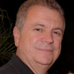
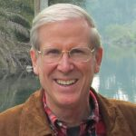
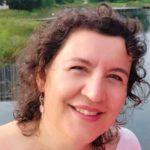
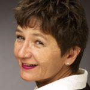

© 2022 International Urantia Association (IUA)

<figure id="Figure_1" class="image urantiapedia">

</figure>

<figure id="Figure_1" class="image urantiapedia">

</figure>

## In This Issue

- President’s Message – December 2022 – Enrique Traver, Brazil
- A Study Group As a Circle of Trust – Gard Jameson, USA
- 3rd European Conference of Urantia Book Readers – Olga López, Spain
- Farewell Margo Sherwood
- International Service Board Elections
- About Tidings Newsletter

## President’s Message – December 2022

_Enrique Traver, Brazil_

<figure id="Figure_1" class="image urantiapedia image-style-align-left">

</figure>

Hello, dear friends!

My children, like most Christian children, were born and raised celebrating Christmas on December 25th. It was always a magnificent celebration, with all the family members participating happily and celebrating the birth of our Master and sharing the company among all. Furthermore, when they were little, all of them believed in Santa Claus and their happiness was greatly enhanced by the anticipation of the arrival of this sweet imaginary old man bearing presents. I took advantage of this belief of the little ones to bargain with them for good behavior and high performance at school throughout the year. I grew up that way and my kids did too.

At some point, the sweet old man ceased to exist in our lives, we ceased to be children, bringing disappointment, but at the same time, the joy of being together as a family remained, all gathered in fraternization and celebrating the birth of Jesus.

Over time, we learned that the important thing was always being together, celebrating our families and the birth of Jesus.

[Read more](/en/article/Enrique_Traver/presidents_message_december_2022)
 

## A Study Group As a Circle of Trust

_Gard Jameson, USA_

<figure id="Figure_2" class="image urantiapedia image-style-align-left">

</figure>

I invite you to consider a study group as a Circle of Trust.  I became familiar with the term “Circle of Trust” back in 2004 with the publication of Parker Palmer’s book, _A Hidden Wholeness_.  Our community has engaged a number of retreats using the tool kit of the Circle of Trust.  Parker Palmer hails from the Quaker Tradition and shares in his book many insights of that tradition, which are in agreement with the teachings of Jesus.  He quotes Rufus Jones, one of the human sources used in the development of _The Urantia Book_, who writes: “_I pin my hopes to quiet processes and small circles, in which vital and transforming events take place_.”  In the history of the development of _The Urantia Book_ there was a communication known as the Publication Mandate that the Forum studied very closely which states:

The book is being given to those who are ready for it long before the day of its world-wide mission. **Thousands of study groups must be brought into existence** and the book must be translated into many tongues. Thus will the book be in readiness when the battle for man’s liberty is finally won and the world is once more made safe for the religion of Jesus and the freedom of mankind. \[emphasis added\]

[Read more](/en/article/Gard_Jameson/a_study_group_as_a_circle_of_trust)
 

## 3rd European Conference of Urantia Book Readers

_Olga López, Spain_

### Overcoming Materialism, Enlightening Europe

_(Editor’s note: The Urantia Association of Spain, Urantia Association International, and the European Organizing Committee worked hard to create this event in Southern Europe to unite the European Urantia Community once again for our third European Urantia Conference.)_ 

<figure id="Figure_1" class="image urantiapedia image-style-align-left">

</figure>

The 3rd European Conference of Urantia Book readers was held at the Sol Don Pablo Hotel in Torremolinos (Malaga, Spain) from October 20 to 23. Almost 70 readers attended from different parts of Europe and the rest of the world (from Georgia in Eastern Europe to the United States and Argentina in the American continent). With summer temperatures, we were able to enjoy not only the weather, but also the good company of other readers and some activities related to the theme of the conference and the theme of self-mastery, to which several workshops were dedicated.

This third European conference was intended to have a practical focus, so that attendees would return home with new ideas and tools to improve the art of self-mastery. Hence, the workshops of the so-called "route of self-mastery" had a theoretical part and a practical part in which the participation of the attendees was a prerequisite. To facilitate the organization, two routes were defined by language: English and Spanish, which worked independently but always focused on the same theme: self-mastery under the light of the teachings of _The Urantia Book_. As they developed independently, the approaches were different but equally enriching. There were readers who attended activities in both languages, so multilingual people had the advantage of seeing these different approaches. But there were also joint activities that maintained the cohesion of the group of attendees thanks to the translation services.

[Read more](/en/article/Olga_Lopez/3rd_european_conference_of_urantia_book_readers)
 

## Farewell Margo Sherwood

<figure id="Figure_1" class="image urantiapedia image-style-align-right">

</figure>

Margo Sherwood, beloved wife of Will Sherwood, after a long illness, graduated peacefully in the early hours of Saturday morning, October 29, 2022, with the help and support of her husband, her pets, and loving hospice care workers. 

Margo was born in 1954 in Hungary and escaped that communist nation in her early 20’s. She and her then husband stayed in Austria for nine months awaiting political asylum to become American citizens.

As a successful real estate agent in Los Angeles, CA, she spent her office breaks talking with (unknown to her at the time) Urantia Book reader, Jean Painter. And for about nine months, though they talked much about philosophy, surprisingly Jean never mentioned the book! However, while attending a Whole Life Expo in Pasadena, CA, Margo found herself drawn to the booth hosted by _The Urantia Book_ Los Angeles Society. As she read over a list of people currently reading the book, she was stunned to find that her friend and colleague, Jean, was on the list of people reading and studying the book! Margo immediately called Jean, saying, “This is Margo from Urantia! Why haven’t you told me about this book?” From that point, still in her 20’s, Margo started actively reading the book and attending study groups in Southern California.

[Read more](/en/article/IUA_Tidings/IUA_2022_farewell_margo_sherwood)
 

## International Service Board Elections

The International Service Board (ISB) recently held elections for the positions of Vice President, Secretary, Communications Chair, Dissemination Chair, and Study Groups Chair. Here are the results:

Vice President: Andres Rodriguez (re-elected for second term)
Secretary Joanne Strobel: (re-elected for second term)
Communications Chair: Myra Hight (elected for first term)
Dissemination Chair: Willem Jeths (re-elected for second term)
Study Groups Chair: Phillip Marriott (elected for first term)

Congratulations to the successful candidates. Former Communications Chair and Study Groups Chairs, Kathleen Swadling and Andrés Ramírez respectively completed their second terms so needed to step down. We are very grateful for their incredibly loving, loyal, and tireless service. We welcome Myra Hight from California and Phillip Marriott from South Australia to the ISB. We hope they find their volunteer work for the Urantia revelation fulfilling, rewarding, and joyful.

## About Tidings Newsletter

The __Tidings__ newsletter is a quarterly on-line publication that serves as Urantia Association International’s primary communication tool for reaching out to the Association’s membership, supporters, donors, volunteers, and general readership friends. It provides news and information on the many activities and events of the National and Local Associations around the globe as well as information and announcements from Central Office, the International Service Board (ISB), and the Representative Council (RC). It serves to keep members in touch with one another and gives readers a sense of belonging—of being an integral part of a truly international movement that is designed to promote the Urantia revelation to all corners of the world.

**Note:** _Tidings_ also occasionally provides news of other Urantia-related activities and events that may be of interest to our supporters and friends. Please note that any interpretations, opinions, conclusions, or artistic representations, whether stated or implied, are those of the authors and do not necessarily represent the views and opinions of Urantia Association International, the National or Local Urantia Associations, or the editorial team of the Association’s _Tidings_.

[Read more](https://urantia-association.org/about-tidings-newsletter/#more-36620)

## References

- Tidings newsletter: https://urantia-association.org/about-tidings-newsletter/
- This issue: https://urantia-association.org/newsletter/tidings-december-2022/