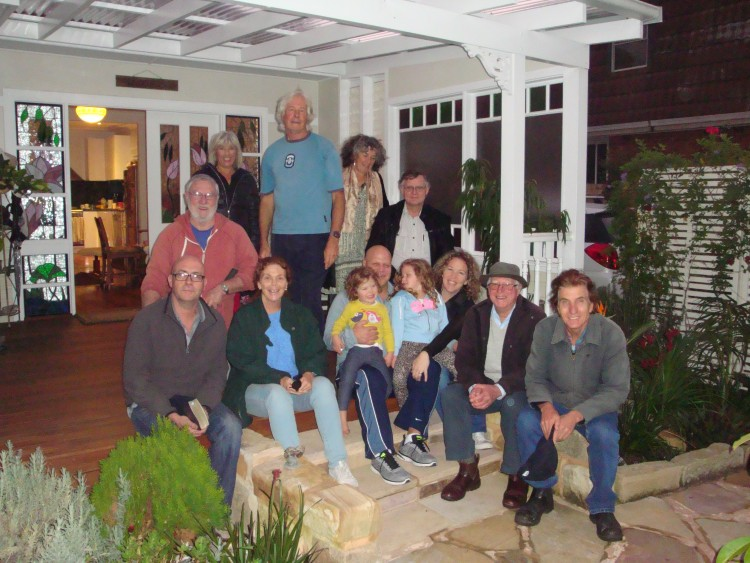
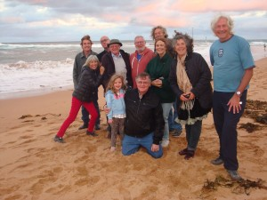
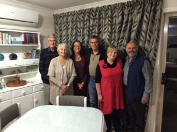
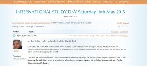

© 2015 International Urantia Association (IUA)

On 16th of May study groups met for the annual International Study Day. This year we read Papers 160 and 161 – _Rodan of Alexandria_ and _Further Discussions with Rodan._ Following are some reflections from several of the groups that met.

## Canberra Visits Sydney

<figure id="Figure_1" class="image urantiapedia">

</figure>

The plan was for the Canberra Study Group to visit the Sydney group for a joint Study Day. In the end only two of us made it, but it was a great day and we were impressed with the turnout of the Sydney group and the way in which it conducted its meeting.

The study was of papers 160 and 161—the discussions with Rodan.

The usual questions about Rodan’s  identity were raised with no-one being any the wiser, and the presentation of his philosophy drew the admiration of most of us, bearing in mind that Rodan had constructed it from his own interpretation of prevailing Greek thought following only some preliminary conversations with Jesus.

It is sometimes not entirely clear whether the Midwayers are quoting Rodan more or less directly, or whether they are adapting his philosophy to more modern interpretation, but whatever the case, a very creditable result is presented, one which is substantially in keeping with Jesus’ teachings.  And following Nathaniel’s astute reasoning to convince Rodan of God’s personal nature there seems little to suggest that Rodan’s position differed much from what Jesus was teaching the apostles.

<figure id="Figure_2" class="image urantiapedia image-style-align-right">

</figure>

Most of us knew these papers fairly well, and there were some spirited discussions and quite some fun in trying out different speculations.

Congratulations, Sydney, for a thoroughly enjoyable and instructive study. 

Regards,  
William Wentworth, Canberra
 

## Buenos Aires, Argentina

We did get together on the planned day and we read paper 160. It was a good reading and we were motivated to talk a lot on Rodan’s teachings… they truly bring a lot of tips to live a better life and we got many good clues to keep advancing with our spiritual evolution. This paper has a lot of value and it is good to read it on and on… We didn’t have time to go through the other proposed paper even though we studied for five hours! So Paper 161 became our task for our following meeting which was Saturday, June 6th and we completed the reading… also with a lot of talking and analysis. We’ve been six readers on each encounter, and we did enjoy the study.

Thanks a lot for keeping on going on with this International Study Groups Day. We have followed your proposal since the beginning of it and we look forward to staying on the same track. Everyone was very satisfied with your choice. Thanks a lot!! May your chosen paper for next year be as inspiring as these two!

Best regards and much love,  
Carlos Rubinsky

## Tasmania

<figure id="Figure_3" class="image urantiapedia image-style-align-left">

</figure>

Warm greetings to all my fellow students of _The Urantia Book_ scattered around Australia and indeed around this amazing planet called Urantia. Over the past few months, our little study group here in Tasmania has more than doubled in size….we now have six regular attendees at our fortnightly meetings with several others coming along intermittently.  It was a real joy to come together on the Study Day weekend knowing that we were part of a worldwide movement of truth-seeking people desirous of learning more about this remarkable Greek philosopher named Rodan, “one of the greatest of his race.”

The Revelators were clearly impressed with this man’s understanding of truth, beauty, and goodness; they devoted a whole paper to his philosophy of life! There was so much to talk about but here are some of the precious ‘gems’ that we discovered:
 

> _Animals know not the meaning of life; man not only possesses capacity for the recognition of values and the comprehension of meanings, but he also is conscious of the meaning of meanings—he is self-conscious of insight._ [[UB 160:1.5](/en/The_Urantia_Book/160#p1_5)]

> _Only a brave person is willing honestly to admit, and fearlessly to face, what a sincere and logical mind discovers._ [[UB 160:1.7](/en/The_Urantia_Book/160#p1_7)]

> _You simply must have tact and tolerance._ [[UB 160:1.9](/en/The_Urantia_Book/160#p1_9)]

> _I am deeply impressed with the custom of Jesus in going apart by himself to engage in these seasons of solitary survey of the problems of living._ [[UB 160:1.11](/en/The_Urantia_Book/160#p1_11)]

> _This worshipful practice of your Master brings that relaxation which renews the mind; that illumination which inspires the soul; that courage which enables one bravely to face one’s problems; that self-understanding which obliterates debilitating fear; and that consciousness of union with divinity which equips man with the assurance that enables him to dare to be Godlike. The relaxation of worship, or spiritual communion as practiced by the Master, relieves tension, removes conflicts, and mightily augments the total resources of the personality._ [[UB 160:1.12](/en/The_Urantia_Book/160#p1_12)]

And so much more…

Regards,  
Julian McGarry

## Forum Online Meeting

<figure id="Figure_3" class="image urantiapedia image-style-align-left">

</figure>

In addition to meeting with my local study group, I was privileged to be asked to facilitate an online study group, via Urantia Association International’s website Forum. This enabled students and readers throughout the world who are isolated or unable to attend a local study group, to meet together and discuss the Rodan papers by posting their comments on the forum. I personally benefited enormously from this role because it meant that I had to go over the material very carefully in order to be properly prepared for the comments of my brothers and sisters in far-flung corners of the globe. This arrangement is still in its early days; with greater publicity, a team of translators, and a longer lead time, it has the potential to become a very useful and popular provision, especially for those who have no access to other readers in their locality.

Love and best wishes to you all!  
Julian McGarry
 

## References

- Tidings newsletter: https://urantia-association.org/about-tidings-newsletter/
- This issue: https://urantia-association.org/newsletter/tidings-june-2015/
- This article: https://urantia-association.org/international-study-day-reflections