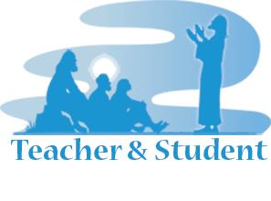

© 2016 International Urantia Association (IUA)

## 14-17 October 2016

<figure id="Figure_1" class="image urantiapedia image-style-align-left">

</figure>

***The Teacher and the Student***

_Hosted by the Bogotá Urantia Association and sponsored by Urantia Association International, Urantia Foundation and The Urantia Book Fellowship_ 

The Bogotá Urantia Association invites you to the First Latin American Urantia Conference to be held October 14 to 17, 2016 at [Lancaster House](http://www.lancasterhouse.com.co/) in Bogotá, Colombia.

The theme of the Conference will be _The Teacher and The Student_. This theme will be developed from questions such as: What does it mean to be a teacher in our community? What does it mean to be a teacher at the local level, to advanced students, to new readers, and to those who have never heard of _The Urantia Book_ and perhaps don’t even care to hear about it? How can we talk about the teachings in the book without ever mentioning the book? How did Jesus teach each of the different audiences he encountered? What can we learn from the teaching methods of all the various ‘schools’ described in the book – Melchizedek schools, Edentia schools, Dalamatia, Salem, Urmia? How were teachers trained in previous revelations?

## Registration

Registrations must be made no later than 7th October 2016. Conference Package costs without lodging is USD$180.

Those who register before 7th October 2016 (early bird) will receive have a SPECIAL DISCOUNT of $40, paying only $140.

Click [here](https://www.regonline.com/Register/Checkin.aspx?EventID=1840454) to register.

For registration related questions email: [latinamericanconference@urantia-association.org](mailto:latinamericanconference@urantia-association.org)

For more detailed information go to: [http://urantia-association.org/2016/05/12/latin-american-urantia-conference/](http://urantia-association.org/2016/05/12/latin-american-urantia-conference/)

## Latin American Leadership Scholarship

For this conference we have created a special Latin American Leadership Scholarship thanks to the help of Urantia Foundation, Urantia Association International and The Urantia Book Fellowship. This means we can assist those leaders in Latin America who may need financial assistance to represent their country at this International Conference. This will include current or future Latin American Presidents, Vice Presidents and leaders who can take home the teachings acquired at the conference and apply them in their Associations and local communities.

If enough Latin American leaders attend this conference we will organize a special meeting for them at the end of the event. For more information about the Latin American Leadership Scholarship contact: [latinamericanconference@urantia-association.org](mailto:latinamericanconference@urantia-association.org)

**_Note_**: _This conference is hosted by the Bogotá Urantia Association and sponsored by Urantia Association International, Urantia Foundation and The Urantia Book Fellowship_

## References

- Tidings newsletter: https://urantia-association.org/about-tidings-newsletter/
- This issue: https://urantia-association.org/newsletter/tidings-june-2016/
- This article: https://urantia-association.org/latin-american-urantia-conference-bogota