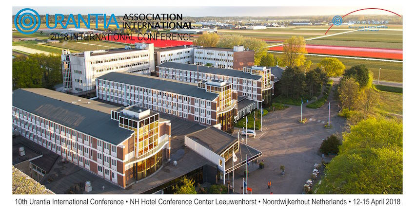

© 2017 International Urantia Association (IUA)

<figure id="Figure_1" class="image urantiapedia image-style-align-left">

</figure>

Urantia Association’s Financial Aid Committee recently met with the organizers of next year’s 2018 International Conference ([The Netherlands 12 to 15 April](https://urantia-association.org/2017/2018-urantia-international-conference/)). Among other things, the important subject of financial aid to students requiring sponsorship was discussed. Following is some information on sponsorships.

**European Sponsorships:**

The committee has decided to give priority to European Urantia Book students/leaders for financial assistance to attend the conference. All the usual conditions for granting sponsorship will apply and applications will be reviewed by the collective Boards of the European National Associations. It was agreed that two sponsorships, each worth €325, would be made available to each of our European Urantia Associations.

**Global Sponsorships:**

Four months prior to the event we will offer any remaining sponsorships to the rest of our worldwide membership. Again, all other Financial Aid procedures will be observed for those who apply for assistance to this event. 

**Past Financial Aid Requests:**

The Financial Aid Committee has also decided to give preference to Urantia Book student/leaders who have not previously received Financial Aid. All applications will be considered, however, including those who have received assistance in the past, so feel free to make a request and it will be reviewed. 

If you feel inclined, please contribute to our Conference Financial Aid Fund by visiting [https://urantia-association.org/get-involved/donate/](https://urantia-association.org/get-involved/donate/).

**Eligible Expenses:**

There are many possible expenses associated with attending an event. In order to optimize our available donations, our policies on eligible expenses take into consideration how many members we can assist, and how much financial aid we can give each person. 

The 2018 Urantia Association International Conference Financial Aid Committee will work with you to determine what specific expenses from the following list of eligible expenses can be provided to assist you:

1. Registration fee for attending the conference
2. Dinner Thursday evening
3. Lunch and dinner Friday
4. Lunch and dinner Saturday
5. All day coffee, tea and water

Note: The conference fee does NOT include travel, hotel, breakfast or lodging costs.

Click [here](https://urantia-association.org/wp-content/uploads/2017/11/2018-Policy-for-Granting-of-UAI-Conference-Financial-Aid.pdf) to access the 2018 Policy for Granting of Conference Financial Aid.

If you need any financial aid to cover transport and lodging cost, we suggest that you request this from your association, so they can start a sponsorship fundraising activity for you. 

**Application Procedure:**

To request Financial Aid please send your request to Mr. Antonio Schefer (ISB Conference Chair) [conferences@urantia-association.org](mailto:conferences@urantia-association.org) or Mr. Hanno van der Plas (Financial Aid Sub-Committee Chair) [hanno@urantia.nl](mailto:hanno@urantia.nl) and you will receive the link to access the online application form.

For more information click [here](https://urantia-association.org/wp-content/uploads/2017/11/Application-Form-to-receive-2018-UAI-Conference-Financial-Aid.pdf) to access the Application Form (Note: this cannot be filled in online without receiving a registration link via email from Hanno van der Plas or Antonio Schefer.)

Before committing to personal expenses for this event please make sure you receive a confirmation email from the 2018 Urantia Association International Conference Financial Aid Sub-Committee as to what specific financial aid will be provided, including how and when it will be provided. If you have not received an approval email, it means we have not yet granted you Financial Aid for the conference. 

If you do not qualify for Financial Aid you will receive a notification letter so you can make other plans to attend our event in 2018.

For more questions please contact Hanno van der Plas or Antonio Schefer.

Sincerely,  
2018 Urantia Association International Conference Financial Aid Sub-Committee

<figure id="Figure_1" class="image urantiapedia">

</figure>

## References

- Tidings newsletter: https://urantia-association.org/about-tidings-newsletter/
- This issue: https://urantia-association.org/newsletter/tidings-december-2017/
- This article: https://urantia-association.org/international-conference-financial-aid