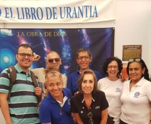

© 2019 International Urantia Association (IUA)

<figure id="Figure_1" class="image urantiapedia image-style-align-left">

</figure>

What is Urantia? What is the work of God? How do we reach him? Is there life on other planets? Did Jesus have brothers? These were some of the many questions we came across at the pavilion of the Cali Book Fair, which lasted 11 days and was organized by the collaborative efforts of the Urantia Associations of Colombia and Cali (URANCOL and URACALI.) Between looks of amazement, a desire for knowledge, skepticism, and interest, more than 8,000 people received our love for the revelation and information about _The Urantia Book_. Eighty people asked to us to keep in touch, and 23 bought a hard copy of the book.
 

Ganid asked Jesus:

> _“Why do you occupy yourself so continuously with these visits with strangers?” And Jesus answered: “Ganid, no man is a stranger to one who knows God. In the experience of finding the Father in heaven you discover that all men are your brothers, and does it seem strange that one should enjoy the exhilaration of meeting a newly discovered brother? To become acquainted with one’s brothers and sisters, to know their problems and to learn to love them, is the supreme experience of living.”_ [[UB 130:2.6](/en/The_Urantia_Book/130#p2_6)]

This year we decided to add the QR barcode to the flyers so visitors could download the book in PDF format directly from the Internet. This encouraged and captivated many young people. It was a gift to listen to their questions and to share the revelation with them.

We discovered new readers, some of whom promised to join our groups, while others were willing to support us in different ways. We also gave an introduction to _The Urantia Book_ to a meeting of 30 people on the fairgrounds.

Book fairs are a magnificent place of loving service, as well as a place to learn temperance of character and exalted meanings. Twenty volunteers were blessed to feel: “The supreme satisfactions of the loving service of man.” [[UB 170:4.12](/en/The_Urantia_Book/170#p4_12)].

We felt the experience of love and dedication while communicating the revelation, and also felt supported and assisted in all human and divine instances. Special thanks to Urantia Association International and their associates who contributed to this great success.

## References

- Tidings newsletter: https://urantia-association.org/about-tidings-newsletter/
- This issue: https://urantia-association.org/newsletter/tidings-december-2019/
- This article: https://urantia-association.org/cali-book-fair-2019