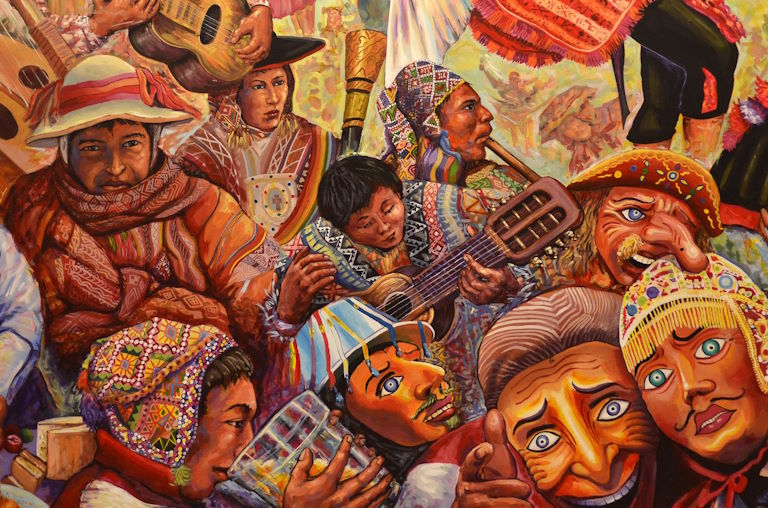

© 2020 International Urantia Association (IUA)

## April 24 to 25, 2021

<figure id="Figure_1" class="image urantiapedia">

<figcaption><em>Image by Carlos Chirinos</em></figcapton>
</figure>

Image by Carlos Chirinos

For many, the CV-19 pandemic has caused havoc, and for those of us in Urantia Peru who have been organizing the planned 2021 Urantia Association International conference in Cusco (Peru) for a long time, it has clearly presented a great challenge. However, it has also presented us with a great opportunity. This crisis has allowed us to analyze the important reasons why we should not cancel this international conference that has been in the planning stages since 2017.

Just as the Father guides us in different ways along our spiritual journey, with his help we have been able to find another way to produce this conference by adapting to the changed circumstances.  

We saw that the theme chosen for this international conference—_Towards Cosmic Citizenship, Your Time Has Come_—could be just as successfully addressed in a virtual format. By doing this, it means a larger number of readers and friends of _The Urantia Book_ from every part of the world can attend and be connected with one another. In addition, we can now call on new speakers and workshop facilitators from distant countries—people who may not have be able to attend a face-to-face event.

Much of the work that has already been addressed to ensure a high-quality standard for our well-deserving attendees, applies to the virtual format as well. Although virtual, it will be equally effective and efficient.

As a result of this challenge, we decided to become more familiar with digital technology; we have undertaken many training sessions, attended meetings on different digital platforms, and consulted lots of young people who are very familiar with digital technology. All this has helped us to consider and assess advantages and disadvantages, and to find the best way to make this event beneficial to all.

So today, with much joy, we can confirm that this important event will take place on April 24-25, 2021 and will be free of charge! We intend to use images of Cusco—our original planned site—as a place that shows the legacy of the violet race.

There will be speakers of all ages representing most continents. The conference will last two days and each day will be composed of two main sections—inspiring presentations and practical workshops. We will provide virtual networking rooms for those who wish to fraternize with one another, and we will also have an opportunity to virtually explore parts of Cusco.

Music will not be absent as some talented artists will be participating in the conference. As a matter of fact, we’d like to take advantage of this opportunity to invite any singers and musicians who are willing to perform and inspire us with their art, to send us an e-mail with a sample of your work as an audition.

Likewise, we call for volunteers of all ages from any part of the world, who speak Spanish, English, French and/or Portuguese to join with us to become part of our virtual working team. 

This event will truly be a unique opportunity to convene and unite—what better way to make this happen seeing as the time has come for us to head “Towards Cosmic Citizenship!”

Lourdes Burga-Cisneros  
Urantia Peru President

Antonio Schefer  
Conference Committee Chair  
Urantia Association International

e-mail: [urantiaperupresidencia@gmail.com](mailto:urantiaperupresidencia@gmail.com)

## References

- Tidings newsletter: https://urantia-association.org/about-tidings-newsletter/
- This issue: https://urantia-association.org/newsletter/tidings-december-2020/
- This article: https://urantia-association.org/virtual-conference-peru-2021