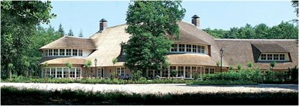
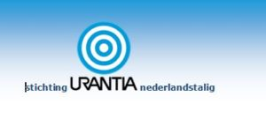

© 2017 Jaap Terra © 2017 International Urantia Association (IUA)

<figure id="Figure_1" class="image urantiapedia image-style-align-left">

</figure>

As in previous years Urantia Association of the Netherlands (UAISUN) is organizing this year’s 2017 annual Urantia Conference for Dutch speaking students of _The Urantia Book_ on August 21st. We will also be celebrating the birth of Jesus of Nazareth, the incarnation of Michael of Nebadon.

Last year we enjoyed an upward trend in the number of attendees compared to previous years; we hope this development continues.

This year’s conference will focus on: _Jesus as a Human Being, as the Living Way, as the Leading Example._ We will be exploring how Jesus developed as a human being prior to his public work.

The venue of the conference will again be the Estate Groot Kievitsdal: ([www.grootkievitsdal.nl](http://www.grootkievitsdal.nl/)). This beautiful centre is perfectly equipped for social meetings.

Groot Kievitsdal is beautifully situated between the forests of the Estate Pijnenburg on the road between Hilversum and Baarn and is well known as one of the most beautiful locations in this region.

<figure id="Figure_2" class="image urantiapedia image-style-align-right">

</figure>

More information about this conference can be found at: [www.urantia.nl](http://www.urantia.nl/).

Jaap Terra,  
President of Urantia Association of the Netherlands (UAISUN)

Read more about

 

## References

- Tidings newsletter: https://urantia-association.org/about-tidings-newsletter/
- This issue: https://urantia-association.org/newsletter/tidings-june-2017/
- This article: https://urantia-association.org/dutch-urantia-conference