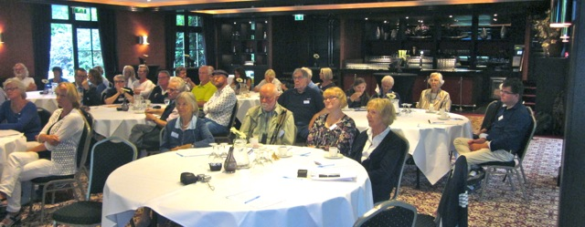
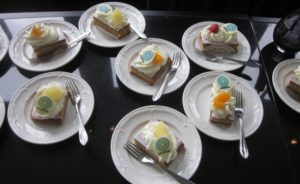

© 2016 Jaap Terra © 2016 International Urantia Association (IUA)

<figure id="Figure_1" class="image urantiapedia image-style-align-left">

</figure>

On Sunday, August 21st the annual Dutch Urantia Meeting Day was held in a nice conference centre “Groot Kievitsdal” near Baarn. It was the 10th time we celebrated the birth of Michael of Nebadon, incarnated as Jesus of Nazareth on Urantia, with readers of _The Urantia Book_.

We could rejoice with a large number of attendees, including 17 new guests visiting this gathering for the first time. It was nice to see that visitors who had joined us in previous years and those who visited for the first time felt a sense of belonging.

During the introduction, attention was paid to the administrative affairs of the SUN (the Urantia Association of the Netherlands). Bernhard Mertens, who passed away in early August after being in hospital for 40 days, was commemorated. Bernhard Mertens and Johan Vandewalle took care of the various presentations for the last few years at our Urantia gatherings. Also Johan and Bernard were planning to provide the first reading for this year.

There is a Urantia candle that we lit as a symbol of the alliance between the Dutch and Belgian Flemish readers of _The Urantia Book_ as some Flemings were our guest this day.

<figure id="Figure_2" class="image urantiapedia">

</figure>

Leading up to the Urantia Association International Conference in Amsterdam in 2018 with the theme: “Jesus as a Teacher,”  the main theme for this year was chosen to be: “Michael of Nebadon: Son of God and Son of the People.” Johan Vandewalle took care of the first presentation with the theme: “The status of Michael for his final bestowal,” while Karen Huigsloot presented the second reading relating to the final bestowal, Jesus himself, his dual purpose, and his bestowal orders and restrictions.

The third presentation was innovative in design. Ria Sprenger and Ina Terra held a dialogue, led by Frank van Rooij with the theme: “The current position of Michael of Nebadon and the value of his bestowal on this planet and the local universe.”

Some passages of the life of Jesus from _The Urantia Book_ were distributed to the attendees so that we could participate interactively, using examples from everyday life and thereby posing the question: “What would Jesus do?” The information from _The Urantia Book_ really came “alive.” From the responses on the survey at the end of the meeting, we concluded that the attendees appreciated this innovative way of presentation.

After the presentatons there was an opportunity to ask questions to the speakers. Some interesting discussions arose. To the credit of the audience, everyone’s opinions where treated with respect. Ultimately it is everyone’s personal relationship with God.

<figure id="Figure_3" class="image urantiapedia image-style-align-right">

</figure>

Afterwards there was sufficient opportunity for social interaction. Given the positive response we have received, we can certainly speak of a successful day.

Make a note in your diary: Urantiadag 2017 on Monday, August 21st.

Jaap Terra

## References

- Tidings newsletter: https://urantia-association.org/about-tidings-newsletter/
- This issue: https://urantia-association.org/newsletter/tidings-november-2016/
- This article: https://urantia-association.org/dutch-urantia-meeting-21st-august