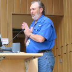

© 2022 James Woodward © 2022 International Urantia Association (IUA)

<figure id="Figure_1" class="image urantiapedia image-style-align-left">

</figure>

The Prison Inquiry Response Team (PIRT) is very near and dear to me. Before it had the official title and an official Director (David), responding to prisoners was one of my duties at Urantia Foundation. As the Reader Services Manager, I was fielding lots of inquiries about _The Urantia Book_, including a growing number of letters from prisoners all over the United States. I decided to recruit my friends in Urantia Association to help with the workload, and a lasting service partnership developed between Urantia Foundation and the Association. The volunteers were eager to serve in a unique and valuable project.

Those “inside the walls” often sent stunningly sincere letters to the publisher; some were requesting pen-pals but that fell outside the office duties. Handing off the correspondence worked out well. Urantia Foundation continued to send the books after the volunteers had vetted an inmate’s level of interest.

<figure id="Figure_1" class="image urantiapedia image-style-align-right">

</figure>

Soon there was a small but devoted team in place. We had a successful program! But it needed someone to oversee the volunteers, keep abreast of prison book policies, and be a visible advocate. My friend David Linthicum turned out to be that person. David was not only a gifted leader of people, an astute administrator, and a passionate Urantia Book student, he also had a personal interest in prison outreach: a close family member was incarcerated. I thanked the angels for this rare individual who was inspired to step up.

David’s achievements have been remembered in so many fine tributes. To me he was a loyal and trusted friend, and I admired his passion for enlightening those in dark places with an epochal revelation. He was an inspiration to all of us. It should not go unsaid that David was a relentless advocate for PIRT and not only gave it his time but also his money when there was need. It can seem a cliche to say that someone is a stand-up guy, but that’s what David was. Always. We spent lots of time together on Urantia Association service teams but he was also a buddy who was a sheer pleasure to hang out with. See ya later my friend.
 

## References

- Tidings newsletter: https://urantia-association.org/about-tidings-newsletter/
- This issue: https://urantia-association.org/newsletter/tidings-special-issue-june-2022/
- This article: https://urantia-association.org/ode-to-a-friend