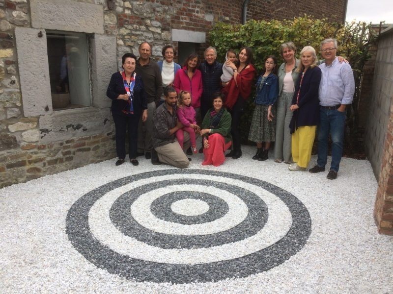

© 2020 Jean Annet © 2020 International Urantia Association (IUA)

<figure id="Figure_1" class="image urantiapedia">

</figure>

On September 27th, a little more than a month after our Creator Son’s birthday on August 21st (COVID obliges) we met in a small group to celebrate our Master Jesus. The hygiene situation did not allow the meeting of large groups, so we took the opportunity to strengthen our fraternal ties.

The meeting began with a convivial meal where we shared the dishes that each one had brought. It was also an opportunity to see the new generation grow and develop. The young Marion (12 years old) has participated almost every year in the group of the Belgian association and Anouchka and Eugene’s little daughters, Solène and Nola, are growing up with parents who are fervent readers of _The Urantia Book_.

In the afternoon we started a spontaneous study group led by Agnès Lazar and our friend Guy Perron from Quebec. It was extremely enriching, especially since one participant was the wife of a long-time reader, but not a reader of the book herself. She shared with us how we can sometimes gargle with big words and beautiful theories about the book but that reality does not always follow the word. It was an opportunity for a frank exchange on the theory and practice of the teachings of the book.

We may have read many times passages without putting it into practice. We remembered how much better it is to act and to develop and manifest the fruits of the spirit without necessarily having a great knowledge of the book, than the other way around.

Then we took a picture in Jean and Isabelle’s new Urantia garden. The day ended with another meal, each of us wanting to make the most of this fraternal reunion.

The ABFU, the _Association Belge Francophone d’Urantia_ exists since 2004 when Gaétan Charland and Gary Rawlings came to Belgium to formalize the existence of the association within the ranks of Urantia Association.

In nearly 15 years, the members of the association have developed several reading and study groups, given numerous conferences around _The Urantia Book_, participated in fairs, organized study days on topics from the book and proposed almost every year festive meetings around August 21 to celebrate Jesus’ birthday.

It currently has about 30 members, although some are no longer very active. We can estimate that about a hundred people have participated in one or another of the organized activities over the years.

## References

- Tidings newsletter: https://urantia-association.org/about-tidings-newsletter/
- This issue: https://urantia-association.org/newsletter/tidings-december-2020/
- This article: https://urantia-association.org/urantia-belgian-group