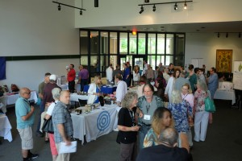
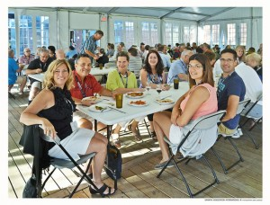

© 2015 Jeff Wattles © 2015 International Urantia Association (IUA)

<figure id="Figure_1" class="image urantiapedia image-style-align-left">

</figure>

The international conference that Line and Gaetan Charland, and others organized in Quebec was unforgettable for me for many reasons, but most of all because of the new initiatives of cooperation that our hardworking and dear President Chris Wood announced between Urantia Association and the Fellowship in upcoming conferences.  One for which I have a date is a joint conference planned for June 9-12, 2016, in San Antonio. Other announcements will be shared as appropriate. There’s one in Budapest; and another in Latin America.

When I attended the Summer Study Session, I could feel it. People are being drawn together – the unseen friends are moving like nothing I’ve ever witnessed before. Anger is being flushed, friendships are being formed, and love is breaking out. Members of Urantia Foundation are involved, too. I heard a number of reports about people who had not associated across organizational lines who are now doing so.

<figure id="Figure_2" class="image urantiapedia image-style-align-right">

</figure>

Those of you who were not in Quebec might want to take a deep breath and see if you can sense and participate in this movement of cooperation and openness. Please pray for the organizers of various organizations and continents and for the participants to sustain this wave.

Obviously it is not necessary to travel in order to be part of this. Audio and video recordings were made of the plenary proceedings in Quebec, and in due time I expect they will be available for you to see. Also, there are many other ways for all to participate.

I have long advocated spiritual unity, assuming that organizational harmony would follow; and my motto from the 1990s was cooperate when you can, fight when you must (and if we cooperate when we can, the need to fight will become less and less). I am one who discovered that I was carrying anger about organizational things that I did not even know was in me, and the next morning in Quebec, it got swept out of me like a spirit hurricane.

I can see how each person has a part to play, and each person is playing his or her part to the best of their abilities. Let us rejoice in the unifying power of the Spirit of Truth. A new day is dawning.

Thanks to One and all!
 

## References

- Tidings newsletter: https://urantia-association.org/about-tidings-newsletter/
- This issue: https://urantia-association.org/newsletter/tidings-august-2015/
- This article: https://urantia-association.org/quebec-conference-reflections