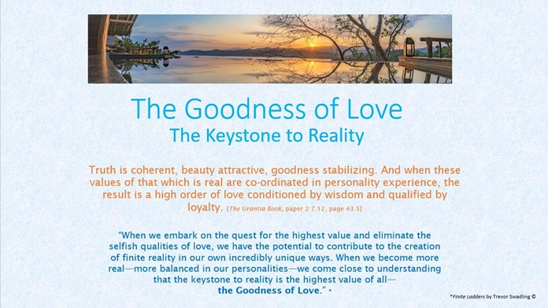
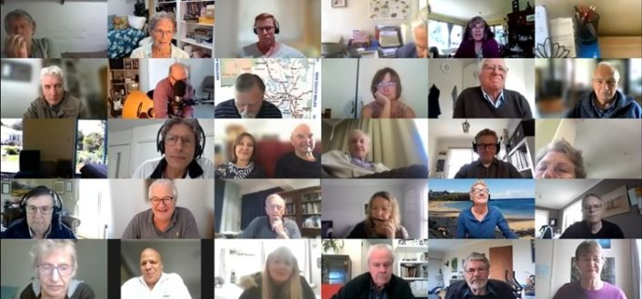

© 2021 Kathleen Swadling © 2021 International Urantia Association (IUA)

<figure id="Figure_1" class="image urantiapedia">

</figure>

This year’s 2021 ANZURA conference, hosted by our Sydney team was held as a virtual Zoom conference on 2nd October. Once again, for all the “new normal” reasons we had to cancel our in-person event. We had high hopes all year that we could meet face-to-face as we saw our case numbers rapidly diminish to almost zero and then… as we all know, Delta hit and cases soared, so it was back to square one. Nevertheless, since we are told that disappointment is actually good for us, we joyfully knuckled down to figure out how we could adjust our plans accordingly.

As this was our second year of lockdowns, many of us were becoming old hands at holding conferences, meetings, and study groups via Zoom. Even though the virtual format is not as good as our face-to-face conferences, it was still wonderful to be with everyone virtually for a good six hours of in-depth Urantia Book presentations and discussions. This method has proven to be a surprisingly effective alternative in keeping us all connected and has even had the very positive outcome of allowing many who could not previously attend study groups or gatherings because of distance, to participate from the comfort of their living rooms.

Merindi Belarski was our MC, and our team of presenters were Julian Martin, Nigel Nunn, Phillip Marriott, Andrew Swadling, Merindi Belarski, Daniel Swadling, Robert Coenraads, Vern Verass and Rita Schaad.

We had a couple of musical interludes thanks to a live performance from Jim Neal and a pre-recorded video clip of a song by Trevor Swadling. We closed with a video clip of what is becoming a conference all-time favorite; _Pray Tell Me How_ (written by Rebecca Oswald and Michael Hanian). Here is a list of the presentation topics:

**Living in the Flesh** – Julian Martin  
**We Are Because I AM** – Nigel Nunn  
**Courageous Loyalty** – Phillip Marriott  
**How is Truth Coherent?** – Daniel Swadling  
**How is Beauty Attractive?** – Merindi Belarski  
**How is Goodness Stabilizing?** – Andrew Swadling  
**The Benefits of Factual Mediation** – Robert Coenraads  
**Fountainhead of Creative Thinking** – Vern Verass  
**Closing Worship** – Rita Schaad

The conference was recorded, and the presentations will eventually be uploaded to YouTube. (Be patient for that. We will announce when they are available.) You will also find a couple of the presentations as articles in this issue of the _[Arena](https://anzura.urantia-association.org/newsletter/arena-winter-2021/)_.

Thank you to all the silent worker-bees who made this event happen. We hope we will see everyone in October of 2022 in Tasmania for what we hope will be an in-person conference.

<figure id="Figure_2" class="image urantiapedia">

</figure>

## References

- Tidings newsletter: https://urantia-association.org/about-tidings-newsletter/
- This issue: https://urantia-association.org/newsletter/tidings-december-2021/
- This article: https://urantia-association.org/2021-anzura-virtual-conference-report