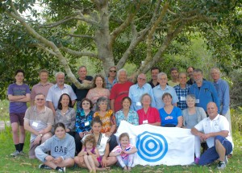
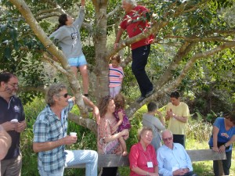
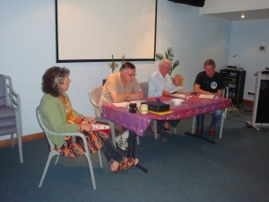

© 2015 Kathleen Swadling © 2015 International Urantia Association (IUA)

## Faith and Courage – the Pathway to Paradise and Beyond

<figure id="Figure_1" class="image urantiapedia image-style-align-left">

</figure>

This year’s Australia & New Zealand Urantia Association (ANZURA) conference was held 9 to 12 October at the Sydney Academy of Sport & Recreation on the shores of the beautiful Narrabeen Lagoon on the Northern Beaches of Sydney. The members of the Sydney Study Group hosted the conference and apart from the Sydney readers, other attendees travelled from Brisbane, Canberra, Finland, Hobart, Melbourne, Newcastle, New Zealand, NSW Central Coast, Queensland’s Gold Coast, and Wollongong. A special thanks went to our visitors who travelled all the way from Finland, Irmeli Sjolie and Matti Hokka.

Given that the members of the Sydney Study Group are keen to hone their skills in presenting topics from _The Urantia Book_, the conference planning committee decided to allocate short presentation time slots to allow for a diversity of presentations. Not only did this approach give the presenters a unique opportunity to delve into an in depth study of their topic and to exercise their presentation abilities, it also kept the conference attendees engaged and interested and left them with much food for thought.

Following is a list of the presentation titles and their presenters: 

- _The Path of Faith_ – William Wentworth
- _Independent Courageous Cosmic Thinking_ – Trevor Swadling
- _Ordination of Faith & Courage –_ Bernie B
- _Daring to Launch – beyond where reason and wisdom can go –_ Nigel Nunn
- _Meditation – the pathway to mental, physical and spiritual activity –_ Neil Francey
- _To Catch a Fraud –_ Daniel Swadling
- _Faith from a Personal Perspective –_ Neville Twist
- _The Act is Ours, the Consequences God’s –_ Phillip Marriott
- _Follow the Yellow Brick Road –_ Kathleen Swadling

<figure id="Figure_2" class="image urantiapedia image-style-align-right">

</figure>

These presentations will gradually be published as study articles in the next few issues of the _Arena_ (ANZURA’s newsletter that can be viewed at [http://urantia-association.org/arena-archives](http://urantia-association.org/arena-archives)).

As well as the presentations there were several other engaging events:

- A break out study session where we all read Paper 196, _The Faith of Jesus_;
- An “Open Space” session facilitated by Marion Steward where spontaneous discussion groups were created around subjects chosen by various participants;
- An inspiring Sunday morning worship session skillfully facilitated by Julian Martin and Christian Birch;
- A Discussion Panel, facilitated by Merindi B where questions were posed to members of the panel on their personal spiritual journeys. This also stimulated much discussion among the wider group.
- A relaxing stroll around the lake shore;
- An hilariously entertaining evening with the _Courageous Capers All Star Talent Show,_ MC’d and master minded by Julian Martin, whereby attendees had an opportunity to entertain the group with their very talented (or not so talented) creative performance abilities. A panel of four extremely critical judges critiqued each performance and gave out scores. And boy, were they tough J. Funky prizes were given for first, second and last!

<figure id="Figure_3" class="image urantiapedia image-style-align-left">

</figure>

Then of course we can never hold a conference without making time for ANZURA’s Annual General Meeting.  The usual business matters were discussed and elections for Vice President and Treasurer were held.  Neville Twist was elected as Vice President and Trevor Swadling as Treasurer.  William Wentworth continues as President and Phillip Marriott as Secretary. Ian Campbell replaced Marion Steward as the New Zealand Representative. Julian McGarry from Hobart volunteered the crew in Tasmania to host next year’s conference. Stay tuned for more details on that one.
 

## References

- Tidings newsletter: https://urantia-association.org/about-tidings-newsletter/
- This issue: https://urantia-association.org/newsletter/tidings-october-2015/
- This article: https://urantia-association.org/anzura-annual-urantia-book-readers-conference