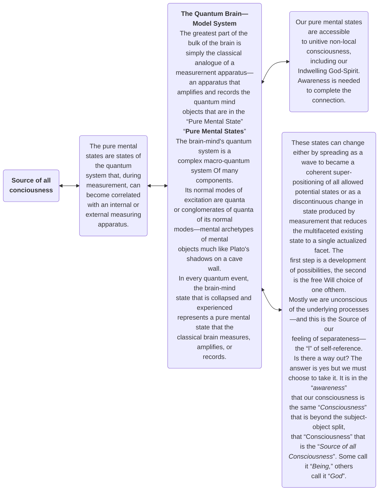

© 2004 Ken Glasziou © 2004 The Brotherhood of Man Library

Most Westerners accept as scientific fact the idea that we live in a materialist world–a world in which everything is made of matter and in which matter is taken as being the only fundamental reality.

In no small part, this scenario owes its origins to the French mathematician, Rene Descartes, who, 400 years ago, proposed his famous philosophy of dualism, one that divides the world into an objective sphere of matter and a subjective one of mind. Together these enshrined his ideas of the world as simply being a machine.

Worse still, a century later Newton and his heirs conclusively established the principle of causal determinism–the concept that all motion can be predicted exactly using only the physical laws of motion and the initial conditions of the system in motion.

Imagine a bunch of billiard balls on a perfectly even billiard table. Given Newton’s equations of motion and the initial positions, masses and velocities of all of these balls at some initial time then, so determinism claims, the whole future of these billiard balls can be calculated.

The philosophical import of this kind of thinking took root to such a degree that another French philosopher-scientist, Pierre Laplace, was able to propose that if some superior intelligence, at a given instance, was acquainted with all the forces by which nature is animated, and at some initial moment also knew the position and velocity of each and every particle of matter then, to that superior-intelligence, neither the past nor the future of the universe would be uncertain.

Laplace also wrote a highly successful book on celestial mechanics. This caught the attention of his emperor, Napolean, who asked why it was that he made no mention of God–to which Laplace responded, “Your majesty, I have no need of that hypothesis.” In a fully deterministic Newtonian world, God was no longer needed!

To these principles of objectivity and determinism in classical physics, a third was added by Einstein. This came as a consequence of his declaration that the velocity of light was a limiting velocity in a vacuum–the velocity of light was a constant that no material thing could exceed.

The implications of this speed limit were far reaching, perhaps none being more important than that all interactions between things material in space-time must travel through space one piece at a time and with finite velocity. Hence all such interactions must be “localized”–they must occur within the boundaries set by the speed of light. This fact has been given the name, ‘the principle of locality.’ Later we will learn that certain important quantum events ignore the principle and can occur instantaneously, even if at opposite ends of the universe. Such events are said to be ‘non-local.’

For about 200 years Cartesian dualism went more or less unchallenged. But then scientists, in particular, began to challenge the mind side of dualism, substituting the principle of material monism, which means there is only one central principle, in this case, matter. Hence, mind, consciousness, and spirit were relegated to being epiphenomena, existing only as derivatives of matter.

And that, roughly, is where the majority of the Western world finds itself today–all without realizing they are more than fifty years behind the empirical findings of modern science–something we will now seek to demonstrate.

<figure class="image urantiapedia image-style-align-left">

<figcaption><em>The Thomas Young experiment of 1803. Light from the light source (far left) passed through a tiny hole (A), then through two parallel slits (B) to shine on a screen (C) and produce a series of light and dark bars that Young interpreted in terms of light waves interfering with one another.</em> </figcaption>
</figure>

<figure class="image urantiapedia image-style-align-right">

<figcaption><em>In Thomas Young's experiment' light waves shine through a pinhole to two slits, thence focus on a screen to produce an interference pattern of alternate light and dark bands.</em> </figcaption>
</figure>

## Beyond Space, beyond any Thing

First we need to know that there is an enormous size gap between the micro world of the atom and that world we normally think of as being microscopic–something visible under a microscope. With a very good microscope bacteria and other single cell organisms can become visible. Their size is mostly in the range 1-10 x 10^-4^ cm. An atom is about 10^-8^ cm; an atom’s nucleus is about 10^-13^ cm; an electron about 10^-21^ cm. (10^-6^ = one 1 millionth; 10^-9^ = 1 billionth)

Perhaps our first intimations of the peculiarities of the quantum world came in the early 19th century when Britisher, Thomas Young, obtained unequivocal evidence that light had similar characteristics to what is observed in a pond of water when wave fronts emanating from different disturbances meet one another. Where their wave peaks meet, they reinforce. When trough meets peak, they cancel.

Young’s concept of the underlying wave characteristics of light dominated physics for the next one hundred years. But then along came the young Einstein to throw a hammer in the works with his interpretation of the so-called photoelectric effect which implied that light also behaved as if it consisted of particles. It turned out that both Young and Einstein were right–light does behave both as a wave and as a particle.

The light particle is given the name “photon.” It is also determined to be mass-less. So what about other sub-atomic particles, those that do have mass, and even electric charge, such as the electron for example?

Experiments of the same kind as Young’s in which a narrow beam of electrons was passed through two parallel slits and then onto a screen gave the same result as Young obtained–an interference pattern of narrow bars interspersed by gaps. So electrons too, appear to have wave-like characteristics. However when electrons were used, it was also technically possible to slow their presentation rate until only one electron at a time was presented.

At first the result appeared to be that each electron registered on the screen as a single spot–that expected for particle-like behavior. But as time went by and thousands of spots accumulated on the screen, the result was extraordinary–a series of bars interspersed with gaps slowly built up (see below). And since each electron went through the slits, one at a time, for this pattern of light and dark bars to build up, each electron surely had to go through both slits and somehow interfere with itself!!

Many years of quite ingenious experimentation were required to catalogue what happens.

> God is possessed of unlimited power to know all things; his consciousness is universal. [UB 3:3.3](/en/The_Urantia_Book/3#p3_3)

<figure class="image urantiapedia image-style-align-right">

<figcaption><em>With our experimental set up similar to that of Thomas Young but using electrons instead of light to bombard the slits get similar results as for light—an interferente pattern when both slits are open and a single bar for just one slit open. But the rate of presentation of electrons could be slowed until only one at a time presented. Initially this gave a single bar directly behind each slit. But as time progressed, once again the interferente pattern slowly built up. The conclusion: each electron interferes with itself!</em> </figcaption>
</figure>

## Delayed choice equals “necromancy?”

In view of the surprising results already obtained it was inevitable that, sooner or later, someone would pose the apparently stupid question, “What would happen if the second slit was not opened until its photon or electron had already gone through the alternative open slit.”

The actual result from testing this hypothesis is illustrated below. With just one slit open, a single bar was obtained (not shown).

When the second slit was opened but only after the photon had already passed through and beyond the first slit, the single dots gradually built up into the bars of the interference pattern. This remained true when any signal to open the second slit would need to exceed the speed of light. Thus any such signal would need to be non-local. (ref. Hellmuth at al, 1986)

Labelled ‘necromancy’ (utilizing information from the dead) when first proposed, the actual experimental proof for “non-locality” had to await development of appropriate technology before becoming achievable. In the meantime advances both in theory and technology already indicated what the probable result would be.

> Everything should be made as simple as possible—but not simpler.
> Albert Einstein

<figure class="image urantiapedia image-style-align-right">

<figcaption><em>The above diagram illustrates the principles of “delayed choice”. With one slit closed, there is no interference and only a single bar appears on screen. With 2 slits both open we have a repeat of Thomas Young's work. What would happen if opening the second slit delayed until after the photon had already passed through the one open slit. The answer? We get the interferente pattern, even when there is insuficient time for a light signal to travel from the point of decision making (arrow) to the slit.</em> </figcaption>
</figure>

## Hidden variables and non-locality

The critical advance in theory came from Irish physicist, John Bell, whose 1965 theorem, among other important predictions, showed that in order to be compatible with quantum theory, hidden variables must be non-local. This was contrary to the criticism of quantum theory by Einstein who insisted that the theory was incomplete, that there must be undiscovered “hidden variables” that would complete the theory and make its extraordinary results rational. To his dying day, Einstein would not accept the concept of non-local signals. For him, all had to be predictable, determinist, and within the boundaries set by local signaling, the speed of light being the upper limit.

Einstein was long dead before technology advanced sufficiently to permit the concept of non-locality to be put to empirical testing.

Though Bell’s theorem had been scrutinized in the laboratory and had given some positive results, it was only in the year 1982 that incontrovertible evidence, acceptable to peer scrutiny, became available through the work of a French group of physicists led by Alain Aspect.

This French group took advantage of the fact that a radioactive isotope of calcium emitted twin pairs of correlated photons in opposite directions. Being correlated means that they share certain properties such that if the magnitude of such a property for one of the twins is known, that for the other can also be determined.

The result of their experiments was to show that whatever happened to one of the correlated photons affected its twin even though no signal at light speed or less could pass between them— implying that instantaneous communication somehow occurred and would still do so even if the photons were at opposite ends of the universe. . . 

Thus the criticism by Einstein and co-workers, Podolsky and Rosen, regarding hidden variables and correlated properties was shown by Aspect’s group to be entirely wrong. It also established the reality beyond doubt of the phenomenon of non-locality as well as demonstrating that if hidden variables existed they must be non-local–that is in a transcendent dimension outside of our space-time. . . 

The Aspect experiment has since been confirmed by independent workers, one such group being in Switzerland where the optical fiber system between two villages separated by a high mountain was utilized. The distance between them was about 15 kilometers. But that was some time back. The record is probably very much larger at the present.

Among the many confirmatory experiments demonstrating the reality of non-local effects is a group of optical tests that “raced” twin photons to a target, one of which had to tunnel through a barrier placed in its path. Curiously, the photon tunneling through the barrier arrived at the target before its twin (which traveled at the speed of light.) For the twin that tunneled through the barrier, the average tunneling velocity was 1.7 times that of light, so a “non-local” effect. A second curiosity was that the twin doing the tunneling was able to “sense” the far side of the barrier and cross it in the same amount of time, no matter how thick the barrier was made. (see Chiao et al. 1993)

Query: how does a mere photon “sense” the thickness of a barrier?

<figure class="image urantiapedia image-style-align-right">

<figcaption><em>The Aspect Experiment. Radioactive calcium emits twin pairs of correlated photons in opposite directions. Each of a pair is passed through a polarizer prior to its polarization being measured. The polarizer on the right has a switching device that changes the angle of polarization every one ten billionths of a second. This time interval is too short for any signal traveling at the speed of light to span the distance between the measuring devices.  The experiment showed that what happened to the photon passing through the switched polarizer was reflected in its twin. This result is expected even if the correlated photons were at opposite sides of the universe. Termed a non-local effect, the linked behavior of the correlated photons is consistent with quantum theory and directly refutes the Einstein-Podolsky-Rosen expectation of no non-local effect.</em> </figcaption>
</figure>

<figure class="image urantiapedia image-style-align-right">

<figcaption><em>When we try to identifY which slit the particle passes through. using some means to identify which slit the photon or electron shows its particle nature and gives only the two bars directly behind the slits. Conclusion: Any attempt to discover “which path” will result in particle-like behavior.</em> </figcaption>
</figure>

## Non-locality—its supreme importance

Quantum theory has many strange quirks that are rightly labeled “out of this world.” Of these, surely the most significant for us human beings is the Bell-Aspect proof of the reality of non-locality–that is a transcendent arena of reality outside of space-time–the existence of which constitutes the ultimate challenge to materialism.

Carried to a logical conclusion, non-locality implies the existence of a transcendent universal consciousness (i.e how does a mere photon “sense” the thickness of a barrier?)–and that consciousness is both within and beyond this material world. For material realists the alternative interpretations are:

To accept that there are faster-than-light signals in a transcendent realm in which hidden variables exist. Either give up strong objectivity or else accept a role for the observer’s consciousness. Sweep the Bell-Aspect work under the carpet.

The Bell-Aspect results and their independent confirmation occurred more than 20 years ago. And although they shattered the foundations of materialism, they can provide a meaning for life, even open the pathway to God, and are by far the most significant achievements of quantum science for humanity up to this present day–nevertheless they remain ignored and almost unknown.

### What most quantum physicists believe

Back in 1911, Ernest Rutherford proposed a planetary model for atomic electrons which, he said, circulated around the atom’s nucleus much as planets revolve about the sun.

However this model had a weakness in that it was inherently unstable and should eventually result in electrons crashing into the nucleus or being lost by its atom.

Suppose, said Norwegian physicist, Neils Bohr, that the orbits the electrons describe are discrete. Each such orbit, from the lowest energy level to the highest, has a fixed unalterable pathway–a stationary orbit, non-changing in its energy value. To change that orbit, energy must be absorbed or emitted in discrete quanta. But in doing so, it is by a quantum jump, without that electron ever being anywhere in between.

These electron orbits were also visualized as stationary waves, each of which, according to Max Born, was really a probability wave that tells us where we are likely to find an electron in any attempted observation. However, in order to do so for a single electron, the observer is forced to collapse the wave pattern. Thus single electrons can only ever be observed in particle form.

These concepts were slowly developed by physicists such as Heisenberg, Dirac, and Schrodinger–the wave equation for matter, known as the Schrodinger equation, emerging as the connection for the mathematics that replaced Newton’s laws in the new physics.

The revolution in all this was that the change over from classical to quantum physics introduced uncertainty, for we can no longer think in terms of the absolute position and momentum of any object. Now, and presumably forevermore, we can only provide a probability estimate of such parameters, and these must be in accord with the Heisenberg uncertainty principle which states that the more accurately we know the position of an object, the less we can know about its momentum or velocity–and vice versa.

These are “uncertain” times in which the atom and its sub-atomic components belong to the quantum world–a world of components that exist in states of “being neither this nor that,” and are dislodged from such states only when observed.

<figure class="image urantiapedia image-style-align-left">

<figcaption><em>The results of repeated measurements of the position of a hydrogen electron in its orbit of lowest energy. The distribution is illustrative of the probabilistic distribution of the electron.</em> </figcaption>
</figure>

<figure class="image urantiapedia image-style-align-right">

<figcaption><em>De Broglie's vision of electrons as stationary waves surrounding the nucleus in the confinement of the atom.</em> </figcaption>
</figure>

## Decisions—who or what makes them?

Beyond all this there is the problem of decision making. Who, what, and where are the decisions made on the actions to be taken. And who or what keeps the records? After an electron wave is collapsed by an observer to become a particle in order to make a measurement, an electron particle will, of its own accord, spread out quite rapidly but only as a probability wave.

Given sufficient time it could spread throughout the whole universe–only to be ordered to collapse instantaneously to a particle state again because some inquisitive human being wants to make a measurement. Who has the record of its probability distribution so that the collapse can be carried out instantaneously in an orderly manner?

In the Aspect experiment, it was the measurement of the polarization of one of two correlated photons that collapsed its wave function–and instantaneously and automatically brought about the polarization alignment on the same axis of its correlated partner. Yet no signal at light speed or less could pass between them.

It was the conscious decision of the experimentalists that both started the chain and triggered the second collapse. A consciousness that can trigger both collapses, the second collapse somehow getting its instructions from beyond space and time, must surely itself be non-local or transcendent, or at least be contiguous with a consciousness that is so capable.

Quantum physics has demolished materialism as a valid concept. So what alternatives are there that are consistent with presently known ‘facts.’ One possibility is some form of monistic idealism such as the well-known platonic version of people who sit in a dark cave watching the shadows on its back wall. According to Plato that is the reality, for what we experience in this world is but the reflections of the reality of the perfect world that lies beyond our vision.

Is our science compatible with an appropriate form of idealism (based on ideas), and if so, can we interpret both science and philosophy on some mutually compatible formulation?

At least superficially, there is a resemblance between the answers to key questions given by quantum physics and those given by Zen masters:

“What is Buddha?” asked a student monk. “The mind is Buddha,” answered the master. “Then what is mind?” asked another student. “The mind is not Buddha,” responded the master.

Imagine a student asking the ghost of physicist Neils Bohr if an electron is a particle. “It is,” is his likely reply. Another student asks him, “Is an electron a wave?” Again Bohr responds, “It is.” “Where can we find such a wave?” asks another. “Beyond time and space,” says Bohr. “And where is that?” is the next question–to which Bohr enigmatically answers, “Where the wave is.”

When we fire electrons, one at a time through parallel slits, at first single hits register on our screen–which is consistent with the electron as a particle. But if we fire thousands of single electrons, one at a time, through the same slits, we get an interference pattern–which is consistent with the electron as a wave. This wave aspect persists, even for a single electron–a wavicle? Where is this wave aspect before the thousands of other single electrons were fired, before the interference pattern commenced to register? It never manifests in ordinary space, so where was it hiding and how does it manifest as diffraction only after the event?

> Neither fire nor wind, birth nor death, can erase our good deeds.
> Buddha

<figure class="image urantiapedia image-style-align-left">

<figcaption><em>This diffraction pattern was produced by passing a beam of electrons through a crystal and is illustrative of the wave nature of electrons.</em> </figcaption>
</figure>

If we wish to observe the single electron of a hydrogen atom, we can only do so by collapsing its wave form and observing it as a particle. As soon as we cease observing it commences to spread out probabilistically in accordance with the Schrodinger equation. Where does it go? Wherever that may be, the moment we again choose to observe it, it collapses instantly.

According to physicists, the collapse of such a wave is just too rapid to be within the limits set by the speed of light–so it cannot be within our space-time. So where was it? Heisenberg named its location “potentia,” a word which he borrowed from Aristotle. To be in “potentia” is to be in a transcendent domain that appears to be conceptually identical with “non-locality” as defined by the Bell-Aspect work.

Idealists also consider that to be non-local is to be in the domain of “consciousness,” which, for them, is also the “ground of all being”–a domain which is “original, self-contained, and constitutive of all things, manifesting itself as the subject that chooses, experiences what it chooses, and which collapses the wave function in the presence of brain-minded awareness.”

Quantum theory then, when interpreted according to idealist metaphysics is paving the way for an idealist science in which consciousness is the “all of being”–and matter and materialism pale into secondary importance.

However a primary contribution of quantum physics to this scenario is that it has positively demonstrated a new dimension, non-locality, showing that there is more to this world than just matter, Einsteinian space-time, and a pre-determined, mechanistic universe.

> the universe of universes in toto is mind planned, mind made, and mind administered. [UB 42:11.2](/en/The_Urantia_Book/42#p11_2)

## Reconciling Realism and Idealism

In what appeared to have been an absurd idea, philosophers Gottfried Leibniz and Bertrand Russell both suggested that the views of realists and idealists can be reconciled if each of us has two heads. Empirical objects, the ordinary objects of our daily lives, would lie outside our “Small Head” to be used or experimented with. But simultaneously these same objects would be theoretical ideas inside of our “Big Head”–which also embraces our “Small Head”–and thus itself becomes an object of empirical scrutiny.

In reality, this “Big Head” does not have to be ours alone, but can be composed of all such Heads. And since this one super Head would hold all of reality within it, we could all be sharing the one “Big Head.”

This concept provides us with two ways of sharing reality. One aspect, all of our small Heads, is “local”–it is within the confines of Einsteinian space-time with accessibility limited by the speed of light. But Big Head is non-local, instantaneously accessible, and encompasses the experiences of every empirical object, including our Small Heads, our empirical brains.

Given the existence of both local and non-local aspects of mind, the latter being an organizing principle connecting with brain-mind and local and non-local consciousness, both idealism and realism can be valid–for if brain-mind is an object in a non-local consciousness that encompasses all reality, then what materialists nominate as objective empirical reality is also within this same consciousness.

But why is there so much consensus about an apparently material, determinist objective world that looks to be so permanent? If it is true that the moon is there only when we look at it–as most quantum physicists will assert–why does that moon appear to be so real, so permanent?

Firstly, even the smallest of classical objects, relative to quantum objects, have enormous masses–which means their quantum probability waves spread only very slowly. Such slow spreading makes the trajectory of their approximate center of mass highly predictable. Thus, whenever we look at the moon, we find it where we expect it. Furthermore the complexity of macro bodies translates into a very long regeneration time for their wave function–which induces us to look at them in causal terms.

In the non-local universal consciousness all phenomena, even so-called classical empirical objects, are simply objects in consciousness.

**The world, the whole universe, is made of consciousness and is existent only in consciousness**. That is a lesson of quantum physics and its differentiation of locality and non-locality.

With idealist science we have arrived at a science that excludes neither the subjective nor the objective, neither spirit nor matter–and thus is able to resolve the deep schisms of our thought.

> All the worlds of every universe are constantly within the consciousness of God. [UB 3:3.2](/en/The_Urantia_Book/3#p3_2)

> The whole Universe is made from consciousness, and is existent only in consciousness.
> Monistic idealism

## What says the Urantia Revelation?

(Please note that the words “consciousness” and “mind” are not precisely defined either in philosophy or in the Urantia revelation and tend to be interchangeable.)

> "In the evaluation and recognition of mind it should be remembered that **the universe** is neither mechanical nor magical;** it is a creation of mind**) ([UB 42:11.1](/en/The_Urantia_Book/42#p11_1))

> “Mechanisms do not absolutely dominate the total creation; **the universe of universes in toto is mind planned, mind made, and mind administered**. But the divine mechanism of the universe of universes is altogether too perfect for the scientific methods of the finite mind of man to discern even a trace of the dominance of the infinite mind. For this creating, controlling, and upholding mind is neither material mind nor creature mind; it is spirit-mind functioning on and from creator levels of divine reality.” ([UB 42:11.2](/en/The_Urantia_Book/42#p11_2))

> “Cosmic mind is the diversified mind of time and space. Cosmic mind comprises all finite mind levels and coordinates experientially with the evolutionary deity levels of Supreme Mind and transcendentally with the existential levels of absolute mind. Mind always connotes the presence and activity of loving ministry plus varied energy systems, and this is true of all kinds of mind. Paradise mind is beyond human understanding; It is existential, non-spatial, and non-temporal.” ([UB 42:10.6](/en/The_Urantia_Book/42#p10_6))

> “The Universal Father is the only personality in all the universe who does actually know the number of the stars and planets of space. All the worlds of every universe are constantly within the **consciousness** of God.” ([UB 3:3.2](/en/The_Urantia_Book/3#p3_2))

> “God is possessed of unlimited power to know all things; his **consciousness** is universal. His personal circuit encompasses all personalities, and his knowledge of even the lowly creatures is supplemented indirectly through the descending series of divine Sons and directly through the indwelling Spirit of the Father.” ([UB 3:3.3](/en/The_Urantia_Book/3#p3_3))

> “The Universal Father realizes in the fullness of the divine **consciousness** all the individual experience of the progressive struggles of the expanding minds and the ascending spirits of every entity, being, and personality of the whole evolutionary creation of time and space. And all this is literally true, for ”**in Him we all live and move and have our being**." ([UB 1:5.16](/en/The_Urantia_Book/1#p5_16))

> With tie and patience, the mulberry leaf becomes silk.
> Chinese proverb

## Quantum Theory and the Observer

In the experiments of Chaio et al. presented below, the basic set-up utilized a down converter, an instrument that splits a photon into twins having equal energy. These then went to a beam splitter that presented two alternative pathways to a detection system measuring the simultaneous arrival of the twin pair–an event that signalled wave-like behavior.

The addition of a polarizer to only one of the alternative pathways labelled that pathway and immediately destroyed all wave-like properties of the photons. The question then asked was: “what would happen if the information about the marked pathway was left intact while the photons went through polarizer P1, but was destroyed by the P2 polarizers just before arriving at the detection system?” The answer was unequivocal–wave behavior was restored.

A more elaborate version of this type of experiment was carried out at the University of Rochester which demonstrated that even when there was no observable difference in the photons arriving at the detection system, if it was even theoretically possible that their pathway could be retraced then that was sufficient to collapse the wave function and bring about particle-like behavior.

### Faster than light

The Aspect experiments which confirmed the theoretical results predicted by Bell demonstrated that any signals passing between the twin pair of correlated photons emitted by radio-active calcium must exceed the speed of light.

High tech optical experiments have confirmed this conclusion. To do so, twin photon pairs were raced against one another. After adjusting their tracks to be identical, a barrier was placed across one path to take advantage of the tunneling effect–an effect long used in electronics with the tunneling diode in which the probability relations for energy distribution permit the occasional electron to surmount “impossible” energy barriers.

Interestingly the photon tunnelling through a barrier arrived at its target before its unimpeded twin, the average velocity over many trials being 1.7 times the velocity of light. It was also found that, in the process of tunneling, a photon is somehow able to sense the far side of the barrier and cross it in the same amount of time no matter how thick the barrier may be. Strange, is it not? Is a photon in some way conscious?

<figure class="image urantiapedia image-style-align-left">

<figcaption><em>Pritchard Experiment at the atomic level: A beam of vaporized sodium atoms sends the atoms to a interferometer providing alternative pathways for single atoms to enter a detection system for signalling wave-like behaviour. When a laser light shines on one only pathway (B), hence giving ‘which-way’ knowledge, the wave signal is lost. But when the wave length of the laser liglt is shortened so as to shine on both paths, a ‘which-path’ path can no longer be determined and the wave-like behaviour of the sodium atoms is restored. ‘Information’ appears to be the only logical variable that is affecting differences in the wave-like behavior in the experiment. But who or what is interpreting? This result with whole atoms that are in the order of billion times larger than an electron brings quantum-type behaviour into the macro-world.</em> </figcaption>
</figure>

<figure class="image urantiapedia image-style-align-right">

<figcaption><em>Chian et al (1992). How erasing and information only can change photon behaviour from wave to particle and back. Pl and P2 are removable polarizers. With none in place the twin pair of photons from a down converter strike a beam splitter and from there can go to a coincidence detection system that signals wave or particle behavior. With no polarizers in place, each photon takes both pathways and wave behavior is observed. Add the polarizer P1 and one pathway becomes labelled. Now we observe only particle behavior. Leaving Pl where it is but add identical polarizers, P2 and the label enabling us to distinguish pathways is destroyed. Wave behavior is restored.</em> </figcaption>
</figure>

## In Search of the Quantum Mind

The empirical evidence deriving from quantum theory research has shown that at molecular, atomic, and sub-atomic levels, prior to observation, objects are composed of something indeterminate that is neither wave nor particle, is neither here nor there but is distributed ‘who knows where’ as a probability distribution that will materialize instantaneously at the behest of an observer. And it does so either as a wave or particle, or a conglomeration of particles depending upon the methodology of the observer.

In their indeterminate format of “neither wave nor particle,” such objects may be distributed in, even throughout, the world of space-time, or alternatively, in a dimension beyond space-time that some refer to as “non-local.”

Non-local is a zone, dimension, or whatever, in which time appears to be non-existent, a zone of reality that is instantaneously accessible on demand from within space-time.

### The Brain-Mind as both a Quantum System and a Measuring Apparatus.

We look at the brain-mind’s quantum system as a complex macro-quantum system consisting of many components.

We can represent the states of a complex quantum system by its so-called normal modes of excitation, its quanta, or more generally, by conglomerates of the normal modes. Suppose these normal modes represent mental archetypes of mental objects (much like Plato’s shadows on the cave wall). Call these states of the brain’s system pure mental states.

Suppose also that the bulk of the brain is the classical analogue of a measurement apparatus and this classical apparatus of the brain amplifies and records the quantum mind objects.

In this quantum model, the mental states are states of the quantum system which, with a measurement, become correlated with the states of its measuring apparatus.

Thus in every quantum event the brain-mind state that is collapsed and experienced represents a pure mental state that the classical brain measures, amplifies, or records.

The concept that most of the brain is simply a measuring apparatus leads to a new and useful way to think about the brain and conscious events.

So could it be that a quantum mechanism in our head opens the way for the supervention of non-local consciousness?

Definitive experimental evidence for a non-local quantum system in the brain-mind comes from Grinberg-Zyllerbaum and co-workers in which two subjects maintain their direct contact while each is in a Faraday cage at a distance from one another. When the brain of one responds to an external stimulus with an evoked potential, the other’s brain also shows a potential, in form, similar to that evoked potential.

This is interpreted as an example of quantum non-locality due to correlation between two brain-minds that is established through their non-local consciousness.

Classical concepts about the brain-mind system mostly treat the brain itself as computer-like hardware with mind being the software. In the idealist model the mental states we experience are derived from the interaction of both the classical and quantum systems.

Importantly, in any individual the causal potency of the brain-mind quantum system arises from non-local consciousness that both collapses the mind’s wave function and experiences the outcome. Objects appear from a transcendent domain of possibility into the domain of manifestation when non-local unitive consciousness collapses their wave function.

However for the collapse to be completed it must be in the presence of an awareness of the brain-mind in order that “measurement” is made. Thus we have a circularity situation–there is no completion of measurement without awareness, but there is no awareness without completion of measurement.

To see our way clear of this circularity we can apply quantum measurement theory to the brain-mind. According to von Neumann, the state of a quantum system changes in two ways. The first is by spreading as a wave to become a coherent superpositioning of all the allowed potential states. The second is a discontinuous change in state produced by a measurement thereby reducing the multifaceted existing state to a single actualized facet. That first step is a development of a pool of possibilities and the second, the choice of one of them.

Most physicists view this as a random choice, but according to the idealist interpretation, it is consciousness that does the choosing–a consciousness, with awareness, that can transcend locality to become both non-local and unitive.

Whereas it is our consciousness that chooses this outcome of the collapse of the quantum state of our brain-mind, nevertheless we remain quite unconscious of the underlying process. And it is this same unconsciousness that leads to our feeling of separateness–the “I” of circularity, self-reference, and tangled hierarchy rather than the “we” of unitive consciousness.

Is there a way out from circularity and self-reference? The answer is yes but we must choose to take it. It is the recognition that our consciousness is the same consciousness that is beyond the subject-object split–the consciousness of the source of all consciousness. Some call it “Being;” others call it “God.”

Of inestimable value for humanity is the fact that quantum physics has provided incontrovertible empirical proof for the existence of transcendent orders of reality about which materialism was in total denial. And in doing so we mortals have been liberated from the rigidity of determinism–and had our minds freed to explore the pathway to belief in a First Cause which, in turn, can lead us to discover the God who is love.

> From out of the many particulars comes oneness, and out oneness come all the many particulars.
> Heractitus

> Consciousness is the ground of all Being.
> (Monistic Idealism)

## What does the Urantia revelation say about our minds and our contact with “non-locality”

All universe mind is derived initially from the third person of the Trinity—the Infinite Spirit. The general distribution of mind to the universes is as Cosmic Mind, but to an individual universe it is via the Universe Mother Spirit.

The exception is for non-teachable mechanical mind present in the most primitive forms of material life—which is ministered to by the Master Physical Controllers. This mind-level may also be functional at some level, even among the most advanced forms of animal life.

Animal life, including human beings, is ministered to by the seven Adjutant Mind Spirits which are non-personal derivatives of the Universe Mother Spirit. These are known by names that reflect their functionality—the adjutants of intuition, understanding, courage, knowledge, counsel, worship, wisdom.

Mortal man first experiences the ministry of spirit in conjunction with mind when the purely animal mind of evolutionary creatures develops reception capacity for the adjutants of worship and of wisdom. This ministry of the sixth and seventh adjutants indicates mind evolution crossing the threshold of spiritual ministry.

But for the reception of a so-called Thought Adjuster, the indwelling Spirit of God, creature mind must exhibit worship outreach and indicate wisdom function by exhibiting the ability to choose between the emerging values of good and evil—moral choice.

Since the feast of Pentecost following Jesus' resurrection, all normal-minded individuals have been recipients of an indwelling Spirit of the Father. Most commonly this has occurred following the individual's first moral decision—presently averaging at around 6 years of age.

This indwelling Spirit obviously forms a direct bond linking both the mind and the consciousness of each individual with the consciousness of God. This Spirit of God, because it occupies a central place in the brain-mind of the individual, forms a link by which the Spirit of Truth and other spirit forces can gain access to the human brain-mind.

Thus we conclude that the concepts of monistic idealism and the thoughts presented to us in the Urantia revelation are complementary.

> In every man's heart there is a secret nerve that answers to the vibrations of beauty.
>   Christopher Morley

## From the Urantia Revelation

> Cosmic consciousness implies the recognition of a First Cause, the one and only uncaused reality. God, the Universal Father, functions on Deity-personality levels of sub-infinite value and relative divinity expression:
> 
> 1. Pre-personal—as in the ministry of the Father fragments, his indwelling Spirit.
> 2. Personal—as in the evolutionary experience of created and procreated beings.
> 3. Super-personal—as in the eventuated existences of certain transcendent beings. ([UB 0:2.2-5](/en/The_Urantia_Book/0#p2_2))

> God is possessed of unlimited power to know all things; his consciousness is universal. His personal circuit encompasses all personalities, and his knowledge of even the lowly creatures is supplemented indirectly through the descending series of divine Sons and directly through his indwelling Spirit. And furthermore, the Infinite Spirit is all the time everywhere present. ([UB 3:3.3](/en/The_Urantia_Book/3#p3_3))

> The Universal Father is the only personality in all the universe who does actually know the number of the stars and planets of space. All the worlds of every universe are constantly within the consciousness of God. ([UB 3:3.2](/en/The_Urantia_Book/3#p3_2))

> The cosmic mind encompasses all finite-mind levels and co-ordinates experientially with the evolutionary-deity levels of the Supreme Mind and transcendentally with the existential levels of absolute mind—the direct circuits of the Conjoint Actor. ([UB 42:10.6](/en/The_Urantia_Book/42#p10_6))

> Mind always connotes the presence-activity of living ministry plus varied energy systems, and this is true of all levels and of all kinds of mind. But beyond the cosmic mind it becomes increasingly difficult to portray the relationships of mind to non-spiritual energy. Paradise mind is beyond human understanding; it is existential, non-spatial, and non-temporal. ([UB 42:10.7](/en/The_Urantia_Book/42#p10_7))

> Faith transmutes potentials to actuals in the spiritual world, but potentials become actuals in the finite realms of the Supreme only by and through the realization of choice-experience. ([UB 110:6.17](/en/The_Urantia_Book/110#p6_17)) [Note: the Supreme is the finite God of the finite.]

> Human consciousness rests gently upon the electrochemical mechanism below and delicately touches the spirit-energy system above. Of neither of these two systems is the human being ever completely conscious in his mortal life; therefore must he work in mind, of which he is conscious. And it is not so much what mind comprehends as what mind desires to comprehend that insures survival; it is not so much what mind is like as what mind is striving to be like that constitutes spirit identification. It is not so much that man is conscious of God as that man yearns for God that results in universe ascension. What you are today is not so important as what you are becoming day by day and in eternity. ([UB 111:1.5](/en/The_Urantia_Book/111#p1_5))

> God-consciousness, as it is experienced by an evolving mortal of the realms, must consist of three varying factors, three differential levels of reality realization. There is first the mind consciousness—the comprehension of the idea of God. Then follows the soul consciousness—the realization of the ideal of God. Last, dawns the spirit consciousness—the realization of the spirit reality of God. ([UB 5:5.11](/en/The_Urantia_Book/5#p5_11))

> The bestowal of personality is the exclusive function of the Universal Father, the personalization of the living energy systems which he endows with the attributes of relative creative consciousness and the freewill control thereof. ([UB 5:6.4](/en/The_Urantia_Book/5#p6_4))

> The Supreme Being did not create man, but man was literally created out of, his very life was derived from, the potentiality of the Supreme. Nor does he evolve man; yet is the Supreme himself the very essence of evolution. From the finite standpoint, we actually live, move, and have our being within the immanence of the Supreme. ([UB 117:3.12](/en/The_Urantia_Book/117#p3_12))

> The evolving soul of mortal man is created out of the pre-existent possibility for such experience within the Supreme. In this manner do the manifold experiences of all creation become a part of the evolution of Supremacy. Creatures merely utilize the qualities and quantities of the finite as they ascend to the Father; the impersonal consequences of such utilization remain forever a part of the living cosmos, the Supreme person. ([UB 117:5.12](/en/The_Urantia_Book/117#p5_12))

> Time, space, and experience are man's greatest aids to relative reality perception and yet his most formidable obstacles to complete reality perception. Mortals find it necessary to think of potentials as being actualized in space and evolving to fruition in time, but this entire process is a time-space phenomenon which does not actually take place in eternity. On the absolute level there is neither time nor space; all potentials may be there perceived as actuals. ([UB 106:9.3](/en/The_Urantia_Book/106#p9_3))

> Those who know God have experienced the fact of his presence; such God-knowing mortals hold in their personal experience the only positive proof of the existence of the living God which one human being can offer to another. The existence of God is utterly beyond all possibility of demonstration except for the contact between the God-consciousness of the human mind and the God-presence-within that indwells the mortal intellect and is bestowed upon man as the free gift of the Universal Father. ([UB 1:2.8](/en/The_Urantia_Book/1#p2_8))

> We are fully cognizant of the difficulties of our assignment; we recognize the impossibility of fully translating the language of the concepts of divinity and eternity into the symbols of the language of the finite concepts of the mortal mind. But we know that there dwells within the human mind a fragment of God, and that there sojourns with the human soul the Spirit of Truth; and we further know that these spirit forces conspire to enable material man to grasp the reality of spiritual values and to comprehend the philosophy of universe meanings. But even more certainly we know that these spirits of the Divine Presence are able to assist man in the spiritual appropriation of all truth contributory to the enhancement of the ever-progressing reality of personal religious experience—God-consciousness. ([UB 0:12.13](/en/The_Urantia_Book/0#p12_13))

### Value Creation

> The human mind does not create real values; human experience does not yield universe insight. Concerning insight—the recognition of moral values and the discernment of spiritual meanings—all that the human mind can do is to discover, recognize, interpret, and choose.
> 
> The moral values of the universe become intellectual possessions by the exercise of three basic judgments or choices of the mortal mind:
> 
> 1. Self-judgment—moral choice.
> 2. Social-judgment—ethical choice.
> 3. God-judgment—religious choice.
> 
> Thus it appears that all human progress is effected by a technique of conjoint revelational evolution.
> 
> Unless a Divine Lover lived in the mind of man, individuals could not unselfishly and spiritually love. And unless an Interpreter lived in their minds, they could not truly realize the unity of the universe. Also, unless an Evaluator indwelt each mind, that mind could not appraise moral values nor recognize spiritual meanings. This Indwelling Lover hails from the very source of Infinite Love; this Interpreter is part of Universal Unity; this evaluator is of the Center and Source of all absolute values of divine and eternal reality.
> 
> . . . Human survival is, in great measure, dependent on consecrating the human will to the choosing of those values selected by this spirit-value sorter—the indwelling interpreter and unifier—our indwelling God-Spirit. ([UB 196:3.10-17](/en/The_Urantia_Book/196#p3_10))

## What does it all Mean?

**Firstly**, we have reviewed the experimental confirmation for the reality of “non-locality” as an established scientific phenomenon existing independently of universe space-time and free from its restrictions such as the limiting velocity imposed by the properties of light.

Whereas the strange new properties of non-locality appeared to be confined to the sub-atomic realm, clever technology has now taken quantum strangeness, at the very least, to the molecular level and has fortified the belief of most quantum physicists that it extends to all things including that even ourselves have both “particulate” and wave-like behavior.

**Secondly**, we have learned that, to be functional, non-locality must often be required to both contain and to make available a wealth of information relevant to the situation under observation. For example, for the delayed choice type of experiment (p. 5), its originator, Nobelist John Wheeler, suggests the experiment could be done using light from a quasar (an exceptionally bright star-like object) that is focused into two beams around a galaxy acting as a gravitational lens (several exist). If done it would be with photons emitted billions of years ago but nevertheless able to exhibit particle or wave behavior at the observer’s behest. (Note: this experiment has since been done using quasar 0956+A,B.)

This remarkable potential for a photon to appear to possess information about all of the possibilities presently available or able to become available is also illustrated by the experiments of Chiao et al. presented on p.10.

Imagine you were a photon having to behave in this way. How many pages of instruction would you need to have to be able to fulfill any task liable to be set?

**Thirdly**, the very complexity of these possible outcomes is such that it appears that the individual photon has insight into the observer’s mind and knowledge of observer intentions–enabling it to either fulfill or frustrate them.

Could a mere photon have such information and ability? Surely most of us would draw a negative conclusion. So what is our explanation?

Following the Occam’s Razor principle of selecting the simplest hypothesis, we could do far worse than to go along with the idealist assumption that the whole universe is made from consciousness, and is existent only in consciousness. Or the parallel Urantian revelation that the universe of universes is mind made, mind planned, and mind administered.

Philosophically and scientifically, the Urantia revelation accords well with what many consider to be the most advanced human thought of the 21st century (i.e. monistic idealism). Which, after all, is what most readers should expect.

<figure class="image urantiapedia image-style-align-left">

<figcaption><em>God said, “Let there be light.” And there was light. And God saw that it was good.</em> </figcaption>
</figure>

> Monistic idealists (MI) posit the primacy of consciousness, with mind and body being epiphenomena. 
> 
> The Urantia Revelation (UR) states the universe of universes is mind planned, mind made, and mind administered. 
> 
> The whole universe is made from consciousness and is existent only in consciousness. (MI)
> 
>  All the worlds of every universe are constantly within the consciousness of God. (UR) 
> 
> Consciousness is the ground of all being. (MI) 
> 
> The universe is neither mechanical nor magical; it is a creation of mind. (UR) 
> 
> In the idealist philosophy, consciousness is fundamental; thus our spirituality and spiritual experience are meaningful. (MI) 
> 
> God, being self-existent is also self-explanatory. God actually lives within every rational mortal, wherein his purpose is to be self-revealing. (UR)

## References

- R.Y. Chiao, P.G. Kwiat, &amp; A.M. Steinberg (1993) Scientific American 269, (2), 52.
- J.Horgan (1992) _Quantum Philosophy_, Scientific American 267 (1) 72
- Goswami, A., R.E. Reed, &amp; M. Goswami 1993. _The Self-Aware Universe_ (Simon &amp; Schuster.)
- Hellmuth, T.,Zajonc, A. G., and H. Walther .In _New Techniques and Ideas in Quantum Measurement Theory_. Editor. Greenberger. (New York Academy of Science)
- Grinberg-Zylberbaum et al. _The EPR paradox in the human brain_. Physics Essays 7 (4) 1994.

## External links

- Article in Innerface International: https://urantia-book.org/archive/newsletters/innerface/vol11_5/page3.html

