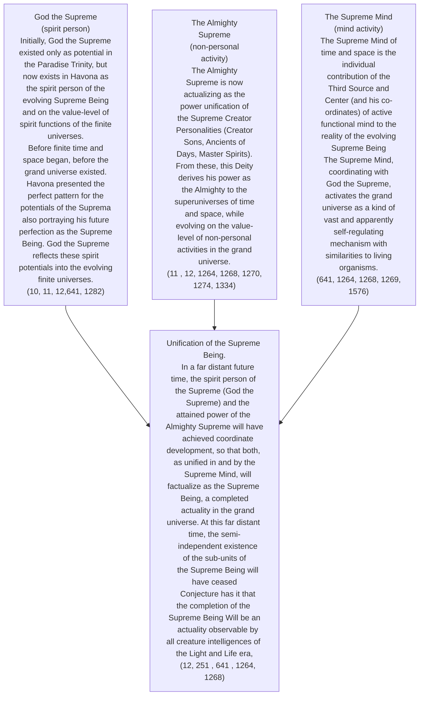

© 2000 Ken Glasziou © 2000 The Brotherhood of Man Library

<figure class="table chapter-navigator">
  <table>
    <tbody>
      <tr>
        <td>
        <a href="/en/article/Ken_Glasziou/Atonement_Jewish_Origins">
          Atonement: Jewish Origins
        </a>
        </td>
        <td>
        <a href="/en/index/articles_innerface#volume-7-no-3">
          Volume 7 - No. 3 — Index
        </a>
        </td>
        <td>
        <a href="/en/article/Keith_McPaul/Relation_of_The_Urantia_Papers_and_Process_Theology">
          Relation of the Urantia Papers and Process Theology
        </a>
        </td>
      </tr>
    </tbody>
  </table>
</figure>

In the Urantia Papers, some authors tend to refer to the Supreme Being as both existent and not yet existent—hence in ways similar to how particle physicists treat particles as simultaneously being both wave and particle.

Although the evolving Supreme Being is yet to complete his existence, and still remains in finite reality in fragmented forms as God the Supreme, the Almighty Supreme, and the Supreme Mind, nevertheless in the transcendent domains of Paradise, the Supreme Being already “is.”

It is factual that in some Papers a very concise distinction is made between the incomplete Supreme Being and those parts that are now functional during the evolutionary stages of the grand universe. In others, the term “the Supreme” or “the Supreme Being” may be used in such a way as to leave the reader to sort out what is really meant. Another term occasionally used is “Supremacy,” and mostly refers to the joint effects of the Supreme Being and the Paradise Trinity.

For those with some budding interest in philosophy and theology, the concepts expressed in the Urantia Papers on the relationships of finite (immanent) and transcendent Deity have some similarities to current ideas of process philosophy and theology. However in detail and concept, the Urantia Papers appear to be far in advance of any current works.

Even a modest acquaintance with process theology such as is presented in, for example, Encyclopedia Britannica, can be very helpful for deepening our understanding of the Urantia Papers.

In the Papers, we are informed that the creativity of us humans is limited to the sorting of basic ideas rather than to their creation. Perhaps this confirms what many of our greatest mathematicians have always believed—they do not “create” new theorems or laws but rather “discover” them. Naturally this brings up much argument about where these theorems were prior to their discovery, and also on who created them.

The Papers inform us that all possible original ideas, concepts, etc., are already present as potentials and possibilities in the keeping of the Absolutes of Infinity. ([UB 115:2.1](/en/The_Urantia_Book/115#p2_1), [UB 115:4.6](/en/The_Urantia_Book/115#p4_6))

Those that become available to us humans do so apparently because they have already been “processed,” and are present and available in the now functional Supreme Mind. ([UB 117:5.10](/en/The_Urantia_Book/117#p5_10))

Through the cosmic mind of the Infinite Spirit and the Adjutant Mind Spirits of the Universe Mother Spirit, these pre-existent thoughts are presented for our selection, sorting, recombining, and decision making. ([UB 117:4.8](/en/The_Urantia_Book/117#p4_8), [UB 117:5.11](/en/The_Urantia_Book/117#p5_11))

At least, that is how it seems to be. The charts that follow may be of help for the carrying out of some self-conducted sorting.

> It is out of the very reality of the Supreme that the Adjuster, with the  consent of the human will, weaves the patterns of the eternal nature of an ascending son of God. ([UB 117:4.8](/en/The_Urantia_Book/117#p4_8))

## The Creation of the Universes

```mermaid
flowchart TB
    P1["The Absolutes of Infinity
    All possibilities and potentials, whether of matter,
    mind, spirit, event, or idea, all are initially and
    permanently existent in the Absolutes of Infinity,
    including all that is, or may become, finite.
    It is from these possibilities and potentials that the
    superuniverses (and all that therein is), plus the
    outer space bodies, are created as our finite reality.
    (1155, 1261, 1264, 1298)"]
    P2["Transmuting the Transcendent
    Since these possibilities and potentials resident with
    the Absolutes are transcendent, that is “outside” of
    space and time, to become finite reality they must be
    transmuted (transformed) to appear as actualized
    reality within finite space and time.
    This is a shared task, integration of which is the
    function of the Infinite Spirit. For matters of non-
    personal reality, the initial actualization is
    undertaken by the Architects of the Master Universe,
    then by the Supreme Creator Personalities (the
    Creator Sons, Ancients of Days, and Master Spirits),
    who involve the Supreme Being.
    (1150, 1264, 1284, 1287, 1298)"]
    P3["The Evolutionary Supreme Being
    Now present as God. the Supreme (spirit), the Mind
    of the Supreme (mind), and the Almighty Supreme
    (power and non-personal activities), these aspects
    of finite Deity are functional during the evolution of
    the Grand Universe to Light and Life.
    When all is perfected, the evolution of the Supreme
    is completed. The transient aspects of the Supreme
    Will then become united in the immanent and
    perfected God of the finite Universes, the Supreme
    Being (251, 1268, 1269)"]
    P1 --> P2
    P2 --> P3
```

## Evolution of The Supreme Being

## External links

- Article in Innerface International: https://urantia-book.org/archive/newsletters/innerface/vol7_3/page7.html

<figure class="table chapter-navigator">
  <table>
    <tbody>
      <tr>
        <td>
        <a href="/en/article/Ken_Glasziou/Atonement_Jewish_Origins">
          Atonement: Jewish Origins
        </a>
        </td>
        <td>
        <a href="/en/index/articles_innerface#volume-7-no-3">
          Volume 7 - No. 3 — Index
        </a>
        </td>
        <td>
        <a href="/en/article/Keith_McPaul/Relation_of_The_Urantia_Papers_and_Process_Theology">
          Relation of the Urantia Papers and Process Theology
        </a>
        </td>
      </tr>
    </tbody>
  </table>
</figure>
