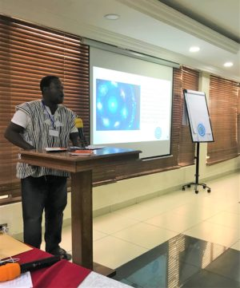
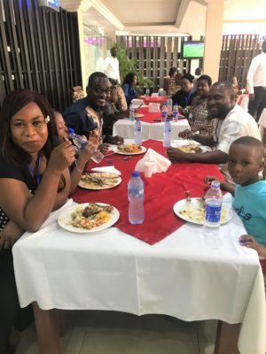
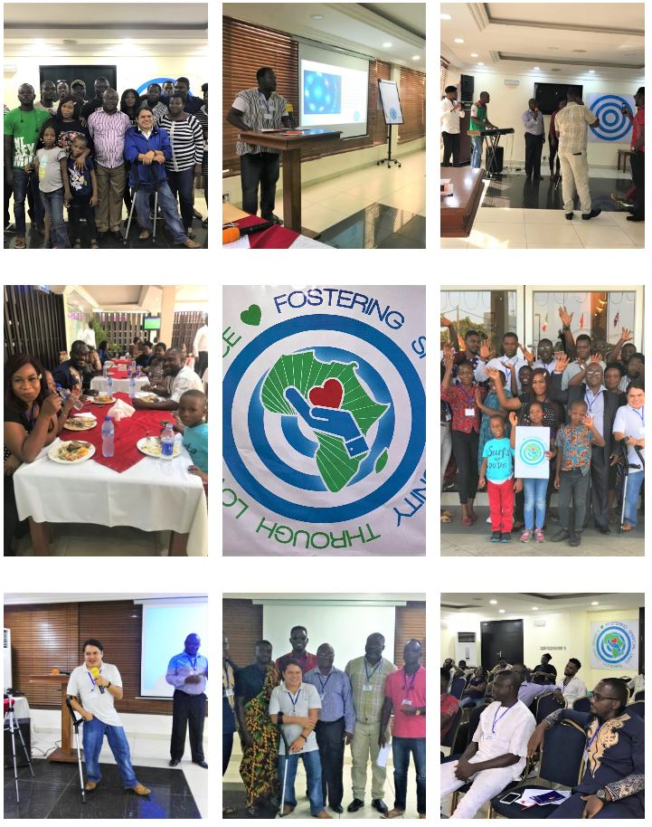

© 2020 Kwadjo Spiri and Emeka Anazodo © 2020 International Urantia Association (IUA)

<figure id="Figure_1" class="image urantiapedia">

</figure>

## Fostering Spiritual Unity Through Loving Service

Urantia Nigeria and Urantia Ghana, in collaboration with Urantia Association International, organized a successful conference from 6 to 8 December 2019 in Lagos on the Victoria Islands in Nigeria. The theme was _Fostering Spiritual Unity Through Loving Service_. In attendance were readers from Ghana and Nigeria as well as Urantia Association’s Conference correspondent and organizer on the ground, Antonio Schefer.

Following are two reports written by Kwadjo Spiri and Emeka Anazodo:

## Kwadjo Spiri, Ghana writes:

<figure id="Figure_2" class="image urantiapedia image-style-align-right">

</figure>

Meet and greet was on the Friday evening after readers traveling from Ghana by road arrived safely. Other readers from various states in Nigeria converged in Lagos for this conference. Saturday was the day for the main event.

The content of the conference was enriched by various presentations from readers from Ghana and Nigeria. Emeka Anazodo of Urantia Nigeria opened the conference with a personal introduction and an opening prayer. This was immediately followed by short introductions from everyone seated for the event, who briefly stated their connections and experiences with _The Urantia Book_. New readers were encouraged and enthused by the experiences of the more experienced readers.

<figure id="Figure_3" class="image urantiapedia image-style-align-left">

</figure>

Collins Lomo from Ghana gave an interesting presentation on “My Brother’s Keeper,” drawing attention to supporting ourselves and being there for each other as children of the kingdom—God’s children. Between presentations, Shola, a Nigerian reader and musician, refreshed the gathering with music.

I gave a presentation on “Spiritual Communion” where emphasis was placed on the importance of being adamant in our faith in the reality of the indwelling Adjuster, or Father, at all times in life. The Thought Adjuster is a solution-package to all our challenges in this first earthly life. Faith in the reality of this indwelling super-power through intelligent prayer can release the power to overcome any of life’s tasks and challenges. Attention was drawn to faith in the Thought Adjuster as being the only requirement to gain favor with God and that, through this same faith, we can increasingly share in the nature of God and ultimately fuse (become one) with him.

Jesse gave a speech on the importance of reading _The Urantia Book_, the fifth epochal revelation and a young lady, Maya of Nigeria, refreshed the short space afterwards with a memory verse from the book.

Emeka concluded the day’s presentations with a talk on effective praying, drawing our attention to the prerequisites of effective prayer as outlined in _The Urantia Book_. He expounded on each point and shared great insights into the subject in order to whet our appetite for daily effective prayer.

Emeka and I led participants in a prayer circle and offered prayers for the growth of the Urantia teachings and its associated movements in the world and especially Africa, which is a new beacon of light to the world regarding truth, beauty, and goodness.

<figure id="Figure_4" class="image urantiapedia image-style-align-right">

</figure>

Generally, this was a successful conference as it met its anticipated target of bringing African readers together (seasoned and new) to learn, discover and socialize. Also, we achieved our goal of strengthening and consolidating the African Urantia study groups and clubs. As a result, readers from all parts of Africa have continued to be in close touch after the conference.

There’s room for improvement regarding our understanding of the teachings of _The Urantia Book_ and building study groups in Africa, but we will surely get there. Many thanks to Urantia Association International for their concerted efforts to foster the teachings of the book in Africa and the world. I’m sure the Father above is most happy to see these efforts.
 

## Emeka Anazodo writes:

The December 2019 Nigeria-Ghana Urantia conference was a great and memorable event that made a very significant impact on my struggles over the years to bring together Urantia Book readers in Nigeria.

Readers in Nigeria have relied mainly on phone calls and social media, especially WhatsApp for group communication, group study, and fellowship. Several efforts have been made with Zoom cloud meetings, but a poor mobile network and the cost of data effectively marred the project. Several other efforts have been made locally to facilitate face-to-face meetings of readers, but none have been as far-reaching and uniting as this last conference.

<figure id="Figure_5" class="image urantiapedia image-style-align-left">

</figure>

This conference gave Nigerian Urantia Book readers the opportunity to set up organizational structures and guidelines for the Nigerian groups, and also inspired a collaboration of African readers to set up similar structures and guidelines to ensure that the teachings of _The Urantia Book_ are spread in Africa in such a way that the original intents and purposes of the revelators of the fifth epochal revelation are fulfilled.

On a personal level, the conference provided an opportunity for Urantia Book readers to socialize and put faces to the many names they have known for many years through social media interactions. Readers were brought together from far and wide, a feat that would not have been possible had Urantia Association International not covered the costs of logistics. Most importantly for me, I got to understand more of the purposes of the Association and have become more open to collaborations with them to move the revelation forward in Africa.

All in all, a lot of love flowed in Lagos. The ripple effect of this loving action is just beginning to gather and will yet spread through Africa and the greater world. I am indeed grateful.

Please enjoy a few photos of our time together:

<figure id="Figure_5" class="image urantiapedia">

</figure>

 

## References

- Tidings newsletter: https://urantia-association.org/about-tidings-newsletter/
- This issue: https://urantia-association.org/newsletter/tidings-march-2020/
- This article: https://urantia-association.org/presidents-message-march-2020