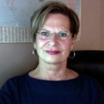
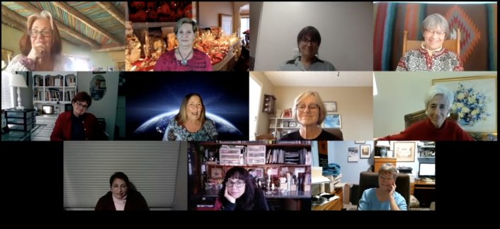

© 2021 Line St Pierre © 2021 International Urantia Association (IUA)

<figure id="Figure_1" class="image urantiapedia image-style-align-left">

</figure>

After more than 15 months without being able to meet, we wondered if it would be possible to create the proper atmosphere in an online retreat. 

The four of us, the Daughters of God, had to do the experiment first, and assess the possible discomfort or technical difficulties before gathering a small group in “the cloud!” With a touch of this new retreat experience on Zoom, and more preparation on our part, our plan was put into action! 

We invited women who had already participated in one of our retreats in order to get a better sense of how the interaction could happen when we’re on Zoom and when we look at the screen and don’t really know who is really being addressed. Since these attendees already knew how the in-person retreats worked, they should be able to adjust their participation to the small screen. 

The day before the retreat, just as we do in our retreats at Urantia Foundation in Chicago, we scheduled a two-hour get-together as an icebreaker. We enjoyed an aperitif in our own homes and interacted with the group online.  It was wonderful to see each other again, even through this small screen, and catch up with news and updates. 

The next day, Sunday, December 13, from noon to 4:30 pm, after being informed of the protocol of this platform, we spent some time in prayer and meditation before regrouping in the first of the three circles of trust that we facilitated. 

The eleven participants had settled into a quiet place in the comfort of their homes, without any disturbance of electronic devices. The intimacy of this ensemble was experienced as standing in a sacred bubble, thus promoting the authenticity of each one in our sharing in this union of souls. We introduced and considered the question: **The Universe is meant to be a dance of cooperation and love, so how can we find the courage to progress and dance through these difficult times?** 

This is how hearts opened and other hearts received and were filled with love, with this love of our Heavenly Father and his spiritual helpers. 

One of the participants read what the Catholic priest, author and theologian Henri Nouwen wrote: 

> _Listening is a form of spiritual hospitality by which you invite strangers to become friends, to get to know their inner selves more fully, and even to dare to be silent with you._

All of us appreciated the level of trust, respect and vulnerability in our sharing.  Our individual contributions came from the Spirit, which does not differentiate whether we are in person or virtually. The Spirit recognizes the state of soul. At the end of the afternoon, we all felt uplifted and supported in this sacred circle.   

<figure id="Figure_2" class="image urantiapedia">

</figure>

## References

- Tidings newsletter: https://urantia-association.org/about-tidings-newsletter/
- This issue: https://urantia-association.org/newsletter/tidings-march-2021/
- This article: https://urantia-association.org/dancing-with-god-2