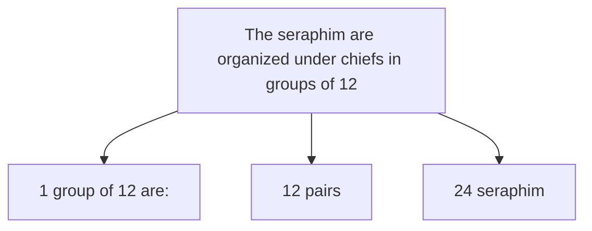
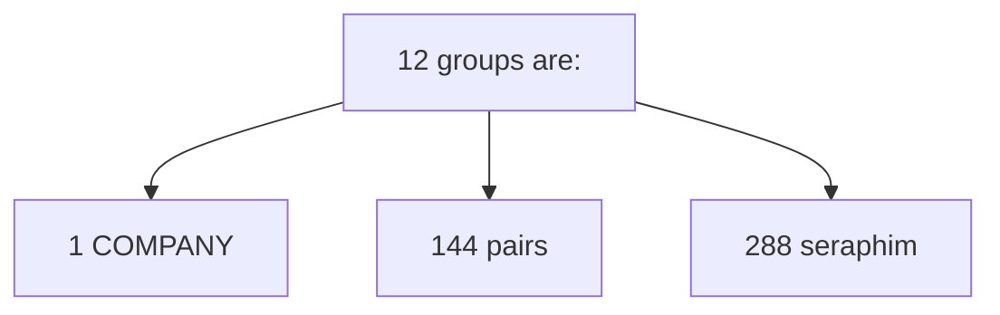
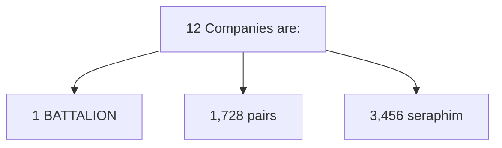
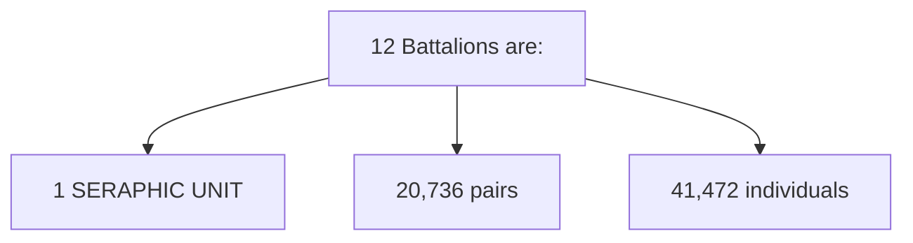
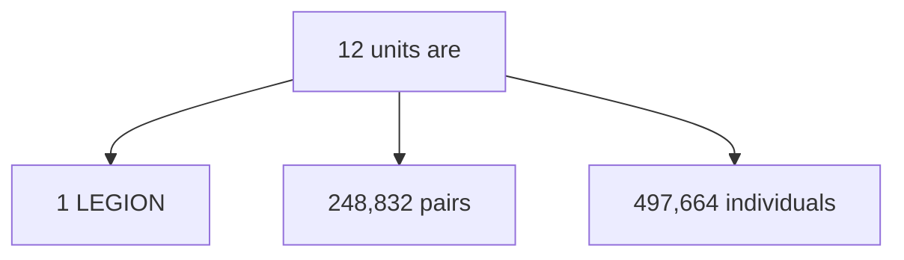
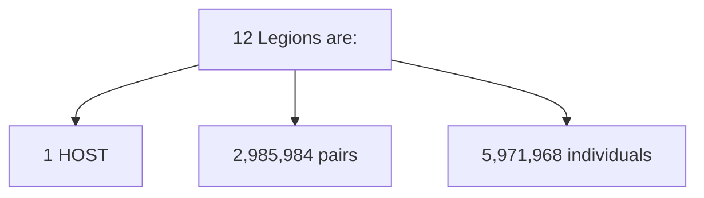
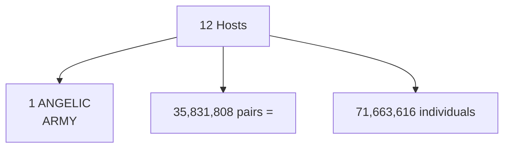
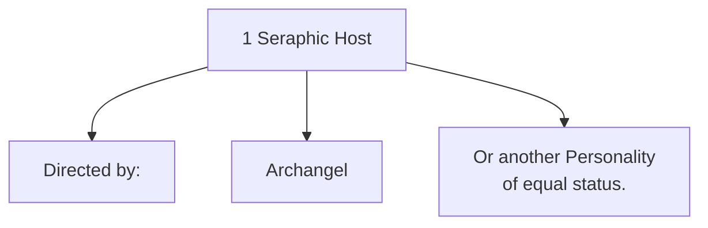
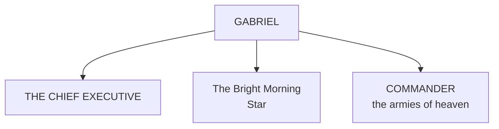

<p class="v-card v-sheet theme--light grey lighten-3 px-2">© 2005 Luis Coll<br>© 2005 Urantia Association of Spain</p>
<figure class="table chapter-navigator">
  <table>
    <tbody>
      <tr>
        <td>
        </td>
        <td>
        <a href="/en/index/articles_spain">
          <span class="mdi mdi-book-open-variant"></span><span class="pl-2">Urantia Association of Spain — Index</span>
        </a>
        </td>
        <td>
        </td>
      </tr>
    </tbody>
  </table>
</figure>

## Paper 38, Page 421

Characteristics of the Seraphim: Page 418, 420, 421

1. Created by: Universal Mother Spirit
2. Origin: 7 primary spheres of Salvington
3. Home: means the home of 2 seraphim (they live in pairs)
4. State: they are not masculine and feminine, they are negative and positive
5. Characteristics: They are not characterized by sexual emotion, although they are enormously personal and truly affectionate.
6. Organization: Group, Company, Battalion, Unit Headquarters
7. Services: Ministering spirits of time. Service in some local system; their assignments may include Nebadon and even Orvonton.

After the second millennium of their sojourn at the seraphic headquarters, the seraphim are organized under chiefs in groups of twelve (twelve pairs, 24 seraphim), and twelve of these groups constitute a company (144 pairs, 288 seraphim) under the command of a leader. Twelve companies under a commander constitute a battalion (1,728 pairs or 3,456 seraphim), and twelve battalions under a director constitute a seraphic unit (20,736 pairs or 41,472 individuals), while twelve units, under the command of an overseer, constitute a legion, which numbers 248,832 pairs or 497,664 individuals. Jesus alluded to such a group of angels that night in the Garden of Gethsemane when he said, “_Even at this very moment I can ask my Father, and he will immediately give me more than twelve legions of angels._” Twelve legions of angels comprise a host numbering 2,985,984 pairs or 5,971,968 individuals, and twelve hosts (35,831,808 pairs or 71,663,616 individuals) form the largest organization of seraphim, the angelic army. A seraphic host is directed by an archangel or some other personality of equal status, while the angelic armies are directed by the Bright and Evening Stars or other immediate lieutenants of Gabriel. And Gabriel is the “supreme commander of the armies of heaven,” the chief executive of the Sovereign of Nebadon, “he is God, Lord of hosts.”

Although serving under the direct supervision of the Infinite Spirit as personalized on Salvington, since Michael's bestowal on Urantia, the seraphim and all other local universe orders are now subject to the sovereignty of the Master Son. Even when Michael was born in the flesh on Urantia, a superuniverse broadcast went out to all Nebadon proclaiming “_and let all angels worship him._” All categories of angels are subject to his sovereignty; they are part of that group that has been termed “his mighty angels.”















Management and Commanders:



```mermaid
flowchart TB
	A["ANGELICAL ARMS"]
	A1["Directed by: "]
	A2["Bright Stars"
	Evenings
	A3["or lieutenants of
	Gabriel ."]
	A --> A1
	A --> A2
	A --> A3
```



Gabriel of Salvington is the Chief Executive of the universe of Nebadon—the Bright and Morning Star—Commander in Chief of “the armies of heaven”—that is, the Heavenly Hosts. (Urantia Book [UB 33:4.6](/en/The_Urantia_Book/33#p4_6))


## References

- [This article on the Urantia Association of Spain website](https://aue.urantia-association.org/wp-content/uploads/sites/6/2018/03/OrganizacionSerafica.pdf)


<figure class="table chapter-navigator">
  <table>
    <tbody>
      <tr>
        <td>
        </td>
        <td>
        <a href="/en/index/articles_spain">
          <span class="mdi mdi-book-open-variant"></span><span class="pl-2">Urantia Association of Spain — Index</span>
        </a>
        </td>
        <td>
        </td>
      </tr>
    </tbody>
  </table>
</figure>