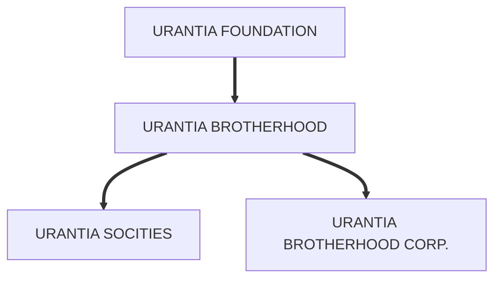

© 1964 Marian Rowley

## Urantia History

There seems to be a great deal of confusion among our friends and members of the Urantia movement about the various organizations: The Urantia Foundation, the Urantia Brotherhood, and the Urantia Brotherhood Corporation. I am going to try to clear up this confusion by helping you to understand the purposes and functions of these organizations.

## The Urantia Foundation (the first organization)

For many years prior to the publication of the Urantia Book oona October 19, 1955, a group of people had met at this address, 533 Diversey Parkway, Chicago, Illinois, for the purpose of studying the manuscripts which ultimately comprised “The Urantia Book.” Then the Revelatory Commission (producers of the manuscripts) advised us of their completion it was decided (with probably a nudge from the Revelatory Commission) that plates should be made of the manuscripts on the assumption that some day they would be published. Accordingly, a contract was made for production of the plates at a cost of approximately 25,000.00$. It was also determined to create a foundation as titleholders of the plates, which formed the basis of the [Declaration of Trust](/en/article/Declaration_of_Trust) creating the Urantia Foundation. This Declaration of Trust was filled for record on Janury 21, 1950. The Foundation created thereby is a non-profit and tax-exempt organization.

With the Foundation seting as publiaher, the Urantia Book was published under internetional copyright on October 12, 1955. A sum of money in excess of 49,000.00$ was contributed for this purpose.

The Foundation is administered by five Trustees, who are self-perpetuating. It is the primary duty of tho Trustees to perpetually preserve inviolate the text of the Urantia Book. The Trustees must use and employ such means, methods, and facilities as in their judgment shall be necessary and proper for preserving and safeguarding the original text of the Urantia Book. The Trustees of the Urantia Foundation must retain absolute and unconditional control of all plates and other media for the printing and reproduction of the Urantia Book, or say translation thereof.

The Declaration of Trust creating Urantia Foundation sets forth under Article II the objects:

2.1. PRINCIPAL OBJECT: The object for which this Foundation is created is the promotion, improvement, and expansion among the peoples of the world of the comprehension and understanding of Cosmology and the relation of the planet on which we live to the Universe, of the genesis and destiny of Man and his relation to God, and of the true teaching of Jesus Christ; and for the inculcation and ecouragement of the realization and appreciation of the Fatherhood of God and the Brotherhood of Man — in order to increase and enhance the comfort, hapiness, and well being of Man, as an individual and as a member of society, through the fostering of a religion, a philosophy, and a cosmology which are conmensurate with Man's intellectual and cultural development.

2.2. CONCORDANT OBJECIS: The concordant objects for which the Foundation is created are to perpetually preserve inviolate the text of THE URANTIA BOOK and to disseminate the principles, teachings, and doctrines of THE URANTIA BOOK.

The present Trustees of the Urantia Foundation are:

- William M. Hales, President 
- Thomas A. Kendall, Vice President
- E. L. Christensen, Secretery
- Edith E. Cook, Treasurer, and Asst. Secretary
- Kenton E. Stephens, Asst. Treasurer

The Foundation Trusteets meet every three monts and say be called together for special or mergency meetings.

All money donated to the Foundation are used for translations, (the French translation meant an outley of over $20,000.00 ), the preparation and publication of the Index, and future printings of the Urantia Book. Since our present supply of Urantia Books from the first printing of 10,000 copies is rapidly dwindling, it will be necessary to print a second edition within the next two or three years. While we have the plates to use for the second printing, the cost of the next edition of 10,000 copies will be approximately $65,000.00. In addition to this, the Foundation must also raise money for the making of plates and the printing of the Index when that tremendous job shall have been completed. The cost will exceed $25,000.00.

So you will readily understand why the Foundation is in need of funds and I hope you will appreciate our yearly plea for funds. We have no other income with which to produce additional copies of the Urantia Book — only your donations.

The foundation holds the copyright to the Urantia Book as well as the Trade MArk (the three concentric circles), and the use of the word “Urantia.”

The Northern Trust Company of Chicago carries the Foundation accounts, both savings and checking.

## The Urantia Brotherhood

In order that the Urantia Foundation could properly carry out its duty to disseminate the teachings end doctrines of the Urantia Book, it was inevitable that some cort of fraternal organization should come into existence. In August 1952 instructions from the Revelatory Commision caused the Trustees to begin the consideration of a voluntary and fraternal organization of Urantia beleivers. Accordingly, on January 2, 1955, a group of persons who believed the teachings of the book and who were interested in their proclamation, assembled in Chicago and completed the organization of the Urantia Brotherhood.

The Urantia Brotherhood is a voluntary and fraternal organization of beleivers in the Urantia Book, functioning in various Urantia Societies, each of which is made up of ten or more dedicated individuals.

The 36 foundaers constitute what we know as the General Council of the Urantia Brotherhood, which directs the affairs of the Brotherhood through the Executive Committee. The Executive Committee is composed of the officers of the Brotherhood together with the chairman of the nine functioning committees — a group of fourteen. The Executive Committee meets the first Monday of each month.

The original 36 founders of the Urantia Brotherhood (or their successors) directed the organization for the first nine years. Thereafter, the Brotherhood will be governed by a new General Council selected by the action of a Triennial Delegate Assembly composed of delegates from the various Urantia Societies. The First Triennial Meeting was held during 1964.

The purpose of the Brotherhood is well expresaed in the preamble to the Constitution, as follows:

“Inasmuch as it is our solean conviction that the confort, happiness, and well-being of men will be enhanced by the creation of an organization devoted to the purposes hereinafter expressed, and inasmuch as it is our considered judgment that the purposes hereinafter expressed may best be accomplised through the mutual assistance and association of a body of people working together for a common cause, we do hereby unite together as a voluntary association and fellowship under the name Urantia Brotherhood, and wo do hereby adopt and establinh this constitution of Urantia Brotherhood.”

Among the early activities of the Brotherhood was the organization of the Urantia Brotherhood School, which begen its first session in September, 1956. The highest degree granted is that of “Ordained Teacher.” A shorter course of study leads to the degree of “Certifled Leader.”

An of this mriting, the Officers of the Urantia Brotherhood are:

- E. L. Christensen, President
- Alvin L. Kulieke, Vice President
- Harry E. Romley, Treasurer
- Anna Rawson, Secretary
- Marian T. Rowley, Secretary-General

The Secretary-General is the principal clerical and liaison officer between the General Council and each Departmental Committee. She keeps in close touch with the work of each Urantia Soeiety and carries on a mountain of correspondence with these societies and the numerous inquirers and friends of the Urantia movement throughout the world. She is ex-officio member of each departmental committee. It is her job to see that the organization is functioning in top form and that we are all doing our jobs.

## Urantia Brotherhood Corporation

Since the Urantia Brotherhood is not a corporation — not a legal entlty — the Executive Committee of the Urantia Brotherhood asured to be organized a not-for-profit corporation under the laws of the State of Illinols in the name of URANTIA BROTHERHOOD CORPORATION. This Corporation is the fiscal agent of the Brotherthod and, in a general way, takes care of the various financial and legal interests of the Brotherhood. The Executive Committee may from tine to time organise additional corporations for profit or not for profit an shall be considered necessary.

All donations, therefore, which you make to the Urantia Brotherhood are handled through the Urantia Brotherhood Corporation. The Brotherhood does not have a bank account or any funds. Their account is carried in the name of URANTIA BROTHERHOOD CORPORATION.

The Officers and Directors of the Corporation are the same as the Officers and directors of the Brotherhood.

All money given to the Brotherhood is used for running expenses, such as rent, equipment, stationery, stamps, telephone, mineograph work, textbooks, etc., ad infinitum. There are no paid workers.

The Brotherhood Corporation accounts are also carried in the Northern Trust Company of Chicago.

## References

* [This article in The Urantia Book Fellowship archives](https://archive.urantiabook.org/archive/originals/organization_history1064.pdf)
