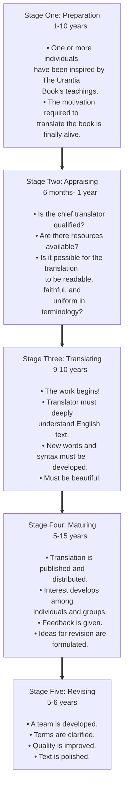

© 2019 Marilynn Kulieke © 2019 Urantia Foundation

<figure class="table chapter-navigator">
  <table>
    <tbody>
      <tr>
        <td>
        <a href="/en/article/UF_News_Online/Welcome_Contact_Details_2019_07">
          Welcome & Contact Details
        </a>
        </td>
        <td>
        <a href="/en/index/articles_uf_news_online#volume-13-issue-2-july-2019">
          Volume 13, Issue 2, July 2019 — Index
        </a>
        </td>
        <td>
        <a href="/en/article/Judy_Van_Cleave/Noteworthy_Board_Decisions_from_the_April_2019_Trustees_Meeting">
          Noteworthy Board Decisions from the April 2019 Trustees Meeting
        </a>
        </td>
      </tr>
    </tbody>
  </table>
</figure>

<figure id="Figure_1" class="image urantiapedia image-style-align-left">

</figure>

_By Marilynn Kulieke, Chair of Translations, vice president, Urantia Foundation, Illinois, United States_

_Editor's Note: During the Cultural Symposium held at Urantia Foundation in April, Marilynn gave an excellent and informative presentation on the process used to produce quality translations. It was video recorded, so please view it here. The end result is a deeper appreciation for the incredible work required to translate_ The Urantia Book.
 

https://www.youtube.com/watch?v=_ufcn_nmc-A

A main avenue in fulfilling Urantia Foundation's principal object is the production of translations of _The Urantia Book_ into the many languages of our world. They are a vital part of our work in fulfilling the mission of seeding _The Urantia Book_ and its teachings globally.

It is my pleasure to serve as chair of the Translation Committee. Other members are Georges MichelsonDupont (manager of translations), Henk Mylanus, Jay Peregrine, Minoo, and Tamara Strumfeld. Our work, including the creation of this process, is truly a team effort.

It is our goal to be the producer of the highest-quality translations, and therefore our translation committee created a systematic process based on our love for the Urantia Revelation. The process development began in 2006, and is based on the Standard Guide for Quality Assurance in Translation that was adopted by ASTM International.

As we applied these standards, it became clear to us that a fivestage process of approximately 40 years or more was needed to produce a high-quality translation. These stages are outlined as follows:

At the end of this process, when the revision has matured, it is time to reintegrate the enhanced language and clarity of thinking into the evolutionary channels and cultures just waiting for this new truth. The following quote truly sums up the work we are engaged in:

> The spread of civilization must wait upon language. Live and growing languages insure the expansion of civilized thinking and planning. During the early ages important advances were made in language. Today, there is great need for further linguistic development to facilitate the expression of evolving thought. [UB 81:6.16](/en/The_Urantia_Book/81#p6_16)

## References

- [Urantia Foundation's News Online](https://www.urantia.org/urantia-foundation/newsletter-pdf-archives)
- [This article](https://www.urantia.org/news/2019-06/creating-translations-out-love-urantia-foundations-quality-process)

<figure class="table chapter-navigator">
  <table>
    <tbody>
      <tr>
        <td>
        <a href="/en/article/UF_News_Online/Welcome_Contact_Details_2019_07">
          Welcome & Contact Details
        </a>
        </td>
        <td>
        <a href="/en/index/articles_uf_news_online#volume-13-issue-2-july-2019">
          Volume 13, Issue 2, July 2019 — Index
        </a>
        </td>
        <td>
        <a href="/en/article/Judy_Van_Cleave/Noteworthy_Board_Decisions_from_the_April_2019_Trustees_Meeting">
          Noteworthy Board Decisions from the April 2019 Trustees Meeting
        </a>
        </td>
      </tr>
    </tbody>
  </table>
</figure>
