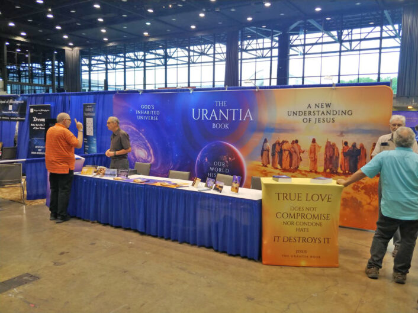
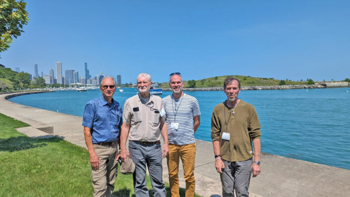

© 2023 Mark Blackham © 2023 International Urantia Association (IUA)

<figure id="Figure_1" class="image urantiapedia">

</figure>

The Parliament of the World’s Religions (PoWR) convened in Chicago (August 14-18, 2023) at McCormick Place, a massive conference center situated on the sandy shores of Lake Michigan. The general theme for this gathering was, “A Call to Conscience: Defending Freedom & Human Rights.” Over 7,000 people from 95 countries attended this event.  

The first Parliament was held in Chicago on September 11th 1893, in conjunction with the World’s Columbian Exposition, which introduced the first Ferris Wheel as America’s answer to the Eiffel Tower. The next PoWR did not occur until 100 years later, in 1993, but since then, it has been a triennial event held in different cities around the globe.    

The Parliament is an interfaith movement that seeks to unite over 200 diverse traditions and beliefs by highlighting the common ground between them. And indeed, whether religious or secular, we were delighted to see how many enlightened beliefs and lofty goals we all mutually share.

The opening ceremony was a grand event that set the tone for the next five days. Attendees from all corners of the globe were greeted with a vibrant display of music, dance, and ritual to celebrate the diversity, unity, and sacredness of this interfaith gathering. 

As the theme suggests, there was a particular emphasis on ethics, morality, and human rights, subjects also underscored in _The Urantia Book_, albeit in more depth. Students of the book know that ethics and morality are never the whole of religious experience (5 :5.4), but they also know that both are essential to the growth of this experience:

> Morality is the essential pre-existent soil of personal God-consciousness, the personal realization of the Adjuster’s inner presence, but such morality is not the source of religious experience and the resultant spiritual insight. [UB 196:3.2](/en/The_Urantia_Book/196#p3_2)

Overall, there were more than 860 sessions with workshops, panels, performances, and religious observances on a myriad of subjects. On each of the five days, a plenary convened in the 4200-seat Crown Theater to raise participants’ awareness of the work done by faith leaders and inter-spiritual communities as they join together in the pursuit of truth, justice, freedom, human rights, and democracy for the entire world.

One of the major sub-themes of this conference was social cooperation; a moral call to help each other in our daily struggles, to learn to understand each other, to sympathize, and to stand up as one voice against injustice, prejudice, ignorance, and bigotry. But just as important, this was a positive appeal to the better side of humanity, one furthered through the socialization of religion.

> There is a real purpose in the socialization of religion. It is the purpose of group religious activities to dramatize the loyalties of religion; to magnify the lures of truth, beauty, and goodness; to foster the attractions of supreme values; to enhance the service of unselfish fellowship; to glorify the potentials of family life; to promote religious education; to provide wise counsel and spiritual guidance; and to encourage group worship. And all live religions encourage human friendship, conserve morality, promote neighborhood welfare, and facilitate the spread of the essential gospel of their respective messages of eternal salvation. [UB 99:6.2](/en/The_Urantia_Book/99#p6_2)

While there is no consensus over what constitutes a religion, one definition in the Merriam-Webster Dictionary is that it is a set or system of spiritual attitudes, beliefs, and practices.

> Religion implies that the superworld of spirit nature is cognizant of, and responsive to, the fundamental needs of the human world. [UB 2:6.2](/en/The_Urantia_Book/2#p6_2)

_The Urantia Book_ is not a religion in the sense that the book itself is an object of worship. Nonetheless, the greater portion of the book is _about_ religion. _The Urantia Book_ is overwhelmingly dedicated to a discussion of God, Deities, spirituality, and religion, including 34 direct references to the “religion of Jesus.” The importance of this religion is emphasized in the last two sections of the book, which are: “The Religion of Jesus” and “The Supremacy of Religion.” In light of this, we can safely say that one main objective of _The Urantia Book_ is to elaborate and promulgate a new personal religion—the newly revealed religion of Jesus.

Despite all the religions represented at the conference, the Urantia booth was quite popular, especially in the late mornings and early afternoons. Usually, there were two to four of us staffing the booth at any one time. Most of us had several opportunities to interact with the many interested people who passed by. At times, we had some challenging questions but nearly all inquiries were engaging and fruitful. Overall, it was a tremendous success.

There were two books for sale: _The Urantia Book_ and _The Untold Story of Jesus_. And while sales were good for both books, many more people were content to walk away with a web link from printed handouts where they could either read or listen to _The Urantia Book_ on their laptops or phones.

<figure id="Figure_2" class="image urantiapedia">

</figure>

People from all Urantia organizations as well as some who were unaffiliated participated as volunteers at the booth. Four people from Canada worked the Urantia booth every day on behalf of Urantia Association International: Nathen Jansen, Marc Belleau, Brian Sikorski, and myself. It was indeed fulfilling to see the tact, tolerance, and intelligence that all participants exercised on behalf of the teachings.

We want to thank the Urantia Foundation, The Urantia Book Fellowship, Urantia Association International, and Truth Book for their careful planning to make the Urantia Booth possible. And special thanks to executive director, Tamara Strumfeld, for facilitating our visit. We would also like to thank Jerry and Carrie Prentice, who were at the booth every day, all day, helping out wherever and whenever needed.

We were also grateful for the hard-working crew who set up the booth. They did a wonderful job. And at the closing of the this Parliament, while keeping the Urantia booth open until the last minute, the same crew of amazing volunteers worked together to take down and remove the booth with practiced efficiency. 

Other Urantia Book related booths or events were:

“The Center for Unity” booth was situated two sections down from the Urantia Booth. It displayed a creative “Cinematic Jesus” film bringing to life the untold stories of Jesus, in Part IV of _The Urantia Book_.  Additionally, the new “Discover Jesus” app was presented at this booth, “Discover Jesus at your own pace, learn by asking questions.”  There was considerable interest in this interactive AI application.

Gard Jameson presented “The Circle of Trust,” in which cocreative teams learn how to come together around the major issues of our time, globally and locally, to collectively solve those issues in a spirit of partnership, collaboration, and cooperation. Gard was also instrumental in setting up a number of yurts in which people could rest, meditate, pray, and worship. These events were well attended.

Pato and Antoinette held a lively concert entitled, “Peace and Justice.” A Pato Banton concert is an experience not to be forgotten. He conversed with the crowd on a range of topics including current-day events and spiritual freedom while keeping the musical vibes upbeat and fun! Antoinette featured “The Rootsdawtah Collective” which is a collaboration of her music on the Feminine Divine and Social Justice.

Women’s Dignity. While not directly related to _The Urantia Book_, this project takes aim at social equality by putting women at decision-making tables for religion, governments, and funding organizations with the intent of bringing balanced feminine leadership and a greater vision for humanity.  Women’s unique gifts of nurturing, intuition, creativity, as well as emotional and spiritual intelligence are essential in co-creating sacred relationships. These vital conversations encourage women and girls to fully participate in leadership roles in order to increase the human potential for finding solutions and getting help in times of poverty, conflict, and climate crises.  

Sikh Langar. We all had the benefit of free lunches, compliments of the Sikh community. Langar, short for Guru Ka Langar, is a community meal served free to all – regardless of an individual’s gender, caste, creed, social status, or religion. Sikhs have served Langar at all in-person Parliament convenings. In these events, vegetarian food is prepared and served by a multitude of volunteers. Anyone who wishes to partake in Langar is asked no questions. Instead, they are merely welcomed as they arrive and thanked when they leave.

There were many praises sung to this event. This one came from Dr. Myriam Renaud, Principal Investigator and Director of the Global Ethic Project:

“It was impressive to see how, thirty years on, the Parliament’s 1993 document, ‘Towards a Global Ethic,’ generated a lot of buzz during this year’s convening. Whether in casual conversations or on social media, a lot of people talked about how, although most of us don’t share the same beliefs, we agree on the basic values and principles expressed in the document. They appreciated how this clear statement can serve as a conversation-starter and help people connect, whether they come from different religions or the same religion, or are not religious at all.”
 

## References

- Tidings newsletter: https://urantia-association.org/about-tidings-newsletter/
- This issue: https://urantia-association.org/newsletter/tidings-september-2023/
- This article: https://urantia-association.org/reflections-on-the-parliament-of-the-worlds-religions-chicago-2023